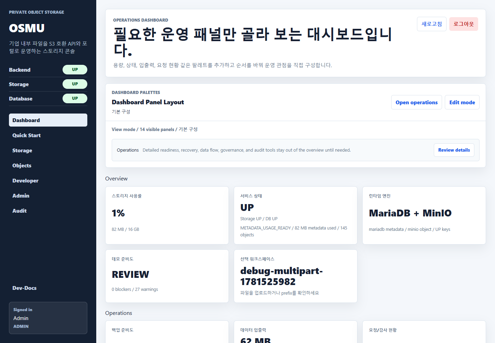
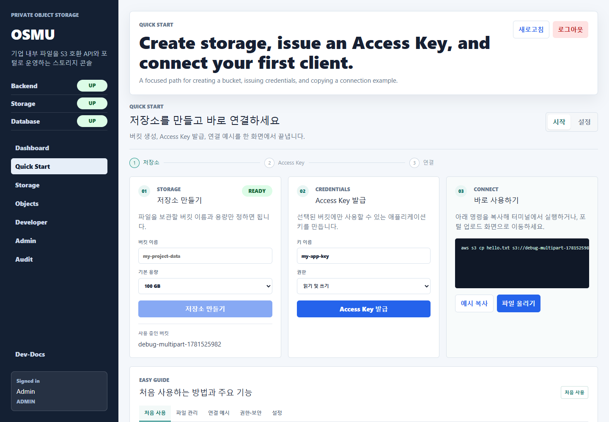
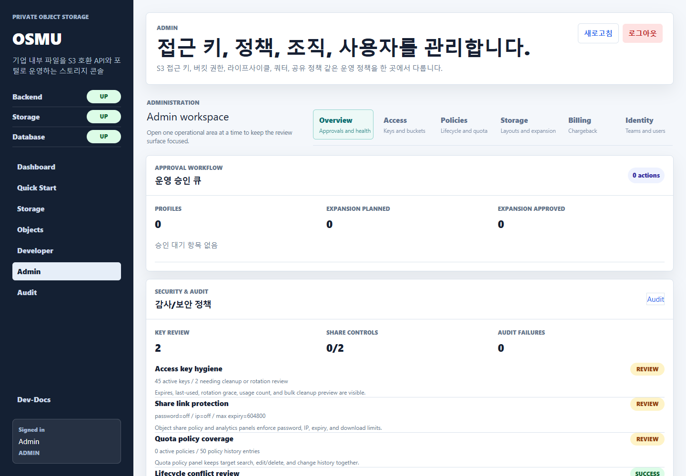
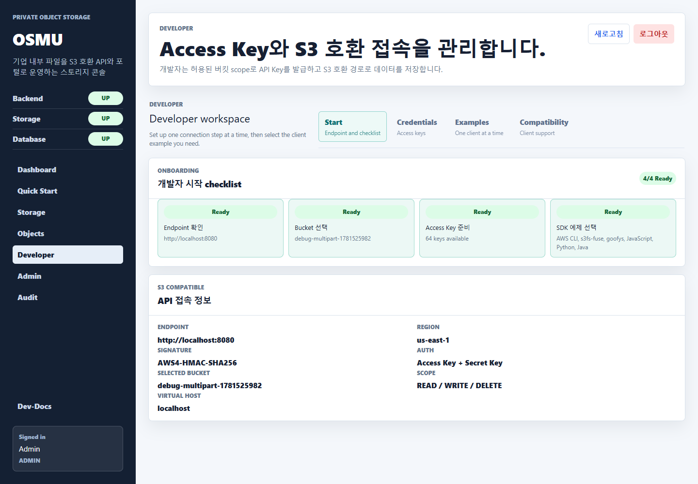
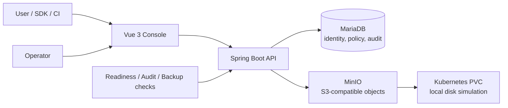

# OSMU

> Self-hosted, S3-compatible private object storage console for teams that need practical operations, controlled access, and a clear path from a local demo to Kubernetes PVC-backed storage.

<p align="center">
  
  
  
  
  
</p>

## At a glance

OSMU turns private object storage into a usable team product: users receive an S3-compatible endpoint and credentials, operators retain control through policies, audit trails, readiness checks, and storage-layout planning.

- **For users:** create a bucket, issue a key, upload an object, and copy a working S3 configuration.
- **For operators:** monitor service readiness, manage identities and policies, review audit events, and plan PVC-backed storage layouts.
- **For a portfolio demo:** launch a complete stack with one command and use seeded data immediately.

## Product tour

<p align="center">
  
  
</p>
<p align="center">
  
  
</p>

### What the screens demonstrate

| Area | Portfolio signal |
| --- | --- |
| Dashboard | Compact operational overview: availability, readiness, storage, and data-flow status without dumping raw evidence into the page. |
| Quick Start | A guided path from bucket issuance to an S3 client connection, with plain-language setup examples. |
| Developer | Endpoint, credentials, SDK examples, compatibility details, and request-oriented integration tools. |
| Admin | Role-aware controls for users, keys, policies, storage profiles, audit, and operational preparation. |

## Core capabilities

- **S3-compatible object workflow:** buckets, objects, upload/download, presigned URLs, lifecycle and retention-oriented operations.
- **Identity and access:** organizations, users, role-based screens, access-key lifecycle, scoped bucket access, and credential rotation.
- **Storage operations:** MinIO object store integration with a PVC-oriented storage model and RAID 0-9 / JBOD planning profiles.
- **Readiness and recovery:** deployment checks, operation evidence, backup/restore readiness, and actionable pending work.
- **Governance:** audit history, object and key review, policy controls, and safer production defaults.
- **Developer experience:** endpoint discovery, client examples, quick start, and in-product Dev-Docs.

## Architecture



| Layer | Responsibility | Main technology |
| --- | --- | --- |
| Console | Role-aware operations, quick start, docs, data visibility | Vue 3, Vite |
| API | Auth, policy enforcement, S3 orchestration, admin and audit APIs | Java 17, Spring Boot |
| Metadata | Users, organizations, policies, operational records | MariaDB |
| Object store | S3 API and object persistence | MinIO |
| Storage model | Local simulation of production persistent volumes | Docker volumes / Kubernetes PVC |
| Demo delivery | Reproducible local environment | Docker Compose, PowerShell |

## Run the portfolio demo

### Prerequisites

- Docker Desktop running
- Windows PowerShell or Command Prompt

### One command

```powershell
.\run-demo.cmd
```

The launcher builds the stack, selects unused host ports when common ports are occupied, starts MinIO, MariaDB, backend, and frontend, then seeds the demo. It prints the final URLs and demo account details in the terminal.

Typical local endpoints:

| Service | Default URL |
| --- | --- |
| Console | `http://localhost:5173` |
| API | `http://localhost:8080/api` |
| MinIO S3 API | `http://localhost:9000` |
| MinIO Console | `http://localhost:9001` |

If a default port is already in use, the script assigns a free port automatically. The generated local configuration stays in `infra/local/.env.portfolio` and is excluded from Git.

Useful commands:

```powershell
.\run-demo.cmd Status
.\run-demo.cmd Stop
.\run-demo.cmd Reset
.\run-demo.cmd -Verify
```

Detailed walkthrough: [PORTFOLIO_DEMO.md](PORTFOLIO_DEMO.md)

## Demo path

1. Sign in with the credentials printed by the launcher.
2. Open **Quick Start** and review the generated endpoint, bucket, and access key workflow.
3. Open **Storage** to create or inspect a bucket.
4. Open **Objects** to upload and browse data.
5. Open **Developer** to copy an SDK or CLI integration example.
6. Open **Admin** to inspect access controls, storage layouts, readiness, and audit evidence.
7. Open **Dev-Docs** for role-specific guides aimed at both human operators and automation agents.

## Engineering choices

| Decision | Why it matters |
| --- | --- |
| S3-compatible API over a proprietary file API | Existing SDKs, CLI tools, and CI systems can connect with familiar patterns. |
| MinIO behind an application API | Keeps object operations compatible while centralizing identity, policy, audit, and product workflows. |
| PVC-oriented storage abstraction | Keeps the local demo simple while matching a realistic Kubernetes persistence deployment shape. |
| RAID / JBOD profiles as explicit planning data | Lets administrators compare performance and durability tradeoffs before storage changes. |
| Readiness as structured checks | Turns deployment and operations work into visible, reviewable tasks instead of hidden runbooks. |
| Separate quick-start and admin surfaces | Users get a short path; operators get detail only when needed. |

## Repository map

```text
osmu-backend/       Spring Boot API, auth, S3 orchestration, operations APIs
osmu-frontend/      Vue console, Quick Start, Developer, Admin, Dev-Docs
infra/local/        Docker Compose and local environment templates
scripts/            Demo launcher, verification, readiness helpers
docs/assets/        README portfolio screenshots
PORTFOLIO_DEMO.md   Presenter script and demo operations guide
```

## Security posture

- Production defaults require explicit administrator bootstrap and secret configuration.
- Development-only credentials remain isolated in the local profile and Compose environment.
- Access key handling supports lifecycle actions and scoped access.
- Forwarded client IP headers are trusted only when the backend proxy configuration explicitly allows them.
- Operational metrics exposure is disabled by default outside intended environments.

Do not use demo credentials or local Compose secrets in a production deployment. Configure environment-specific secrets, TLS, network controls, backups, and persistent PVC storage before production use.

## Validation

The project is exercised through backend tests, frontend unit tests, API contract verification, and a Compose-based end-to-end demo startup. The portfolio screenshots above are captured from the seeded local demo with Playwright.

```powershell
# Backend
cd osmu-backend
.\gradlew.bat test --no-daemon

# Frontend
cd ..\osmu-frontend
npm.cmd run test:unit
npm.cmd run build

# Local verification
cd ..
.\scripts\verify-local.ps1
```

## Project status

OSMU is a functional portfolio and demo system focused on object-storage workflows and operations readiness. It is intentionally transparent about the boundary between a local demonstration environment and a production service: Kubernetes deployment hardening, enterprise identity integration, external backup targets, and performance validation remain deployment-specific work.

---

Built to demonstrate full-stack product thinking across storage APIs, operational UX, secure defaults, and reproducible delivery.