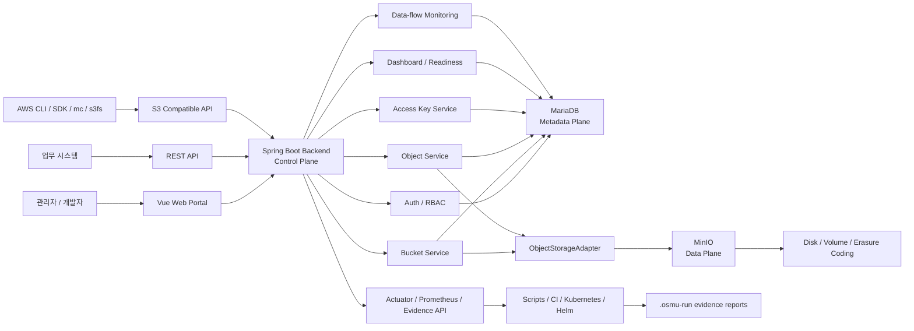

# OSMU - 사설 오브젝트 스토리지 관리 플랫폼

OSMU(Object Storage Management Utility)는 기업 내부망 또는 전용 인프라에서 대용량 파일, 이미지, 영상, 로그, AI 데이터셋을 버킷 단위로 관리하기 위한 사설 오브젝트 스토리지 관리 플랫폼입니다. MinIO를 실제 오브젝트 저장소로 사용하고, Spring Boot 백엔드가 인증, 권한, 메타데이터, 감사 로그, quota, 운영 readiness, data-flow monitoring을 담당합니다. Vue 기반 웹 포털은 관리자와 개발자가 브라우저에서 버킷, 오브젝트, Access Key, 운영 상태를 다룰 수 있게 합니다.

현재 저장소는 로컬 durable MVP 데모를 검증 가능한 상태로 유지하면서, Kubernetes/Helm, 백업/복구, HA/DR, 보안 evidence, 운영 readiness 자동화까지 제품화 범위를 확장하는 중입니다.

## 핵심 목표

- 기존 S3 클라이언트가 큰 수정 없이 사용할 수 있는 대체용 S3-compatible API를 제공하되, AWS S3 전체 스펙의 세부 호환을 제품 목표로 삼지는 않는다. S3는 제품의 중심 기능이 아니라 내부 스토리지 전환을 돕는 호환 계층이다.
- MariaDB에는 사용자, 조직, 버킷, 오브젝트 인덱스, 권한, 감사 로그, quota, readiness evidence 같은 metadata를 저장한다.
- MinIO에는 실제 오브젝트 binary와 multipart payload를 저장한다.
- 웹 포털에서 관리자 콘솔, 개발자 콘솔, bucket/object 탐색, Access Key, quota, audit, lifecycle, 공유, dashboard, data-flow monitoring을 제공한다.
- Docker Compose 로컬 MVP에서 시작해 Kubernetes/Helm 운영 배포, 백업/복구, HA/DR, 보안 evidence, storage expansion workflow까지 확장한다.

## 현재 상태

- 로컬 durable MVP 데모: Docker Compose 기반 MariaDB + MinIO + Backend + Frontend 조합으로 검증 가능.
- Web Portal: 로그인, dashboard, bucket/object, admin/developer, audit, lifecycle, share, quota, storage expansion, operations readiness, data-flow monitoring 화면 제공.
- Backend: REST API, S3 호환 API, SigV4, bucket/object, multipart, CopyObject, multi-delete, Access Key, dashboard/readiness, monitoring API 제공.
- Operations: Kubernetes/Helm draft, monitoring artifact, backup/restore drill, storage expansion runner, secret rotation/commercial integration/commercial approval/operations handoff package evidence writer와 manual evidence workflow, security evidence writer/finalizer, operations readiness finalizer와 verifier 제공. Handoff package는 readiness/convergence JSON을 원문 저장 없이 result/count/sync summary로 축약한다.
- 남은 큰 축: 실제 운영 클러스터 evidence, GitHub-hosted durable gate evidence, dedicated partitioned/time-series 저장소, target secret rotation/commercial integration/commercial approval과 readiness/convergence snapshot을 포함한 운영 handoff package `result=passed` evidence 확보이다. Data-flow는 daily/materialized rollup, monthly aggregate JSON/CSV, monthly aggregate store refresh/read/export, storage readiness/row count 상태 표면까지 진행됐고, S3 client smoke는 대체성 회귀 검증으로 유지한다.

## 아키텍처 개요

OSMU는 다섯 plane으로 나누어 이해하면 쉽습니다.

- **Web/API Plane**: 사용자가 접근하는 Vue Web Portal, REST API, S3 compatible API.
- **Control Plane**: Spring Boot backend. 인증, RBAC, bucket/object 정책, quota, lifecycle, Access Key, readiness, monitoring 흐름을 조정한다.
- **Metadata Plane**: MariaDB. 사용자, 조직, 버킷, 오브젝트 인덱스, audit, data-flow event, 운영 evidence를 저장한다.
- **Data Plane**: MinIO. 실제 오브젝트 byte, multipart part, bucket payload를 저장한다.
- **Operations Plane**: scripts, CI, Docker, Kubernetes, Helm. 배포, 검증, 백업/복구, HA/DR, security evidence를 자동화한다.

## Chargeback Note

- 현재 billing/chargeback은 내부 pricing policy/proposal, 상업 가격표 승인 참조 기록, preview/export, data-flow daily rollup 기반 일별 chargeback 추세와 CSV export, threshold alert, notification/payment outbox, notification webhook/Slack/EMAIL SMTP relay adapter send, payment provider generic/CARD/BANK/TAX/ERP webhook profile handoff send/readiness, private/local webhook URL과 SMTP relay host 기본 차단, outbound payload size cap, generic notification/payment webhook HMAC signature header 옵션, invoice/payment workflow, adapter retry 상태 기록, notification/payment adapter retry worker dry-run/run까지 제공한다.
- 아직 남은 범위는 실제 card/bank/tax/ERP native provider API adapter 구현, target 환경의 secret/certificate rotation, commercial integration, commercial approval, operations handoff package `result=passed` evidence 확보이다. Native payment provider adapter SPI와 composite dispatch 경로는 준비됐지만 실제 외부 provider 구현은 아직 붙이지 않고, commercial integration evidence는 현재 대체 가능한 webhook/profile 경로와 payment-provider adapter readiness snapshot을 증빙하는 수준으로 둔다. Commercial approval evidence는 외부 승인 참조와 내부 pricing proposal의 `PRICE_LIST_APPROVED` 상태 snapshot을 묶되, 가격표 원문/계약 원문은 저장하지 않는다.



## 구성 요소 관계

| 구성 요소 | 책임 | 직접 의존 |
| --- | --- | --- |
| `osmu-frontend` | Vue 웹 포털, mock API, E2E 진입점 | Backend REST API |
| `osmu-backend` | REST/S3 API, 인증/RBAC, 정책, metadata orchestration | MariaDB, MinIO, Actuator |
| MariaDB | metadata source of truth, audit, readiness, data-flow event | Backend repository |
| MinIO | 실제 오브젝트 binary 저장 | `ObjectStorageAdapter` |
| `infra/local` | Docker Compose durable demo | Backend, Frontend, MariaDB, MinIO |
| `infra/k8s` | Kubernetes manifest draft | Backend, Frontend, MariaDB, MinIO, CronJob |
| `infra/helm/osmu` | Helm chart draft | Kubernetes 리소스 |
| `infra/monitoring` | Prometheus rule, Grafana dashboard draft | Actuator metrics |
| `scripts` | 로컬 검증, release gate, operations evidence 자동화 | Docker, Java, Node, kubectl, gh |
| `dev-docs` | 요구사항, API, DB, frontend/backend, 운영 설계 | 구현 기준 문서 |

Frontend는 MariaDB나 MinIO에 직접 접근하지 않습니다. Backend API만 호출합니다. Backend는 control plane 판단을 MariaDB metadata와 권한 정책으로 수행하고, 실제 object byte 처리는 `ObjectStorageAdapter`를 통해 MinIO 또는 in-memory adapter에 위임합니다. Operations plane은 런타임을 직접 대체하지 않고, 배포와 evidence 생성을 자동화해 readiness 판단의 입력을 만듭니다.

## 주요 기능

- 인증/세션: JWT login, refresh/logout, route guard.
- 사용자/조직: 사용자 상태, 조직, 조직별 버킷 관리.
- 버킷: 생성, 목록, 상세, 삭제, quota, tag, permission.
- 오브젝트: 업로드, presigned URL handoff, 다운로드, 목록, 검색, prefix 탐색, tag, soft delete, restore, purge, multipart threshold/part-size/retry tuning, 대용량 upload Pause/Resume.
- S3 호환 API: SigV4, bucket/object 기본 동작, range/conditional GET, CopyObject, multipart, multi-delete, checksum header/trailer 및 multipart checksum negotiation 일부, aws-chunked body decode, S3 XML 오류 응답을 지원한다. 목표는 주요 S3 클라이언트 대체 사용 가능성이고, AWS의 모든 세부 edge parity는 목표가 아니다. 새 S3 작업은 실제 클라이언트 전환 흐름이 깨질 때만 보강한다. 전체 지원/부분지원/미지원 범위는 `dev-docs/s3-compatibility.md`에 정리한다.
- Access Key: one-time secret, bucket scope, 권한 분리, revoke/bulk disable, MinIO policy 연동 초안.
- 조직/팀 RBAC: `ADMIN`/`ORG_ADMIN`/`AUDITOR`/`USER` 역할, 조직별 사용자/팀 관리, `TEAM` bucket permission, 권한 회수 시 Access Key policy 재동기화.
- Lifecycle/Retention: rule dry-run, conflict report, S3 lifecycle XML import/export, MinIO bucket lifecycle sync, explicit bucket versioning management, version/trash retention cleanup.
- 공유/보안: object share link, password/IP 제한, usage limit, cleanup, analytics, enterprise auth plan.
- Dashboard: widget catalog, layout preset, system/backup/quota/share/readiness/data-flow 요약.
- Monitoring: data-flow event 저장, filter, detailed/daily-rollup/materialized-rollup/monthly-rollup CSV export, source/operation trend chart, daily/monthly rollup, daily rollup materialized store refresh/read/export, monthly rollup materialized store refresh/read/export, storage readiness/row count status, event/daily-rollup/monthly-rollup retention status/manual run, tenant chargeback preview API/UI, data-flow daily rollup 기반 chargeback trend API/UI/CSV export, billing pricing policy와 proposal/internal approval/commercial price-list reference, threshold alerts, chargeback alert notification preview/outbox/webhook send/adapter retry state, chargeback preview CSV export, chargeback invoice draft CSV export/persistence/internal approval, final invoice/payment state workflow, payment provider handoff outbox/webhook send/adapter retry state/readiness, Prometheus/Grafana starter artifact.
- Storage backend status: `GET /api/admin/storage/backend-status`와 dashboard health widget이 object storage health, access-key provisioner health, bucket/object metadata count, optional MinIO Prometheus capacity metrics를 표시한다. direct metrics가 준비되지 않고 MinIO mode에서 통과한 storage backend telemetry evidence가 있으면 `.osmu-run/latest-storage-backend-telemetry.json` 용량을 사용하고, 둘 다 없으면 bucket metadata usage fallback을 사용한다. MinIO pool/node 운영 증거는 `scripts/write-storage-backend-telemetry-evidence.ps1`, `.github/workflows/manual-storage-backend-telemetry-evidence.yml`, 또는 storage expansion finalizer의 `-RunStorageBackendTelemetryEvidence` 옵션으로 `mc admin info --json` 결과를 요약해 `.osmu-run/latest-storage-backend-telemetry.*`에 남긴다. Manual workflow는 기존 `OSMU_MINIO_ADMIN_INFO_JSON_BASE64` prepared mode와, `collection_mode=live`에서 `OSMU_MINIO_ACCESS_KEY`/`OSMU_MINIO_SECRET_KEY`로 target MinIO에 직접 `mc admin info --json`을 실행하는 mode를 모두 지원한다. Browser multipart upload에 필요한 bucket CORS는 `scripts/verify-minio-bucket-cors.ps1`로 `ETag`, `x-amz-request-id`, `x-amz-id-2`, `x-amz-version-id` expose 여부를 검증한다. `GET/PUT /api/buckets/{bucketName}/versioning`은 bucket 관리 권한으로 underlying storage bucket versioning을 `ENABLED` 또는 `SUSPENDED`로 조회/설정한다.
- Storage Expansion: 증설 요청, dry-run/apply/rollback runner, GitOps artifact, execution history.
- Operations Readiness: evidence plan, invocation unblock, dispatch preflight, workflow run id, storage backend telemetry/secret rotation/commercial integration/approval/handoff package manual evidence workflow와 artifact import/finalizer, convergence report, readiness/convergence snapshot 기반 handoff package evidence.
- Enterprise Auth Evidence: OIDC/LDAP smoke plan과 target IdP/directory evidence를 operations readiness blocker로 추적.

## 저장소 구조

```text
object-storage-osmu
├─ osmu-backend/             Spring Boot API, S3 compatibility, metadata repositories
├─ osmu-frontend/            Vue portal, mock API, Playwright E2E
├─ infra/local/              Docker Compose local durable demo
├─ infra/k8s/                Kubernetes manifests
├─ infra/helm/osmu/          Helm chart
├─ infra/monitoring/         Prometheus rules and Grafana dashboard draft
├─ scripts/                  Local verification, release gates, operations evidence automation
├─ dev-docs/                 Product, API, DB, frontend/backend, operations documents
├─ PRODUCT_REQUIREMENTS.md   Product requirements
└─ README.md                 Korean project entry point
```

## 실행 모드

### 1. 자동 선택 MVP 데모

현재 머신에서 가능한 가장 강한 데모 모드를 자동 선택합니다.

```powershell
powershell -ExecutionPolicy Bypass -File .\scripts\start-mvp-demo.ps1 -Verify -ForcePorts
```

선택 순서:

1. Docker 사용 가능: MariaDB + MinIO + Backend + Frontend durable demo.
2. JDK 17+ 사용 가능: Spring Boot in-memory prototype + Vite frontend.
3. 그 외: frontend mock demo.

중지:

```powershell
powershell -ExecutionPolicy Bypass -File .\scripts\stop-mvp-demo.ps1 -ForcePorts
```

### 2. Docker durable demo

MariaDB, MinIO, Backend, Frontend를 Docker Compose로 실행합니다.

```powershell
powershell -ExecutionPolicy Bypass -File .\scripts\start-local-demo.ps1 -SeedDemo -VerifyDemo
```

접속 정보:

- Frontend: `http://localhost:5173`
- Backend API: `http://localhost:8080/api`
- MinIO Console: `http://localhost:9001`
- OSMU login: `admin` / `password`
- MinIO login: `minioadmin` / `minioadmin`

중지:

```powershell
powershell -ExecutionPolicy Bypass -File .\scripts\stop-local-demo.ps1
```

데이터까지 초기화:

```powershell
powershell -ExecutionPolicy Bypass -File .\scripts\stop-local-demo.ps1 -ResetData
```

### 3. Frontend mock demo

Java나 Docker 없이 UI와 mock API를 확인할 때 사용합니다.

```powershell
powershell -ExecutionPolicy Bypass -File .\scripts\start-frontend-mock-demo.ps1
```

Mock login:

- Admin: `admin` / `password`
- Developer: `developer` / `password`

Mock API self-test:

```powershell
cd .\osmu-frontend
npm run mock:api:self-test
```

## 검증 명령

사전 조건 확인:

```powershell
powershell -ExecutionPolicy Bypass -File .\scripts\verify-prototype-prerequisites.ps1 -RequireNode
```

로컬 통합 검증:

```powershell
powershell -ExecutionPolicy Bypass -File .\scripts\verify-local.ps1 -JavaHome C:\jdk-17
```

`verify-local.ps1`는 Flyway migration version, `scripts/write-migration-rollback-plan.ps1`/`scripts/verify-migration-rollback-plan.ps1` 기반 rollback plan, `scripts/verify-metadata-index-coverage.ps1` 기반 metadata/data-flow/audit/storage expansion/chargeback retry 주요 index prefix, `scripts/write-mariadb-query-plan-evidence.ps1`/`scripts/verify-mariadb-query-plan-evidence.ps1` 기반 MariaDB EXPLAIN evidence contract, `scripts/verify-object-list-query-pushdown.ps1` 기반 object search/filter SQL pushdown 회귀를 확인한다.

프론트엔드 unit test:

```powershell
cd .\osmu-frontend
npm run test:unit
```

백엔드 Gradle test:

```powershell
cd .\osmu-backend
$env:JAVA_HOME="C:\jdk-17"
$env:Path="$env:JAVA_HOME\bin;$env:Path"
.\gradlew.bat test --no-daemon
```

MVP readiness report:

```powershell
powershell -ExecutionPolicy Bypass -File .\scripts\verify-mvp-demo-readiness.ps1
powershell -ExecutionPolicy Bypass -File .\scripts\write-mvp-demo-package-notes.ps1
```

Durable MVP gate:

```powershell
powershell -ExecutionPolicy Bypass -File .\scripts\verify-durable-demo-preflight.ps1
powershell -ExecutionPolicy Bypass -File .\scripts\verify-durable-demo-gate.ps1
```

최종 durable MVP 흐름:

```powershell
powershell -ExecutionPolicy Bypass -File .\scripts\finalize-durable-mvp-demo.ps1 -S3Client docker-mc
```

Browser E2E:

```powershell
powershell -ExecutionPolicy Bypass -File .\scripts\verify-browser-e2e-mock-demo.ps1
powershell -ExecutionPolicy Bypass -File .\scripts\verify-browser-e2e-prototype.ps1 -JavaHome C:\jdk-17
powershell -ExecutionPolicy Bypass -File .\scripts\verify-browser-e2e-local-demo.ps1
```

S3 client smoke:

```powershell
powershell -ExecutionPolicy Bypass -File .\scripts\verify-s3-client-smoke.ps1 -Client auto -RequireClient
powershell -ExecutionPolicy Bypass -File .\scripts\verify-s3-client-smoke.ps1 -Client boto3 -RequireClient
powershell -ExecutionPolicy Bypass -File .\scripts\verify-s3-client-smoke.ps1 -Client aws-js -RequireClient
powershell -ExecutionPolicy Bypass -File .\scripts\verify-s3-client-smoke.ps1 -Client docker-mc -RequireClient
```

Storage backend telemetry evidence:

```powershell
powershell -ExecutionPolicy Bypass -File .\scripts\verify-storage-backend-telemetry-evidence.ps1
powershell -ExecutionPolicy Bypass -File .\scripts\write-storage-backend-telemetry-evidence.ps1 -EnvironmentName <env> -TargetCluster <cluster> -Operator <operator> -MinioAlias <alias> -EvidenceRef <run-ref> -AdminInfoJsonPath .\.osmu-run\minio-admin-info.json -FailIfNotPassed
```

MinIO bucket CORS verification:

```powershell
powershell -ExecutionPolicy Bypass -File .\scripts\verify-minio-bucket-cors-self-test.ps1
powershell -ExecutionPolicy Bypass -File .\scripts\verify-minio-bucket-cors.ps1 -BucketName <bucket> -MinioAlias <alias> -Execute -FailIfNotPassed
```

`-Execute`는 `mc cors info <alias>/<bucket>`을 실행한다. 운영자가 이미 수집한 XML만 검증하려면 `-CorsXmlPath .\.osmu-run\minio-bucket-cors.xml`을 사용한다. report는 `.osmu-run/latest-minio-bucket-cors-verification.*`에 요약만 저장하고 raw CORS XML이나 credential은 저장하지 않는다.

Enterprise auth smoke plan:

```powershell
powershell -ExecutionPolicy Bypass -File .\scripts\write-enterprise-auth-smoke-plan.ps1
powershell -ExecutionPolicy Bypass -File .\scripts\verify-enterprise-auth-smoke-plan.ps1
gh workflow run enterprise-auth-smoke-ci.yml -f run_live=true -f api_base=<api-base> -f admin_login_id=<admin> -f require_oidc=true -f require_ldap=true
```

## 문서 진입점

- `dev-docs/document-index.md`: 전체 문서 색인.
- `PRODUCT_REQUIREMENTS.md`: 제품 목표, MVP 범위, 최종 제품 범위.
- `dev-docs/feature-inventory.md`: 현재 구현 상태, gap, 다음 개발 방향.
- `dev-docs/system-architecture.md`: 시스템 아키텍처.
- `dev-docs/api-spec.md`: REST/S3 API 설계.
- `dev-docs/database-design.md`: MariaDB schema와 metadata 설계.
- `dev-docs/backend-design.md`: Spring Boot backend 설계.
- `dev-docs/frontend-design.md`: Vue portal 설계.
- `dev-docs/operation-monitoring.md`: health, metrics, backup readiness, data-flow monitoring.
- `dev-docs/mvp-release-checklist.md`: MVP release gate와 go/no-go 기준.

## 운영 evidence와 `.osmu-run`

검증 script는 실행 결과를 `.osmu-run` 아래 JSON/Markdown evidence로 저장합니다. 이 디렉터리는 로컬 실행 산출물이며 git에 포함하지 않습니다. Dashboard readiness API는 일부 evidence 파일을 읽어 운영자가 현재 blocker, 다음 명령, finalizer 상태를 웹 포털에서 볼 수 있게 합니다.

Enterprise auth는 `scripts/write-enterprise-auth-smoke-plan.ps1` 또는 `.github/workflows/enterprise-auth-smoke-ci.yml`로 OIDC authorization/callback, LDAP bind/search login, claim preview/JIT approval, audit log 확인 계획을 `.osmu-run/latest-enterprise-auth-smoke.json`과 Markdown으로 남깁니다. 기본 plan-only 모드는 HTTP 요청을 실행하지 않으며, 실제 IdP/LDAP smoke는 운영자가 `-Execute` 또는 workflow `run_live=true`와 필요한 credential/state를 명시한 경우에만 수행합니다. evidence에는 admin password, LDAP password, token, OIDC code/state, raw claim JSON을 기록하지 않습니다.

## 개발 기준

- 구현 기준은 `dev-docs`와 `PRODUCT_REQUIREMENTS.md`입니다.
- Backend 변경은 관련 service/controller/repository test 또는 focused Gradle test로 검증합니다.
- Frontend 변경은 `npm run test:unit`, mock API self-test, 필요 시 Playwright E2E로 검증합니다.
- 배포/운영 script 변경은 해당 `scripts/verify-*.ps1` self-test로 검증합니다.
- API contract 변경은 `dev-docs/api-spec.md`, `dev-docs/openapi-mvp.json`, `dev-docs/test-cases.md`를 함께 갱신합니다.

## 다음 개발 축

- 실제 Kubernetes cluster와 GitHub-hosted workflow evidence 수집.
- MinIO pool/node telemetry는 evidence writer, storage expansion finalizer 옵션, backend status fallback, dashboard label, manual workflow의 prepared/live collection mode까지 연결했다. 남은 단계는 target workflow run에서 `result=passed` evidence를 확보하는 것이다.
- MinIO bucket CORS live verification과 explicit bucket versioning management API는 연결했다.
- 관리자/감사자/조직 관리자 워크플로우 보강, 실제 IdP/LDAP pilot smoke 실행과 `.osmu-run/latest-enterprise-auth-smoke.json` evidence 확보.
- data-flow daily rollup, materialized daily rollup store, monthly aggregate JSON/CSV, monthly aggregate store 기반 장기 analytics와 storage readiness/row count를 운영 화면에서 제공한다. `scripts/write-data-flow-storage-plan.ps1`로 target partition/time-series 전환 전 sizing/backfill/rollback/dashboard cutover/no-object-key aggregate policy evidence를 먼저 확보하고, dashboard readiness는 최신 plan의 candidate store/pending check/scope policy를 보여준다.
- tenant billing/chargeback: preview API, admin billing panel, data-flow daily rollup 기반 일별 chargeback trend와 CSV export, pricing policy 저장과 proposal/internal approval/commercial price-list reference, warning/critical threshold alert, alert notification preview/outbox/webhook/Slack/EMAIL SMTP relay send/adapter retry state, private/local webhook URL과 SMTP relay host 기본 차단, outbound payload size cap, generic notification/payment webhook HMAC signature header 옵션, payment provider generic/CARD/BANK/TAX/ERP webhook profile handoff/readiness, native payment provider adapter SPI/composite dispatch, 비용 리포트 CSV export, draft invoice CSV export/persistence/internal approval, final invoice/payment state workflow, payment provider handoff outbox/webhook send/adapter retry state, notification/payment adapter retry worker를 기반으로 payment-provider adapter readiness snapshot 포함 target commercial integration evidence와 pricing proposal commercial approval snapshot 포함 final commercial approval evidence를 보강. 실제 native provider API adapter는 이후 vendor 계약/secret/certificate 준비 뒤 붙인다.
- S3 대체성 유지: host `aws`/`mc`, boto3, AWS SDK smoke에서 실제 사용 흐름이 깨지는 경우만 우선 보강하고, AWS 세부 parity 추적은 제품 영향이 확인될 때만 수행한다.
- 운영 패키징: demo notes, release notes, troubleshooting, runbook, commercial approval evidence, readiness/convergence snapshot 포함 operations handoff package target evidence 보강.
