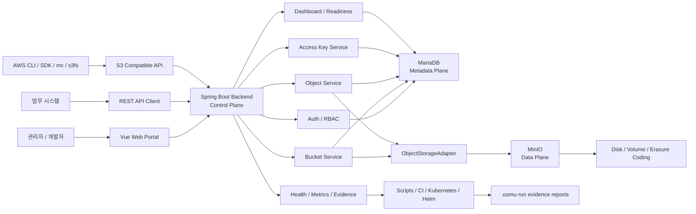

# OSMU - Private Object Storage Management Platform

OSMU(Object Storage Management Utility)는 기업 내부에 설치해서 쓰는 프라이빗 오브젝트 스토리지 관리 플랫폼입니다. MinIO를 실제 오브젝트 저장소로 사용하고, Spring Boot 백엔드가 인증, 권한, 버킷, 오브젝트 메타데이터, 쿼터, 감사 로그, 운영 증적을 관리합니다. Vue 기반 웹 포털은 관리자와 개발자가 이 기능을 사용할 수 있는 운영 콘솔을 제공합니다.

현재 저장소는 로컬 durable MVP 데모가 가능한 상태이며, MariaDB + MinIO + Backend + Frontend 조합으로 실제 저장소 흐름을 검증할 수 있습니다. Kubernetes/Helm, 백업/복구, HA/DR, 이미지 서명, 보안 증적 자동화는 제품화 준비 단계로 확장되어 있습니다.

## 핵심 목표

- 기업 내부망 또는 전용 인프라에 설치 가능한 S3 호환 오브젝트 스토리지 관리 플랫폼 제공
- 대용량 파일, 이미지, 영상, 백업, 로그, AI 데이터셋을 버킷 단위로 관리
- REST API, S3 호환 API, 웹 포털을 함께 제공
- 사용자, 조직, 버킷 권한, Access Key, 쿼터, 감사 로그를 중앙에서 관리
- MariaDB에는 메타데이터와 운영 상태를 저장하고, MinIO에는 실제 오브젝트 바이너리를 저장
- Docker Compose로 로컬 MVP를 재현하고, Kubernetes/Helm으로 운영 배포 기반을 확장

## 현재 상태

- 로컬 durable MVP 데모: 준비됨
- Docker Compose 기반 MariaDB/MinIO/backend/frontend 실행: 지원
- 브라우저 E2E, Docker smoke, Dockerized S3 client smoke: 지원
- 운영 readiness: Kubernetes live evidence와 security evidence 일부가 남아 있어 별도 추적 중
- 제품화 방향: Kubernetes HA/DR, storage expansion, backup/restore drill, security evidence finalizer로 확장 중

## 아키텍처 개요

OSMU는 다섯 개의 plane으로 역할을 나눕니다.

- **Web/API Plane**: 사용자가 접근하는 Vue 포털, REST API, S3 호환 API
- **Control Plane**: 인증, 권한, 버킷/오브젝트 정책, 쿼터, Access Key, 운영 워크플로를 처리하는 Spring Boot 백엔드
- **Metadata Plane**: 사용자, 조직, 버킷, 오브젝트 인덱스, 감사 로그, readiness 증적을 저장하는 MariaDB
- **Data Plane**: 실제 오브젝트 바이너리를 저장하는 MinIO
- **Operation Plane**: Docker/Kubernetes 배포, 백업/복구, 모니터링, CI evidence, release gate 자동화



## 구성요소 관계

### Frontend

`osmu-frontend`는 운영자가 보는 웹 포털입니다. 로그인, 대시보드, 버킷/오브젝트 탐색, 관리자 화면, 개발자 Access Key 화면, 감사/운영 readiness 화면을 제공합니다. 프론트엔드는 직접 MariaDB나 MinIO에 접근하지 않고, 백엔드 REST API만 호출합니다.

### Backend

`osmu-backend`는 제품의 중심 control plane입니다. REST API와 S3 호환 API를 제공하고, 인증/인가, 쿼터, 감사 로그, Access Key, 버킷 권한, storage expansion, backup/restore evidence, data-flow monitoring을 처리합니다.

백엔드 내부 흐름은 기본적으로 다음 구조를 따릅니다.

```text
Controller -> Service -> Repository
Controller -> Service -> ObjectStorageAdapter
```

- `Controller`: HTTP 요청/응답, 인증 사용자 전달, DTO validation
- `Service`: 도메인 정책, 권한 검사, 쿼터 검사, 트랜잭션 흐름
- `Repository`: MariaDB 또는 in-memory metadata 저장소
- `ObjectStorageAdapter`: MinIO 또는 in-memory object storage 접근 추상화

### MariaDB

MariaDB는 metadata plane입니다. 사용자, 조직, 버킷, 오브젝트 인덱스, Access Key, 쿼터 정책, 감사 로그, dashboard preset, storage expansion 요청, backup/restore drill evidence, data-flow event를 저장합니다.

중요한 경계는 다음과 같습니다.

- 실제 파일 본문은 MariaDB에 저장하지 않습니다.
- MariaDB는 검색, 목록, 권한, 감사, 운영 판단에 필요한 메타데이터의 source of truth입니다.
- MinIO에 직접 저장된 오브젝트와 MariaDB 인덱스가 어긋날 수 있으므로 metadata drift sync 흐름을 둡니다.

### MinIO

MinIO는 data plane입니다. 실제 오브젝트 바이너리, multipart part, bucket object payload를 저장합니다. OSMU는 MinIO를 직접 대체하지 않고, MinIO 위에 기업용 관리 계층을 얹는 구조입니다.

백엔드는 `ObjectStorageAdapter`를 통해 MinIO에 접근합니다. 이 경계 덕분에 테스트/데모에서는 in-memory adapter를 사용하고, durable demo/운영 모드에서는 MinIO adapter를 사용할 수 있습니다.

### Operations

`scripts`, `infra/k8s`, `infra/helm`, `.github/workflows`는 운영 plane입니다. 로컬 데모 실행, release readiness, Docker smoke, Kubernetes HA/DR, backup/restore drill, storage expansion finalizer, image signing, container scan/SBOM evidence 수집을 자동화합니다.

`.osmu-run`은 로컬 실행 결과와 증적 JSON/Markdown을 저장하는 작업 디렉터리이며 git에는 포함하지 않습니다.

## 주요 기능

- 인증/세션: 로그인, JWT, refresh/logout, route guard
- 사용자/조직: 사용자 생성, 상태 변경, 조직 생성/삭제, 조직별 버킷 관리
- 버킷: 생성, 목록, 상세, 삭제, 태그, 권한, 쿼터
- 오브젝트: 업로드, 다운로드, 목록/검색, 태그, soft delete, restore, purge
- S3 호환 API: SigV4, bucket/object 기본 동작, tagging, range GET, conditional request, CopyObject, multipart, multi-delete
- Access Key: one-time secret, bucket scope, 권한 분리, revoke/bulk disable, MinIO policy 연동 초안
- 쿼터/정책: 사용자/조직/버킷 quota policy, 변경 이력, dashboard 요약
- 공유/보안: password/IP 제한 object share link, usage limit, cleanup, analytics
- Lifecycle/Retention: retention policy, rule dry-run, conflict report, S3 lifecycle XML import/export
- Dashboard: widget catalog, layout preset, role/organization default preset, readiness panel
- Monitoring: data-flow event 저장, 필터 조회, source/operation/status 요약
- Storage Expansion: 증설 요청, dry-run/apply/rollback runner, GitOps artifact, execution history
- Operations Readiness: evidence plan, invocation unblock, workflow run id, artifact import/finalizer, convergence report

## 저장소 구조

```text
object-storage-osmu
├─ osmu-backend/          Spring Boot API, S3 compatibility, metadata repositories
├─ osmu-frontend/         Vue portal, mock API, Playwright E2E
├─ infra/local/           Docker Compose local durable demo
├─ infra/k8s/             Kubernetes manifests
├─ infra/helm/osmu/       Helm chart
├─ infra/monitoring/      Prometheus rules and Grafana dashboard draft
├─ scripts/               Local verification, release gates, operations evidence automation
├─ dev-docs/              Product, API, DB, frontend/backend, operations documents
└─ PRODUCT_REQUIREMENTS.md
```

## 실행 모드

### 1. MVP 자동 선택 모드

현재 머신에서 가능한 가장 강한 데모 모드를 자동으로 선택합니다.

```powershell
powershell -ExecutionPolicy Bypass -File .\scripts\start-mvp-demo.ps1 -Verify -ForcePorts
```

선택 순서:

1. Docker daemon 사용 가능: MariaDB + MinIO + Backend + Frontend durable demo
2. JDK 17+ 사용 가능: Spring Boot in-memory prototype + Vite frontend
3. 둘 다 어려움: frontend mock demo

중지:

```powershell
powershell -ExecutionPolicy Bypass -File .\scripts\stop-mvp-demo.ps1 -ForcePorts
```

### 2. 전체 로컬 durable demo

MariaDB, MinIO, Backend, Frontend를 Docker Compose로 실행합니다.

```powershell
powershell -ExecutionPolicy Bypass -File .\scripts\start-local-demo.ps1
```

데모 데이터를 포함해서 시작:

```powershell
powershell -ExecutionPolicy Bypass -File .\scripts\start-local-demo.ps1 -SeedDemo
```

시드 후 검증까지 실행:

```powershell
powershell -ExecutionPolicy Bypass -File .\scripts\start-local-demo.ps1 -SeedDemo -VerifyDemo
```

접속 정보:

- Frontend: `http://localhost:5173`
- Backend API: `http://localhost:8080/api`
- MinIO Console: `http://localhost:9001`
- OSMU login: `admin` / `password`
- MinIO login: `minioadmin` / `minioadmin`

중지:

```powershell
powershell -ExecutionPolicy Bypass -File .\scripts\stop-local-demo.ps1
```

볼륨 초기화:

```powershell
powershell -ExecutionPolicy Bypass -File .\scripts\stop-local-demo.ps1 -ResetData
```

### 3. Frontend mock demo

Java나 Docker 없이 UI/demo smoke를 확인할 때 사용합니다.

```powershell
powershell -ExecutionPolicy Bypass -File .\scripts\start-frontend-mock-demo.ps1
```

Mock login:

- Admin: `admin` / `password`
- Developer: `developer` / `password`

Mock API self-test:

```powershell
cd .\osmu-frontend
npm run mock:api:self-test
```

## 검증 명령

### 기본 사전 조건 확인

```powershell
powershell -ExecutionPolicy Bypass -File .\scripts\verify-prototype-prerequisites.ps1 -RequireNode
```

JDK 17 경로를 명시해서 로컬 검증:

```powershell
powershell -ExecutionPolicy Bypass -File .\scripts\verify-local.ps1 -JavaHome C:\jdk-17
```

프론트/static만 빠르게 확인:

```powershell
powershell -ExecutionPolicy Bypass -File .\scripts\verify-local.ps1 -SkipDocker -SkipBackend
```

### MVP demo readiness

현재 머신에서 가능한 검증을 종합해 MVP readiness report를 작성합니다.

```powershell
powershell -ExecutionPolicy Bypass -File .\scripts\verify-mvp-demo-readiness.ps1
```

Docker와 JDK가 준비된 환경:

```powershell
powershell -ExecutionPolicy Bypass -File .\scripts\verify-mvp-demo-readiness.ps1 -JavaHome C:\jdk-17 -S3Client docker-mc
```

### Durable MVP gate

Docker Desktop이 실행 중일 때 가장 강한 로컬 MVP 증적을 생성합니다. MariaDB + MinIO + Backend + Frontend를 시작하고, Browser E2E, Docker integration smoke, Dockerized S3 client smoke를 실행한 뒤 결과를 `.osmu-run`에 기록합니다.

```powershell
powershell -ExecutionPolicy Bypass -File .\scripts\verify-durable-demo-preflight.ps1
powershell -ExecutionPolicy Bypass -File .\scripts\verify-durable-demo-gate.ps1
```

최종 durable MVP 흐름:

```powershell
powershell -ExecutionPolicy Bypass -File .\scripts\finalize-durable-mvp-demo.ps1 -S3Client docker-mc
```

실행 계획만 확인:

```powershell
powershell -ExecutionPolicy Bypass -File .\scripts\finalize-durable-mvp-demo.ps1 -S3Client docker-mc -PlanOnly
```

### Browser E2E

Mock demo E2E:

```powershell
powershell -ExecutionPolicy Bypass -File .\scripts\verify-browser-e2e-mock-demo.ps1
```

Backend prototype E2E:

```powershell
powershell -ExecutionPolicy Bypass -File .\scripts\verify-browser-e2e-prototype.ps1 -JavaHome C:\jdk-17
```

Docker local demo E2E:

```powershell
powershell -ExecutionPolicy Bypass -File .\scripts\verify-browser-e2e-local-demo.ps1
```

Playwright가 Chromium을 내려받지 못하면 설치된 Chrome 또는 Edge channel을 사용할 수 있습니다.

```powershell
$env:OSMU_PLAYWRIGHT_CHANNEL="chrome"
powershell -ExecutionPolicy Bypass -File .\scripts\verify-browser-e2e-mock-demo.ps1
```

### S3 client smoke

Host AWS CLI, host MinIO Client, Dockerized MinIO Client 중 가능한 클라이언트를 사용합니다.

```powershell
powershell -ExecutionPolicy Bypass -File .\scripts\verify-s3-client-smoke.ps1 -Client auto -RequireClient
powershell -ExecutionPolicy Bypass -File .\scripts\verify-s3-client-smoke.ps1 -Client docker-mc -RequireClient
```

## Kubernetes와 운영 readiness

Kubernetes/Helm 배포 초안은 다음 경로에 있습니다.

- Kubernetes manifests: `infra/k8s`
- Helm chart: `infra/helm/osmu`
- Local overlay: `infra/k8s-overlays/osmu-dev`

검증:

```powershell
powershell -ExecutionPolicy Bypass -File .\scripts\verify-k8s-manifests.ps1
powershell -ExecutionPolicy Bypass -File .\scripts\verify-helm-chart.ps1
```

운영 readiness는 단순 static manifest 검증이 아니라 실제 증적 수집 흐름까지 포함합니다.

```powershell
powershell -ExecutionPolicy Bypass -File .\scripts\write-operations-readiness.ps1
powershell -ExecutionPolicy Bypass -File .\scripts\write-operations-evidence-plan.ps1
powershell -ExecutionPolicy Bypass -File .\scripts\write-operations-readiness-convergence.ps1
```

주요 남은 운영 증적 범위:

- Storage expansion finalizer live evidence
- Kubernetes HA/DR readiness live evidence
- Kubernetes DR finalizer live evidence
- Image signing evidence
- Container scan/SBOM evidence
- Security evidence finalizer report

## 개발 참고

- `.osmu-run/`은 로컬 실행 결과와 임시 도구를 담는 ignored directory입니다.
- Docker 스크립트는 repo-local Docker config `.osmu-run\docker-config`를 사용합니다.
- Backend test는 JDK 17+가 필요합니다.
- Frontend mock mode는 UI/demo smoke 용도이며, Spring Boot, MariaDB, MinIO, Docker, 실제 S3 client 검증을 대체하지 않습니다.
- 운영 apply 계열 스크립트는 기본적으로 plan/dry-run 경로를 먼저 제공하고, 실제 변경은 명시 옵션과 승인 플래그가 있어야 진행됩니다.

## 관련 문서

- 제품 요구사항: `PRODUCT_REQUIREMENTS.md`
- 기능 인벤토리: `dev-docs/feature-inventory.md`
- API 명세: `dev-docs/api-spec.md`
- OpenAPI MVP: `dev-docs/openapi-mvp.json`
- DB 설계: `dev-docs/database-design.md`
- Frontend 설계: `dev-docs/frontend-design.md`
- 운영 모니터링: `dev-docs/operation-monitoring.md`
- 배포 전략: `dev-docs/deployment-strategy.md`
- MVP release checklist: `dev-docs/mvp-release-checklist.md`
- 현재 prototype 상태: `dev-docs/prototype-status.md`
