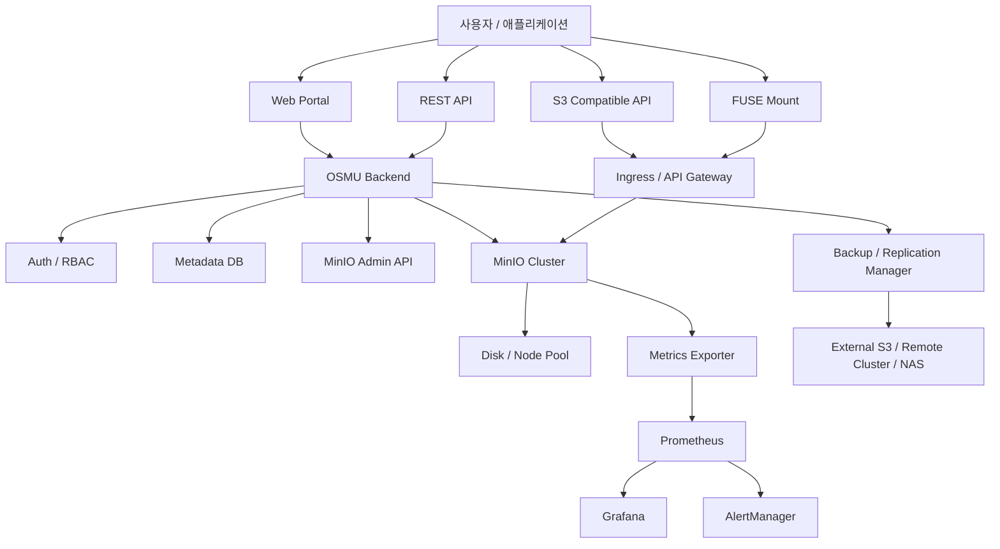

## Lifecycle Rule Requirement

- Admin can define multiple lifecycle rules by target type, prefix, and tag filter.
- Rule targets: soft-deleted trash objects and historical object versions.
- Each rule has enabled flag, priority, retention days, and purge batch size.
- Admin can run lifecycle rule dry-run to preview candidate count, bytes, and sample targets before deletion.
- Admin can view lifecycle rule conflict report for overlapping enabled rule scopes.
- Admin can export/import lifecycle rules using an AWS S3 LifecycleConfiguration XML-compatible subset.
- Bucket owners/admins can manage bucket-scoped lifecycle XML through `GET/PUT/DELETE /api/buckets/{bucketName}/lifecycle`.
- Bucket lifecycle API supports both JSON wrapper and raw XML request/response for stronger S3 client interoperability, including single `Content-MD5`, explicit `x-amz-checksum-*`, and matching `x-amz-sdk-checksum-algorithm` validation before replacement.
- OSMU also provides `/api/s3/{bucketName}?lifecycle` as a path-style S3 lifecycle alias using OSMU REST authentication or OSMU access key headers.
- Access key usage for bucket lifecycle alias requires active target bucket `ADMIN` scope.
- Bucket-scoped lifecycle rules only purge candidates in the configured bucket; global rules use empty `bucketName`.
- This supports B2B storage use cases where departments/projects require different retention windows.

## S3-style Object API Prototype

- Prototype supports root S3 bucket listing through `GET /api/s3` and service-level auth probe through `HEAD /api/s3`.
- Prototype supports bucket-level S3 compatibility operations through `PUT /api/s3/{bucketName}`, `HEAD /api/s3/{bucketName}`, `GET /api/s3/{bucketName}?location`, and `DELETE /api/s3/{bucketName}`.
- Prototype supports `PUT/HEAD/GET/DELETE /api/s3/{bucketName}/{objectKey}` for raw object upload, metadata read, download, and soft delete.
- Prototype supports temporary object share links through `POST/GET/DELETE /api/buckets/{bucketName}/objects/share-links`, `POST /api/buckets/{bucketName}/objects/share-links/cleanup`, scheduled cleanup, `GET/PUT /api/admin/object-share-policy`, `GET /api/admin/object-share-analytics`, and public `GET /api/public/share-links/{token}` for controlled reuse without requiring a portal login on the download side. Share links support expiry, revoke, optional or admin-required password protection, optional or admin-required IP/CIDR allowlist, optional/admin-capped max download count, download count, last-access tracking, bucket/status-filtered admin analytics, audit, and Prometheus cleanup metrics.
- Prototype supports S3 CopyObject through `PUT /api/s3/{bucketName}/{objectKey}` with `x-amz-copy-source`.
- Prototype supports MVP S3 multipart upload path through active upload listing, initiate, upload part, list parts, complete, and abort operations.
- Prototype supports basic `GET /api/s3/{bucketName}` ListObjects V1 XML with prefix, delimiter, marker, max key limit, `encoding-type=url`, and `fetch-owner=true`.
- Prototype supports basic `GET /api/s3/{bucketName}?list-type=2` ListObjectsV2 XML with prefix, delimiter, pagination token, max key limit, `encoding-type=url`, and `fetch-owner=true`.
- Prototype supports S3-style multi-object delete through `POST /api/s3/{bucketName}?delete`.
- Prototype supports single HTTP byte range GET for preview and resumable download use cases.
- Prototype supports S3-style object tagging XML through `GET/PUT/DELETE /api/s3/{bucketName}/{objectKey}?tagging`.
- Prototype returns AWS-style XML error bodies for `/api/s3/**` requests.
- The alias supports Bearer JWT or OSMU Access Key headers.
- The alias supports AWS SigV4 header authorization for access keys created with encrypted signing secret material.
- The alias supports AWS SigV4 query/presigned URL authorization with `UNSIGNED-PAYLOAD` for S3-style object reads.
- SigV4 auth enforces clock-skew and presigned URL expiration in the MVP.
- Non-streaming SigV4 object and multipart part uploads validate signed `x-amz-content-sha256` against the actual body. `UNSIGNED-PAYLOAD` is allowed. AWS `aws-chunked` request bodies are decoded with exact decoded length validation, per-chunk `chunk-signature` chain verification, and trailing checksum validation for SHA256/SHA1/CRC32/CRC32C/CRC64NVME.
- The alias supports MVP virtual-hosted-style routing for configured host suffixes, such as `Host: {bucket}.localhost` with path `/api/s3/{objectKey}`.
- Access Key root bucket listing only returns buckets in the key's still-valid scopes.
- Access Key scope maps object actions to `WRITE`, `READ`, and `DELETE`.
- Raw upload requires `Content-Length` and returns an MD5 `ETag`.
- Raw upload validates optional S3 `Content-MD5` and rejects invalid or mismatched digests.
- Raw upload validates one optional S3 checksum value header among `x-amz-checksum-sha256`, `x-amz-checksum-sha1`, `x-amz-checksum-crc32`, `x-amz-checksum-crc32c`, and `x-amz-checksum-crc64nvme`. If a single `x-amz-sdk-checksum-algorithm` is present without an explicit checksum value, it auto-computes the requested checksum, stores matching checksum metadata, returns the matching checksum response header, and exposes it on later `HEAD`/`GET` plus list checksum algorithm XML; duplicate SDK checksum algorithm headers are rejected as `InvalidRequest`.
- Raw upload supports destination `If-Match` and `If-None-Match: *` overwrite guards and returns `412 PreconditionFailed` before storing the request body when they fail.
- S3 object metadata responses expose `ETag` on `HEAD`, `GET`, `ListObjects`, and `ListObjectsV2` when available.
- S3 object `HEAD` and `GET` support conditional requests through `If-Match`, `If-None-Match`, `If-Modified-Since`, and `If-Unmodified-Since`, including AWS-documented combined-header precedence cases; Range GET supports one range and `If-Range` fallback to full object when the validator is stale. Multi-range GET is rejected because AWS S3 does not support retrieving multiple ranges in one GET.
- CopyObject requires `READ` on the source bucket and `WRITE` on the target bucket. Copied object body, content type, tags, user metadata, and stored checksum metadata are preserved by default. A single `x-amz-checksum-algorithm` can request a recalculated target checksum for supported algorithms (`SHA256`, `SHA1`, `CRC32`, `CRC32C`, `CRC64NVME`), duplicate or unsupported algorithm headers are rejected as `InvalidRequest`, copy result XML can expose stored checksum fields, and `x-amz-copy-source` can target OSMU-retained source versions with `?versionId=...`.
- CopyObject supports `COPY`/`REPLACE` directives for MVP content type, user metadata, and tag replacement.
- CopyObject supports source preconditions through ETag and Last-Modified headers, including AWS-documented combined-header precedence cases, plus destination `If-Match`/`If-None-Match` overwrite guards, and returns `412 PreconditionFailed` when they fail.
- S3 multipart initiate accepts optional OSMU expected-size metadata headers. When omitted, it creates an AWS-style unknown-size multipart session and checks quota on complete using the actual completed object size. It accepts a single supported `x-amz-checksum-algorithm` value (`SHA256`, `SHA1`, `CRC32`, `CRC32C`, `CRC64NVME`) plus a single `x-amz-checksum-type: COMPOSITE|FULL_OBJECT`, validates supported algorithm/type combinations, persists accepted checksum negotiation on the upload session, and echoes accepted checksum negotiation headers in the initiate response. Unsupported initiate controls such as non-private ACL/grant headers, Object Lock, server-side encryption, non-standard storage class, website redirect, and requester-pays are rejected as `InvalidRequest` before session creation.
- S3 multipart part upload validates optional `Content-MD5`, signed `x-amz-content-sha256`, and one optional `x-amz-checksum-*` value header, and returns the matching checksum response header.
- S3 multipart complete validates one optional supported final object checksum value header against the completed object, rejects multiple or unsupported `x-amz-checksum-*` value headers before storage completion, validates a single optional `x-amz-mp-object-size` against the actual completed object size, accepts a single `x-amz-checksum-type: FULL_OBJECT` with a final object checksum, stores matching checksum metadata, returns the matching checksum response header, and exposes it in complete-result XML. If initiate stored `FULL_OBJECT`, complete requires a matching final checksum algorithm and returns `BadDigest` before storage completion on mismatch.
- S3 multipart UploadPart validates explicit checksum headers/trailers, supports a single `x-amz-sdk-checksum-algorithm`, auto-computes and stores the initiated or SDK-selected checksum when no explicit checksum value is supplied, rejects duplicate SDK checksum algorithm headers as `InvalidRequest`, and ListParts emits stored checksum elements. CompleteMultipartUpload XML requires direct `Part` children with exactly one direct `PartNumber` and exactly one direct `ETag`, accepts at most one optional supported per-part checksum element per `Part`, rejects multiple supported or unsupported per-part checksum elements such as `ChecksumMD5`, `ChecksumSHA512`, and `ChecksumXXHASH*`, and validates supported checksum syntax before storage completion; when XML omits per-part checksums, stored UploadPart checksum metadata is merged before validation. When every completed part supplies the same `ChecksumSHA256`, `ChecksumSHA1`, `ChecksumCRC32`, or `ChecksumCRC32C` value and no final object checksum header is supplied, OSMU stores the AWS-style composite checksum calculated from the ordered part checksum bytes and accepts `x-amz-checksum-type: COMPOSITE`. If initiate stored `COMPOSITE`, complete requires matching per-part checksum algorithm/type shape and returns `BadDigest` before storage completion on mismatch. `CRC64NVME` is supported as a full-object multipart checksum only.
- S3 multipart complete rejects missing uploaded parts, stale per-part ETags, and failed destination `If-Match`/`If-None-Match` overwrite guards before storage completion.
- Missing S3 multipart upload IDs return S3 XML `NoSuchUpload`.
- S3 multipart ListParts supports `max-parts`/`part-number-marker` pagination and returns `PartNumberMarker`, `NextPartNumberMarker`, `MaxParts`, and `IsTruncated` XML fields.
- S3 responses expose `x-amz-request-id` and `x-amz-id-2` for client compatibility and request tracing. S3 XML error bodies include `Code`, `Message`, `Resource`, `RequestId`, and `HostId`, with XML `RequestId`/`HostId` matching those headers. S3 `AccessDenied` errors use HTTP `403` and message `Access Denied`; S3 `InvalidRange` errors use HTTP `416` and message `The requested range cannot be satisfied.`; S3 not-found errors use AWS-style `NoSuchBucket`, `NoSuchKey`, and `NoSuchUpload` messages; S3 `PreconditionFailed` errors use HTTP `412` and AWS-style precondition text.
- Bucket-level responses include `x-amz-bucket-region`; MVP default region is `us-east-1`.
- S3-style bucket creation currently uses Bearer JWT auth, accepts S3 `CreateBucketConfiguration/LocationConstraint` XML when it matches the configured storage region, rejects malformed or unexpected CreateBucket XML as `InvalidRequest`, rejects unsupported CreateBucket control headers (`x-amz-acl` values other than `private`, grant ACL headers, object lock enabled, non-default object ownership, and account-regional bucket namespace) as `InvalidRequest`, and returns S3 XML `BucketAlreadyOwnedByYou`/`BucketAlreadyExists` for duplicate creates; bucket deletion supports JWT or an OSMU Access Key with target bucket `ADMIN` scope, requires no active objects or retained object versions, and returns S3 XML `BucketNotEmpty` when bucket data still exists.
- `x-amz-tagging` and `X-OSMU-Tags` are accepted for upload tags.
- Multi-object delete uses the same soft-delete behavior as the REST object API and treats missing keys as deleted for S3 compatibility.
- Object tagging XML uses the same metadata tag store as the REST object API; tag read requires `READ`, tag update/delete requires `WRITE`.
- AWS S3 전체 동작 호환은 제품 요구사항이 아니다. S3 compatibility is scoped to replacement use for common clients and SDKs: authentication, bucket/object CRUD, multipart upload, copy, tagging, lifecycle XML subset, basic checksum, and clear XML errors. AWS edge behavior is only expanded when a supported real-client smoke or target migration scenario proves product impact. `dev-docs/s3-compatibility.md` tracks the supported/partial/unsupported matrix.
# Private Object Storage Platform 기획서 초안

## 1. 문서 개요

이 문서는 기업용 프라이빗 오브젝트 스토리지 플랫폼의 초기 기획, MVP 요구사항, 기능 명세, 시스템 구성 방향을 정리한 초안이다.

본 프로젝트는 MinIO와 Kubernetes 기반 사내 오브젝트 스토리지 구축 사례에서 출발하되, 특정 회사 내부 구축을 넘어 여러 기업 환경에 설치하고 운영할 수 있는 B2B 제품형 플랫폼을 목표로 한다.

프로젝트의 최종 목표와 장기 방향은 `PROJECT_MEMORY.md`에 별도로 고정해둔다. 구현 중 세부 결정이 바뀌더라도 해당 문서를 기준으로 제품 방향을 다시 확인한다.

### 1.1 문서 목적

- 제품의 목표와 문제 정의를 명확히 한다.
- MVP 범위를 정한다.
- 기능 요구사항과 비기능 요구사항을 정리한다.
- 초기 시스템 아키텍처와 개발 순서를 정의한다.
- 향후 제품화, 배포, 판매 전략의 기준 문서로 사용한다.

### 1.2 참고 방향

참고한 DEVOCEAN 글은 MinIO와 Kubernetes를 이용해 사내 오브젝트 스토리지 서비스를 구축한 사례이다.

- 참고 URL: https://devocean.sk.com/blog/techBoardDetail.do?ID=166948&boardType=techBlog

본 프로젝트는 해당 사례와 유사하게 S3 호환 오브젝트 스토리지, Kubernetes 기반 운영, 사내 데이터 통합 관리, REST API, 포털, 모니터링을 핵심 구성으로 삼는다. 다만 최종 목표는 한 회사 내부 서비스가 아니라, 여러 기업에 적용 가능한 범용 프라이빗 스토리지 플랫폼을 만드는 것이다.

## 2. 제품 개요

### 2.1 제품 한 줄 정의

기업이 AWS S3 같은 외부 클라우드 스토리지에 의존하지 않고, 자체 인프라 위에서 대용량 파일을 안전하게 저장, 관리, 공유, 재사용할 수 있도록 하는 S3 호환 프라이빗 오브젝트 스토리지 플랫폼.

### 2.2 제품 이름 가칭

- OSMU: Object Storage Management Utility
- Private Object Storage Platform
- Enterprise Object Storage Platform
- Private S3 Storage Platform

이 문서에서는 임시로 `OSMU`라고 부른다.

### 2.3 핵심 가치

- 기업 내부에 자체 S3 호환 스토리지를 구축할 수 있다.
- 영상, 이미지, 문서, 로그, 백업 파일, AI 학습 데이터 등 다양한 파일을 통합 저장할 수 있다.
- 외부 클라우드 스토리지 비용과 보안 리스크를 줄일 수 있다.
- 사용자, 조직, 버킷, 권한, 용량, 백업을 중앙에서 관리할 수 있다.
- REST API, S3 API, Web Portal, FUSE Mount 등 여러 접근 방식을 제공한다.
- 설치형 제품으로 온프레미스, 프라이빗 클라우드, 하이브리드 환경에 적용할 수 있다.

## 3. 문제 정의

기업 내부에서는 대용량 파일을 여러 방식으로 저장하는 경우가 많다.

- AWS S3, GCP Storage, Azure Blob 같은 외부 클라우드 스토리지
- FTP 서버
- NAS
- 부서별 파일 서버
- USB, 외장 하드디스크
- 개별 서버 디스크
- 애플리케이션별 독립 저장소

이 방식은 다음 문제를 만든다.

### 3.1 통합 스토리지 부재

부서와 서비스마다 저장 방식이 다르면 파일 위치, 소유자, 접근 권한, 사용량을 통합 관리하기 어렵다. 데이터 공유도 비효율적이며, 같은 데이터가 여러 곳에 중복 저장될 가능성이 높다.

### 3.2 보안 문제

외부 클라우드, 개인 저장 장치, 임의 FTP 서버를 사용하면 민감 데이터 유출 위험이 커진다. 접근 제어, 감사 로그, 암호화, 권한 회수도 일관되게 관리하기 어렵다.

### 3.3 비용 비효율

외부 스토리지 사용량이 증가하면 장기 비용이 커질 수 있다. 특히 영상, 이미지, AI 학습 데이터처럼 용량이 빠르게 증가하는 데이터는 저장 비용, 다운로드 비용, API 호출 비용이 부담이 된다.

### 3.4 운영 복잡성

스토리지마다 관리 방식이 다르면 백업, 장애 대응, 용량 증설, 모니터링 체계가 분산된다. 장애 발생 시 원인 파악과 복구도 어렵다.

### 3.5 기존 시스템의 한계

Hadoop, HBase, NAS, FTP 등 기존 저장 방식은 특정 워크로드에는 적합하지만, 대량의 비정형 파일을 S3 API 기반으로 저장하고 다양한 서비스와 쉽게 연동하는 데에는 한계가 있다.

## 4. 제품 목표

### 4.1 비즈니스 목표

- B2B 설치형 스토리지 플랫폼으로 판매 가능한 제품을 만든다.
- 기업 내부 데이터 저장소를 통합할 수 있는 대안을 제공한다.
- 외부 클라우드 스토리지 비용을 줄이고 싶은 고객을 대상으로 한다.
- 보안상 외부 클라우드 사용이 어려운 기업에 프라이빗 스토리지 솔루션을 제공한다.
- 미디어, AI, 연구, 제조, 공공, 헬스케어 등 대용량 파일이 많은 산업에 적용한다.

### 4.2 기술 목표

- S3 호환 API를 제공한다.
- REST API를 제공한다.
- 웹 기반 관리 포털을 제공한다.
- MinIO 기반 오브젝트 스토리지 클러스터와 연동한다.
- Kubernetes 기반 배포를 지원한다.
- 초기 개발과 테스트를 위해 Docker Compose 기반 로컬 배포도 지원한다.
- 사용자, 조직, 버킷, 권한, 용량, 키를 관리한다.
- 모니터링과 알림 기반 운영 체계를 제공한다.
- 백업과 복구 기능을 단계적으로 제공한다.

## 5. 대상 고객

### 5.1 초기 고객군

- 영상 저장이 많은 스트리밍 플랫폼
- 이미지, 비디오, 음성 데이터를 다루는 미디어 기업
- AI 학습 데이터가 많은 기업
- 내부 클라우드 스토리지가 필요한 대기업 및 중견기업
- 외부 클라우드 사용이 제한되는 보안 민감 조직
- 사내 파일 저장소를 통합하려는 기업
- 연구소, 제조사, 공공기관, 헬스케어 조직

### 5.2 주요 사용자

#### 시스템 관리자

- 제품을 설치하고 운영한다.
- 스토리지 클러스터 상태를 확인한다.
- 사용자, 조직, 권한, 용량 정책을 관리한다.
- 백업, 복제, 알림 정책을 설정한다.

#### 조직 관리자

- 특정 부서 또는 프로젝트의 저장소를 관리한다.
- 팀 구성원에게 권한을 부여한다.
- 버킷과 사용량을 관리한다.

#### 일반 사용자

- 파일을 업로드, 다운로드, 삭제한다.
- 자신의 버킷과 접근 키를 확인한다.
- REST API 또는 S3 클라이언트를 통해 데이터를 사용한다.

#### 애플리케이션 개발자

- AWS SDK, boto3, MinIO Client, REST API 등으로 스토리지에 접근한다.
- 서비스에서 생성되는 이미지, 영상, 로그, 백업 파일을 저장한다.

## 6. 사용 시나리오

### 6.1 사내 대용량 파일 저장소

기업은 여러 부서가 흩어져 저장하던 대용량 파일을 OSMU에 통합한다. 관리자는 조직별 버킷과 용량을 할당하고, 사용자는 웹 포털 또는 S3 API로 파일을 저장한다.

### 6.2 스트리밍 플랫폼의 원본 영상 저장

스트리밍 서비스는 업로드된 원본 영상과 인코딩 결과물을 OSMU에 저장한다. 애플리케이션은 S3 API로 영상을 업로드하고, 내부 처리 파이프라인은 REST API 또는 S3 API로 파일을 읽는다.

### 6.3 AI 학습 데이터 저장

AI 팀은 이미지, 동영상, 라벨링 결과, 모델 파일을 OSMU에 저장한다. 데이터셋은 버킷 단위로 관리되고, 학습 서버는 S3 호환 클라이언트 또는 FUSE Mount를 통해 데이터를 사용한다.

### 6.4 클라우드 비용 절감

기업은 자주 사용되는 대용량 데이터를 외부 S3 대신 내부 스토리지에 저장한다. 장기 보관이 필요한 데이터는 외부 클라우드나 별도 백업 저장소로 복제한다.

### 6.5 보안 민감 데이터 저장

외부 클라우드에 저장하기 어려운 데이터는 OSMU에 저장한다. 접근 권한, 감사 로그, 네트워크 제어, 키 관리를 통해 내부 보안 정책을 적용한다.

## 7. 제품 범위

### 7.1 MVP에 포함할 범위

- MinIO 연동
- S3 호환 API 사용 지원
- 자체 REST API 제공
- 관리자/사용자 웹 포털
- 사용자 계정 관리
- 조직 또는 프로젝트 관리
- 버킷 생성, 조회, 삭제
- 파일 업로드, 다운로드, 삭제
- Access Key / Secret Key 발급
- 기본 권한 정책
- 사용자별 또는 버킷별 용량 제한
- 사용량 조회
- 기본 감사 로그
- 기본 모니터링 연동
- Docker Compose 기반 로컬 실행
- Kubernetes 배포 문서 또는 Helm Chart 초안

### 7.2 MVP에서 제외할 범위

- 자체 오브젝트 스토리지 엔진 직접 구현
- 완전한 멀티 리전 복제
- 고급 과금 시스템
- 고급 미디어 변환 기능
- CDN 연동
- 자동 장애 복구 전체 자동화
- 모든 RAID 레벨 직접 지원
- 완전한 SaaS 멀티테넌트 과금 모델

### 7.3 향후 확장 범위

- 클라우드 백업
- 멀티 클러스터 복제
- 데이터 수명주기 정책
- 파일 암호화 정책 고도화
- 감사 로그 고도화
- 부서별 비용 분석 리포트
- 영상 썸네일 생성
- 미디어 메타데이터 추출
- 오브젝트 태깅과 검색
- SSO 연동
- LDAP/Active Directory 연동
- 정책 기반 자동 아카이빙
- 설치 마법사
- 라이선스 관리

## 8. 시스템 아키텍처 초안

### 8.1 전체 구조



### 8.2 구성 요소

#### Storage Engine

초기 버전에서는 MinIO를 사용한다. MinIO는 S3 호환 API, Erasure Coding, 복제, 고가용성 구성이 가능하며 Kubernetes와 잘 결합된다.

#### Backend API

제품의 Control Plane 역할을 한다. 사용자, 조직, 버킷, 권한, 키, 용량, 사용량, 백업 정책을 관리한다.

#### Web Portal

관리자와 사용자가 브라우저에서 스토리지를 관리할 수 있는 화면을 제공한다.

#### Metadata DB

제품 자체의 사용자, 조직, 정책, 감사 로그, 설정 정보를 저장한다. 실제 파일 데이터는 MinIO에 저장한다.

#### API Gateway / Ingress

외부 요청을 내부 서비스로 라우팅한다. 인증, 트래픽 제어, TLS, 접근 제한을 적용할 수 있다.

#### Monitoring Stack

Prometheus, Grafana, AlertManager를 사용해 스토리지 상태, 사용량, 노드 상태, 장애 알림을 제공한다.

#### Backup Manager

초기에는 수동 설정 수준으로 시작하고, 향후 다른 S3 호환 저장소, 원격 클러스터, NAS 등으로 백업/복제하는 기능을 제공한다.

## 9. 기술 스택 초안

### 9.1 Backend

후보:

- Java / Spring Boot
- Node.js / NestJS
- Go

초기 추천:

- 팀이 Java/Spring에 익숙하면 Spring Boot
- 인프라 도구와 단일 바이너리 배포를 중시하면 Go
- 빠른 MVP와 프론트 연동을 중시하면 NestJS

### 9.2 Frontend

후보:

- React
- Next.js
- Vue

초기 추천:

- React 또는 Next.js 기반 관리자 포털

### 9.3 Storage

- MinIO
- 추후 Ceph RGW, SeaweedFS 등 검토 가능

### 9.4 Database

- MariaDB

MVP 기준 기본 RDBMS는 MariaDB로 한다.

역할:

- 사용자, 조직, 버킷, 권한, Access Key, Quota, AuditLog, 시스템 설정 저장
- 실제 파일 데이터는 저장하지 않음
- 실제 오브젝트 데이터는 MinIO에 저장

### 9.5 Cache / Queue

초기 MVP에서는 필수 아님.

향후 후보:

- Redis
- RabbitMQ
- Kafka

### 9.6 Infra

- Docker Compose
- Kubernetes
- Helm
- Ingress NGINX 또는 APISIX
- Prometheus
- Grafana
- AlertManager

## 10. MVP 요구사항 명세서

### 10.1 MVP 목표

MVP의 목표는 기업 내부에 설치 가능한 최소한의 프라이빗 오브젝트 스토리지 플랫폼을 구현하는 것이다.

MVP가 완료되면 다음이 가능해야 한다.

- 관리자가 사용자를 만들 수 있다.
- 사용자가 버킷을 만들 수 있다.
- 사용자가 파일을 업로드, 다운로드, 삭제할 수 있다.
- 애플리케이션이 S3 API로 접근할 수 있다.
- 애플리케이션이 REST API로 접근할 수 있다.
- 관리자가 사용량과 기본 상태를 확인할 수 있다.
- 로컬 또는 서버 환경에서 설치해 데모할 수 있다.

### 10.2 MVP 성공 기준

- Docker Compose로 전체 시스템을 실행할 수 있다.
- MinIO와 Backend가 정상 연결된다.
- 웹 포털에서 로그인할 수 있다.
- 웹 포털에서 버킷 목록을 볼 수 있다.
- 웹 포털에서 파일 업로드/다운로드/삭제가 가능하다.
- REST API로 파일 업로드/다운로드/삭제가 가능하다.
- S3 클라이언트로 파일 업로드/다운로드가 가능하다.
- 사용자별 또는 버킷별 기본 용량 제한을 적용할 수 있다.
- 관리자 화면에서 전체 사용량을 볼 수 있다.
- 기본 설치 문서와 API 문서가 존재한다.

### 10.3 MVP 사용자 역할

#### Admin

- 전체 시스템 관리
- 사용자 생성/비활성화
- 조직 생성
- 버킷 관리
- 용량 정책 관리
- 사용량 조회
- 시스템 상태 조회

#### User

- 본인 버킷 조회
- 파일 업로드/다운로드/삭제
- Access Key 확인 또는 재발급
- REST API Token 확인 또는 재발급
- 본인 사용량 조회

#### Auditor

- 감사 로그 조회와 CSV export
- 운영 usage/status/dashboard summary/readiness 조회
- backup status와 restore drill evidence 조회
- 사용자/조직/쿼터/증설/복구 증거 기록 같은 변경성 admin 작업 차단

### 10.4 MVP 기능 목록

| 구분 | 기능 | 우선순위 | MVP 포함 |
| --- | --- | --- | --- |
| 인증 | 로그인 | P0 | 포함 |
| 인증 | 로그아웃 | P0 | 포함 |
| 인증 | JWT 기반 API 인증 | P0 | 포함 |
| 사용자 | 사용자 생성 | P0 | 포함 |
| 사용자 | 사용자 비활성화 | P1 | 포함 |
| 조직 | 조직 생성 | P1 | 포함 |
| 조직 | 조직별 사용자 연결 | P1 | 포함 |
| 버킷 | 버킷 생성 | P0 | 포함 |
| 버킷 | 버킷 목록 조회 | P0 | 포함 |
| 버킷 | 버킷 삭제 | P0 | 포함 |
| 파일 | 파일 업로드 | P0 | 포함 |
| 파일 | 파일 다운로드 | P0 | 포함 |
| 파일 | 파일 삭제 | P0 | 포함 |
| 파일 | 파일 목록 조회 | P0 | 포함 |
| 키 | Access Key 발급 | P0 | 포함 |
| 키 | Secret Key 재발급 | P1 | 포함 |
| API | S3 API 사용 | P0 | 포함 |
| API | REST API 사용 | P0 | 포함 |
| 권한 | 버킷 소유자 권한 | P0 | 포함 |
| 권한 | 읽기/쓰기 권한 분리 | P1 | 포함 |
| 용량 | 사용자별 쿼터 | P1 | 포함 |
| 용량 | 버킷별 사용량 조회 | P1 | 포함 |
| 운영 | 기본 상태 대시보드 | P1 | 포함 |
| 운영 | Prometheus 연동 | P2 | 일부 포함 |
| 감사 | 파일 작업 로그 | P1 | 포함 |
| 배포 | Docker Compose | P0 | 포함 |
| 배포 | Kubernetes Manifest | P2 | 초안 포함 |

## 11. 기능 명세서

### 11.1 인증 기능

#### 11.1.1 로그인

사용자는 이메일 또는 아이디와 비밀번호로 로그인한다.

초기 관리자 계정은 bootstrap 정책으로 생성한다. 로컬/demo 환경은 기본 credential을 허용할 수 있지만, 운영 배포는 기본 비밀번호를 금지하고 Secret 기반 admin 비밀번호를 요구한다. 운영자가 초기 admin을 별도로 관리하는 환경에서는 bootstrap 자동 생성을 끌 수 있다.

입력:

- loginId
- password

출력:

- accessToken
- refreshToken
- user profile

정책:

- 비밀번호는 해시로 저장한다.
- 로그인 실패 횟수 제한은 MVP 이후 고도화한다.
- JWT 기반 인증을 기본으로 한다.
- refresh token 만료/폐기 또는 저장 session 복구 실패 시 클라이언트는 session state를 정리하고 login 화면에서 재로그인 안내를 표시한다.

#### 11.1.2 로그아웃

사용자는 현재 세션을 종료할 수 있다.

MVP에서는 클라이언트 토큰 삭제 방식으로 처리하고, 향후 refresh token blacklist 또는 session table을 도입할 수 있다.

#### 11.1.3 API Token

REST API 접근을 위한 토큰을 발급한다.

정책:

- 사용자 단위로 발급한다.
- 만료일을 설정할 수 있다.
- 토큰은 생성 시에만 원문을 노출한다.
- 서버에는 해시된 토큰만 저장한다.

### 11.2 사용자 관리

#### 11.2.1 사용자 생성

관리자는 사용자를 생성할 수 있다.

입력:

- 이름
- 이메일
- 로그인 ID
- 임시 비밀번호
- 역할
- 소속 조직

출력:

- 사용자 ID
- 생성 상태

#### 11.2.2 사용자 조회

관리자는 사용자 목록과 상세 정보를 조회할 수 있다.

조회 항목:

- 사용자 ID
- 이름
- 이메일
- 역할
- 소속 조직
- 상태
- 생성일
- 최근 로그인 시간
- 사용량

#### 11.2.3 사용자 비활성화

관리자는 사용자를 비활성화할 수 있다.

정책:

- 비활성화된 사용자는 로그인할 수 없다.
- 기존 Access Key는 비활성화 처리한다.
- 파일 데이터는 즉시 삭제하지 않는다.

### 11.3 조직 관리

#### 11.3.1 조직 생성

관리자는 조직 또는 프로젝트를 생성할 수 있다.

입력:

- 조직명
- 설명
- 기본 용량 제한

#### 11.3.2 조직별 사용자 관리

관리자는 사용자를 조직에 연결할 수 있다.

정책:

- 사용자는 하나 이상의 조직에 속할 수 있다.
- MVP에서는 단일 조직 소속만 먼저 지원해도 된다.

### 11.4 버킷 관리

#### 11.4.1 버킷 생성

사용자 또는 관리자는 버킷을 생성할 수 있다.

입력:

- bucketName
- ownerType
- ownerId
- quota
- visibility

정책:

- 버킷 이름은 전체 시스템에서 유니크해야 한다.
- S3 버킷 이름 규칙을 따른다.
- 기본 visibility는 private이다.
- 생성 시 MinIO에 실제 버킷을 생성한다.
- Metadata DB에 버킷 정보를 저장한다.

#### 11.4.2 버킷 조회

사용자는 본인이 접근 가능한 버킷만 조회할 수 있다.

관리자는 전체 버킷을 조회할 수 있다.

조회 항목:

- 버킷 이름
- 소유자
- 생성일
- 사용량
- 파일 수
- 권한 정책
- 쿼터

#### 11.4.3 버킷 삭제

버킷 소유자 또는 관리자는 버킷을 삭제할 수 있다.

정책:

- MVP에서는 빈 버킷만 삭제할 수 있게 한다.
- 향후 강제 삭제 기능을 제공한다.
- 삭제 작업은 감사 로그에 기록한다.

### 11.5 파일 관리

#### 11.5.1 파일 업로드

사용자는 웹 포털 또는 REST API로 파일을 업로드할 수 있다.

입력:

- bucketName
- objectKey
- file
- contentType
- metadata

정책:

- 파일 확장자는 제한하지 않는다.
- 파일 크기 제한은 시스템 설정으로 관리한다.
- 대용량 파일은 multipart upload를 지원한다.
- 업로드 전 쿼터 초과 여부를 확인한다.
- 업로드 성공 후 감사 로그를 남긴다.

#### 11.5.2 파일 다운로드

사용자는 권한이 있는 파일을 다운로드할 수 있다.

입력:

- bucketName
- objectKey

출력:

- file stream
- contentType
- contentLength

정책:

- REST API 다운로드와 presigned URL 다운로드를 모두 고려한다.
- MVP에서는 REST API 또는 presigned URL 중 하나를 먼저 구현한다.

#### 11.5.3 파일 삭제

사용자는 권한이 있는 파일을 삭제할 수 있다.

정책:

- 삭제는 감사 로그에 기록한다.
- 향후 soft delete 또는 versioning을 지원할 수 있다.
- 현재 MVP는 soft delete 기반 trash/restore/purge 흐름을 제공한다.

#### 11.5.4 파일 목록 조회

사용자는 버킷 내 파일 목록을 조회할 수 있다.

기능:

- prefix 기반 조회
- 페이지네이션
- 파일 크기 표시
- 수정일 표시
- content type 표시

### 11.6 S3 호환 API

MVP에서는 MinIO가 제공하는 S3 API를 그대로 사용한다.

지원 대상:

- AWS CLI
- AWS SDK
- boto3
- MinIO Client
- s3fs-fuse
- goofys

정책:

- 사용자는 발급받은 Access Key와 Secret Key로 접근한다.
- 네트워크 접근은 Ingress 또는 API Gateway를 통해 제공한다.
- 제품 Backend는 Access Key 발급, 권한 정책 생성, 버킷 생성 등을 관리한다.

### 11.7 REST API

제품 자체 REST API를 제공한다.

주요 API:

- POST /api/auth/login
- POST /api/auth/logout
- GET /api/users/me
- GET /api/buckets
- POST /api/buckets
- GET /api/buckets/{bucketName}
- DELETE /api/buckets/{bucketName}
- GET /api/buckets/{bucketName}/objects
- POST /api/buckets/{bucketName}/objects
- GET /api/buckets/{bucketName}/objects/{objectKey}
- DELETE /api/buckets/{bucketName}/objects/{objectKey}
- GET /api/access-keys
- POST /api/access-keys
- DELETE /api/access-keys/{keyId}
- GET /api/admin/usage
- GET /api/admin/system/status

### 11.8 권한 관리

#### 11.8.1 역할

MVP 역할:

- ADMIN
- ORG_ADMIN
- USER

#### 11.8.2 권한 정책

MVP 권한:

- bucket:read
- bucket:write
- bucket:delete
- object:read
- object:write
- object:delete
- accessKey:manage
- admin:manage

#### 11.8.3 버킷 권한

버킷별로 사용자 또는 조직에 권한을 부여한다.

정책:

- 소유자는 기본적으로 read/write/delete 권한을 가진다.
- 공유 사용자는 read 또는 write 권한을 받을 수 있다.
- Public bucket은 MVP에서는 지원하지 않는다.

### 11.9 용량 관리

#### 11.9.1 사용자 쿼터

사용자별 총 사용 가능 용량을 설정할 수 있다.

예:

- 기본 100GB
- 부서별 10TB
- 프로젝트별 50TB

#### 11.9.2 버킷 쿼터

버킷별 용량 제한을 설정할 수 있다.

정책:

- 업로드 전 예상 용량을 확인한다.
- MinIO 사용량 조회와 자체 메타데이터를 조합한다.

#### 11.9.3 사용량 조회

사용자는 본인 사용량을 조회한다.

관리자는 전체 사용량, 조직별 사용량, 버킷별 사용량을 조회한다.

### 11.10 감사 로그

다음 이벤트를 기록한다.

- 로그인 성공/실패
- 사용자 생성/비활성화
- 버킷 생성/삭제
- 파일 업로드
- 파일 다운로드
- 파일 삭제
- Access Key 생성/삭제
- 권한 변경
- 쿼터 변경

로그 항목:

- eventId
- eventType
- actorId
- actorRole
- targetType
- targetId
- ipAddress
- userAgent
- createdAt
- result

### 11.11 모니터링

MVP에서 제공할 지표:

- 전체 저장 용량
- 사용 중인 용량
- 남은 용량
- 버킷 수
- 오브젝트 수
- 사용자 수
- 업로드 요청 수
- 다운로드 요청 수
- 에러 수
- MinIO 상태

향후 제공할 지표:

- 노드별 디스크 사용률
- 디스크 장애 상태
- 네트워크 I/O
- 디스크 I/O
- API latency
- p95/p99 응답 시간
- 버킷별 트래픽
- 사용자별 트래픽

### 11.12 백업 및 복구

MVP:

- 백업 설정 화면 초안
- 외부 S3 호환 저장소로 수동 복제 가이드
- 데이터 복구 절차 문서화

향후:

- 스케줄 기반 백업
- 원격 클러스터 복제
- 버킷 단위 백업 정책
- 특정 시점 복구
- 백업 상태 대시보드
- 백업 실패 알림

## 12. 비기능 요구사항

### 12.1 확장성

- 노드와 디스크 추가를 통해 저장 용량을 확장할 수 있어야 한다.
- Backend API는 수평 확장을 고려해야 한다.
- 대용량 파일 업로드 시 streaming 또는 multipart upload를 사용해야 한다.

### 12.2 안정성

- MinIO의 Erasure Coding 또는 Replication을 사용해 디스크 장애에 대응한다.
- 서비스 장애 시 재시작 가능한 컨테이너 구조로 구성한다.
- Metadata DB는 백업 가능해야 한다.

### 12.3 보안

- 모든 API는 인증을 거쳐야 한다.
- 기본 버킷은 private이어야 한다.
- 비밀번호와 토큰은 평문 저장하지 않는다.
- Access Key와 Secret Key는 노출을 최소화한다.
- TLS 적용을 지원해야 한다.
- 감사 로그를 기록해야 한다.

### 12.4 성능

- 대용량 파일 업로드와 다운로드가 가능해야 한다.
- 파일 목록 조회는 페이지네이션을 지원해야 한다.
- Backend를 통한 파일 전송은 병목이 될 수 있으므로 presigned URL 방식도 고려한다.

### 12.5 호환성

- AWS SDK, boto3, AWS CLI, MinIO Client의 핵심 bucket/object/multipart 사용 흐름과 호환되어야 한다.
- AWS S3 전체 동작 복제가 아니라 내부 스토리지 전환에 필요한 대체 가능성을 목표로 한다.
- S3 호환성은 제품 확장 우선순위가 아니라 회귀 검증 기준이다. 새 S3 세부 동작은 지원 클라이언트 smoke 실패나 고객 전환 blocker가 확인될 때만 추가한다.
- s3fs-fuse, goofys 같은 FUSE 기반 마운트 도구는 고객 전환 시나리오가 확인될 때 연동 범위와 검증 기준을 확정한다.

### 12.6 운영성

- Docker Compose로 로컬 실행이 가능해야 한다.
- Kubernetes 배포 구성을 제공해야 한다.
- 로그와 메트릭을 확인할 수 있어야 한다.
- 장애 알림 체계를 확장할 수 있어야 한다.

## 13. RAID와 데이터 내구성 전략

제품 마케팅에서는 RAID 0, 1, 5, 6 등 전통적인 RAID 레벨을 직접 지원한다고 표현하기보다, 오브젝트 스토리지에 적합한 데이터 내구성 정책으로 정리하는 것이 좋다.

### 13.1 권장 표현

- 데이터 복제 정책
- Erasure Coding 정책
- 디스크 장애 허용 수준
- 노드 장애 허용 수준
- 백업 정책
- 복구 정책
- 데이터 내구성 레벨

### 13.2 MVP 전략

- MinIO의 Erasure Coding을 기본 사용한다.
- 복제와 백업은 향후 확장 기능으로 둔다.
- 디스크/노드 장애 허용 수준은 설치 구성에 따라 문서화한다.

## 14. 데이터 모델 초안

### 14.1 User

- id
- loginId
- email
- name
- passwordHash
- role
- status
- organizationId
- createdAt
- updatedAt
- lastLoginAt

### 14.2 Organization

- id
- name
- description
- defaultQuotaBytes
- createdAt
- updatedAt

### 14.3 Bucket

- id
- name
- ownerType
- ownerId
- quotaBytes
- usedBytes
- status
- createdAt
- updatedAt

### 14.4 AccessKey

- id
- userId
- accessKey
- secretKeyHash
- status
- expiresAt
- createdAt
- lastUsedAt

### 14.5 BucketPermission

- id
- bucketId
- subjectType
- subjectId
- permission
- createdAt
- updatedAt

### 14.6 ObjectMetadata

실제 오브젝트 메타데이터는 MinIO에 존재한다. 제품 DB에는 필요한 경우 최소 정보만 저장한다.

- id
- bucketId
- objectKey
- sizeBytes
- contentType
- createdBy
- createdAt
- updatedAt

MVP에서는 ObjectMetadata를 생략하고 MinIO 조회 결과를 사용할 수 있다.

### 14.7 AuditLog

- id
- eventType
- actorId
- targetType
- targetId
- result
- ipAddress
- userAgent
- message
- createdAt

## 15. API 명세 초안

### 15.1 Auth API

#### POST /api/auth/login

요청:

```json
{
  "loginId": "admin",
  "password": "password"
}
```

응답:

```json
{
  "accessToken": "jwt",
  "refreshToken": "refresh-token",
  "user": {
    "id": "user-id",
    "name": "Admin",
    "role": "ADMIN"
  }
}
```

### 15.2 Bucket API

#### GET /api/buckets

접근 가능한 버킷 목록을 조회한다.

응답:

```json
{
  "items": [
    {
      "id": "bucket-id",
      "name": "project-data",
      "quotaBytes": 1099511627776,
      "usedBytes": 5368709120,
      "createdAt": "2026-01-01T00:00:00Z"
    }
  ]
}
```

#### POST /api/buckets

버킷을 생성한다.

요청:

```json
{
  "name": "project-data",
  "quotaBytes": 1099511627776
}
```

### 15.3 Object API

#### GET /api/buckets/{bucketName}/objects

버킷 내 오브젝트 목록을 조회한다.

Query:

- prefix
- limit
- cursor

#### POST /api/buckets/{bucketName}/objects

파일을 업로드한다.

Form data:

- key
- file

#### GET /api/buckets/{bucketName}/objects/{objectKey}

파일을 다운로드한다.

#### DELETE /api/buckets/{bucketName}/objects/{objectKey}

파일을 삭제한다.

### 15.4 Access Key API

#### GET /api/access-keys

현재 사용자의 Access Key 목록을 조회한다.

#### POST /api/access-keys

새 Access Key를 발급한다.

#### DELETE /api/access-keys/{keyId}

Access Key를 삭제하거나 비활성화한다.

### 15.5 Admin API

#### GET /api/admin/usage

전체 사용량을 조회한다.

#### GET /api/admin/system/status

시스템 상태를 조회한다.

#### GET /api/admin/audit-logs

감사 로그를 조회한다.

## 16. 웹 포털 화면 명세 초안

### 16.1 로그인 화면

기능:

- 아이디 입력
- 비밀번호 입력
- 로그인
- 오류 메시지 표시

### 16.2 사용자 대시보드

표시 항목:

- 내 총 사용량
- 내 버킷 수
- 최근 업로드 파일
- Access Key 상태

### 16.3 버킷 목록 화면

기능:

- 버킷 목록 조회
- 버킷 생성
- 버킷 삭제
- 사용량 표시
- 권한 상태 표시

### 16.4 파일 탐색기 화면

기능:

- 파일 목록 조회
- 폴더처럼 prefix 탐색
- 파일 업로드
- 파일 다운로드
- 파일 삭제
- 파일 검색

### 16.5 Access Key 관리 화면

기능:

- Access Key 목록 조회
- Access Key 생성
- Secret Key 1회 표시
- Access Key 비활성화

### 16.6 관리자 대시보드

표시 항목:

- 전체 저장 용량
- 전체 사용량
- 전체 사용자 수
- 전체 버킷 수
- 시스템 상태
- 최근 감사 로그

### 16.7 사용자 관리 화면

기능:

- 사용자 목록 조회
- 사용자 생성
- 사용자 비활성화
- 역할 변경
- 조직 연결

### 16.8 조직 관리 화면

기능:

- 조직 목록 조회
- 조직 생성
- 조직별 사용자 조회
- 조직별 사용량 조회

## 17. 배포 전략

### 17.1 로컬 개발용

Docker Compose 구성:

- Backend
- Frontend
- MariaDB
- MinIO
- Prometheus optional
- Grafana optional

### 17.2 단일 서버 데모용

Docker Compose 또는 lightweight Kubernetes를 사용한다.

후보:

- Docker Compose
- k3s
- kind

### 17.3 운영용

Kubernetes 기반 배포를 목표로 한다.

구성:

- MinIO Operator
- MinIO Tenant
- Backend Deployment
- Frontend Deployment
- MariaDB
- Ingress Controller
- Prometheus
- Grafana
- AlertManager

### 17.4 설치 자동화

초기:

- 설치 문서
- sample docker-compose.yml
- sample values.yaml

향후:

- Helm Chart
- 설치 CLI
- 웹 기반 설치 마법사

## 18. 개발 단계

### Phase 0. 기획 및 설계

- 제품 목표 확정
- MVP 범위 확정
- 기술 스택 결정
- 기본 아키텍처 확정
- 데이터 모델 확정

### Phase 1. 로컬 MVP

- MinIO 로컬 실행
- Backend에서 MinIO 연결
- MariaDB 연결
- 로그인 구현
- 버킷 생성/조회/삭제 구현
- 파일 업로드/다운로드/삭제 구현
- Access Key 발급 구현

### Phase 2. Web Portal

- 로그인 화면
- 대시보드
- 버킷 관리 화면
- 파일 탐색기 화면
- Access Key 관리 화면
- 관리자 화면

### Phase 3. 운영 기능

- Docker Compose 정리
- Prometheus/Grafana 연동
- 감사 로그 구현
- 쿼터 구현
- 설치 문서 작성

### Phase 4. Kubernetes 배포

- Kubernetes manifests 작성
- Helm Chart 초안 작성
- Ingress 설정
- MinIO Operator 연동
- 운영 환경 배포 테스트

### Phase 5. 제품화

- API 문서
- 관리자 가이드
- 사용자 가이드
- 데모 시나리오
- B2B 제안서
- 라이선스 정책

## 19. 우선순위

### P0

반드시 있어야 MVP라고 할 수 있는 기능.

- MinIO 연동
- 로그인
- 사용자 생성
- 버킷 생성/조회/삭제
- 파일 업로드/다운로드/삭제
- S3 API 접근
- REST API 접근
- Docker Compose 실행

### P1

초기 제품 사용성을 위해 필요한 기능.

- 조직 관리
- Access Key 관리
- 기본 권한 관리
- 쿼터
- 사용량 조회
- 감사 로그
- 관리자 대시보드

### P2

제품화를 위해 필요한 확장 기능.

- Prometheus/Grafana 연동
- Kubernetes 배포
- 백업 설정
- 알림
- 고급 권한 정책
- API 문서 자동화

### P3

향후 차별화 기능.

- 멀티 클러스터 복제
- 클라우드 백업 자동화
- 미디어 메타데이터 추출
- 비용 분석
- 라이선스 관리
- 설치 마법사
- SSO/LDAP 연동

## 20. 주요 리스크와 대응

### 20.1 S3 호환성 리스크

모든 S3 API를 직접 구현하려 하면 범위가 과도하게 커진다.

대응:

- S3 API는 MinIO에 위임한다.
- 제품 Backend는 관리 기능과 REST API에 집중한다.

### 20.2 대용량 파일 전송 병목

모든 파일을 Backend를 거쳐 전송하면 성능 병목이 생길 수 있다.

대응:

- presigned URL 방식을 도입한다.
- multipart upload를 지원한다.
- Backend는 권한 검증과 URL 발급 역할을 담당한다.

### 20.3 운영 복잡성

Kubernetes, MinIO, DB, 모니터링까지 포함하면 설치가 어려울 수 있다.

대응:

- MVP는 Docker Compose로 시작한다.
- 운영용은 Helm Chart로 단순화한다.
- 설치 문서를 제품의 핵심 산출물로 관리한다.

### 20.4 보안 리스크

스토리지 제품은 키, 권한, 데이터 접근 보안이 중요하다.

대응:

- 기본 private 정책을 적용한다.
- Secret Key 원문 저장을 금지한다.
- 감사 로그를 남긴다.
- TLS와 네트워크 접근 제어를 지원한다.

### 20.5 제품 범위 확장 리스크

스트리밍, 클라우드 백업, RAID, CDN, 과금 등 기능을 모두 한 번에 넣으면 MVP가 지연된다.

대응:

- 초기 목표는 기업 내부용 S3 호환 스토리지 플랫폼으로 제한한다.
- 미디어 기능과 고급 백업은 Phase 3 이후로 둔다.

## 21. 미정 사항

다음 항목은 추가 의사결정이 필요하다.

- Backend 기술 스택
- Frontend 기술 스택
- 제품 이름
- 초기 타깃 산업
- 온프레미스 전용인지, 하이브리드도 초기부터 고려할지
- MariaDB를 개발 환경에 직접 포함하고, 운영 환경에서는 외부 DB도 사용할 수 있게 할지
- Kubernetes 배포를 MVP에 포함할지, Docker Compose 이후로 미룰지
- Access Key를 MinIO 계정과 어떻게 매핑할지
- 조직/사용자/버킷 권한 모델을 어느 수준까지 MVP에 넣을지
- 파일 메타데이터를 자체 DB에 얼마나 저장할지
- 백업 기능을 MVP에 실제 구현할지, 문서와 설정 화면까지만 둘지

## 22. 다음 액션

1. 기술 스택을 결정한다.
2. MVP 범위를 P0/P1 중심으로 확정한다.
3. 데이터 모델을 실제 DB 스키마로 변환한다.
4. REST API 명세를 OpenAPI 문서로 작성한다.
5. Docker Compose 기반 로컬 개발 환경을 만든다.
6. MinIO 연동 PoC를 구현한다.
7. 파일 업로드/다운로드 흐름을 먼저 완성한다.
8. 웹 포털의 첫 화면과 핵심 사용자 흐름을 구현한다.

## 23. 최종 요약

OSMU는 기업이 자체 인프라에 설치해 사용할 수 있는 S3 호환 프라이빗 오브젝트 스토리지 플랫폼이다. 초기 제품은 MinIO를 스토리지 엔진으로 사용하고, 그 위에 사용자 관리, 버킷 관리, 권한 관리, REST API, 웹 포털, 사용량 관리, 모니터링을 제공한다.

MVP는 `MinIO + Backend API + Web Portal + Docker Compose` 조합으로 시작한다. 이후 Kubernetes 배포, 백업, 복제, 고급 보안, 운영 자동화, 미디어 특화 기능을 추가해 B2B 판매 가능한 제품으로 확장한다.
