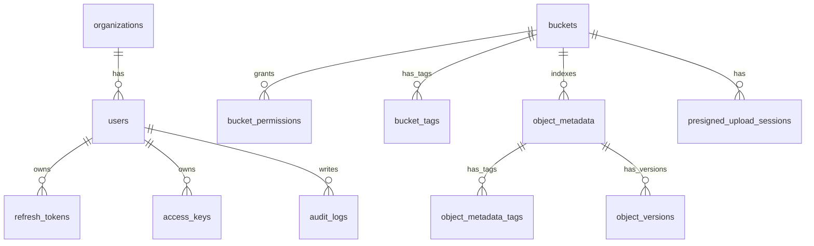

- `V18__object_lifecycle_rules.sql` adds prefix/tag scoped lifecycle rules for trash object and object version retention.
- `V19__object_lifecycle_rule_priority.sql` adds lifecycle rule priority for deterministic conflict handling.
- `V20__object_lifecycle_rule_bucket_scope.sql` adds optional lifecycle rule bucket scope for S3-compatible bucket lifecycle APIs.
- `V25__quota_policies.sql` adds admin-managed quota policy overrides for `USER`, `ORGANIZATION`, and `BUCKET` targets.
- `V26__quota_policy_history.sql` adds quota policy create/update/delete history for admin audit review.
- `V27__quota_policy_history_reason.sql` adds optional quota policy change reason text.
- `V28__object_share_links.sql` adds temporary object share link metadata with hashed tokens, status, expiry, and revoke tracking.
- `V29__object_share_link_usage_limits.sql` adds `max_downloads`, `download_count`, and `last_accessed_at` for share link usage limits and operations review.
- `V30__object_share_link_password.sql` adds optional `password_hash` storage for password-protected share links.
- `V31__object_share_link_ip_allowlist.sql` adds optional `allowed_ip_cidrs` storage for IP-restricted share links.
- `V32__object_share_policy.sql` adds global object share policy storage for password/IP requirements plus expiry/download caps.
# OSMU Database Design

이 문서는 MariaDB 기준 OSMU 메타데이터 DB 설계를 정의한다.

## 1. DB 역할

MariaDB는 실제 파일 데이터를 저장하지 않는다.

저장 대상:

- 사용자
- 조직
- 버킷 메타데이터
- 권한
- Access Key 메타데이터
- 쿼터
- 감사 로그
- 시스템 설정

실제 파일 데이터는 MinIO에 저장한다.

## 2. 공통 규칙

- PK는 `BIGINT AUTO_INCREMENT`를 기본으로 한다.
- 시간 컬럼은 `DATETIME(6)`을 사용한다.
- 기본 시간대는 애플리케이션에서 Asia/Seoul 또는 UTC 중 하나로 통일한다.
- 상태값은 `VARCHAR(32)`로 저장하고 애플리케이션 enum으로 관리한다.
- Secret, Password, Token 원문 저장 금지.
- 감사 로그는 append-only로 다룬다.

## 3. 테이블 목록

| 테이블 | 목적 |
| --- | --- |
| `organizations` | 조직/부서/프로젝트 |
| `users` | 사용자 |
| `refresh_tokens` | refresh token hash와 폐기 상태 |
| `buckets` | 버킷 메타데이터 |
| `bucket_tags` | S3 bucket tagging metadata |
| `bucket_permissions` | 버킷 권한 |
| `access_keys` | S3 접근 키 메타데이터 |
| `quota_policies` | 쿼터 정책 |
| `quota_policy_history` | 쿼터 정책 변경 이력 |
| `object_metadata` | 오브젝트 목록/검색/tag index |
| `object_metadata_tags` | tag exact filter용 inverted index |
| `presigned_upload_sessions` | presigned upload 완료 확정 세션 |
| `audit_logs` | 감사 로그 |
| `system_settings` | 시스템 설정 |

## 4. organizations

```sql
CREATE TABLE organizations (
  id BIGINT AUTO_INCREMENT PRIMARY KEY,
  name VARCHAR(100) NOT NULL,
  description VARCHAR(500) NULL,
  default_quota_bytes BIGINT NULL,
  status VARCHAR(32) NOT NULL DEFAULT 'ACTIVE',
  created_at DATETIME(6) NOT NULL,
  updated_at DATETIME(6) NOT NULL,
  UNIQUE KEY uk_organizations_name (name)
);
```

## 5. users

```sql
CREATE TABLE users (
  id BIGINT AUTO_INCREMENT PRIMARY KEY,
  organization_id BIGINT NULL,
  login_id VARCHAR(100) NOT NULL,
  email VARCHAR(255) NOT NULL,
  name VARCHAR(100) NOT NULL,
  password_hash VARCHAR(255) NOT NULL,
  role VARCHAR(32) NOT NULL,
  status VARCHAR(32) NOT NULL DEFAULT 'ACTIVE',
  last_login_at DATETIME(6) NULL,
  created_at DATETIME(6) NOT NULL,
  updated_at DATETIME(6) NOT NULL,
  UNIQUE KEY uk_users_login_id (login_id),
  UNIQUE KEY uk_users_email (email),
  KEY idx_users_organization_id (organization_id),
  CONSTRAINT fk_users_organization
    FOREIGN KEY (organization_id) REFERENCES organizations(id)
);
```

역할:

- `ADMIN`
- `ORG_ADMIN`
- `USER`

상태:

- `ACTIVE`
- `INACTIVE`
- `LOCKED`

현재 구현 메모:

- `V4__organizations.sql`에서 `organizations` table과 `users.organization_id`를 추가한다.
- in-memory repository도 동일하게 `organizationId`를 사용자 profile에 포함한다.
- 현재 FK는 문서 목표이며 MVP migration은 기존 데이터 호환을 우선해 nullable column과 index부터 제공한다.

## 6. refresh_tokens

```sql
CREATE TABLE refresh_tokens (
  id BIGINT AUTO_INCREMENT PRIMARY KEY,
  user_id BIGINT NOT NULL,
  token_hash VARCHAR(128) NOT NULL,
  status VARCHAR(32) NOT NULL DEFAULT 'ACTIVE',
  expires_at DATETIME(6) NOT NULL,
  created_at DATETIME(6) NOT NULL,
  revoked_at DATETIME(6) NULL,
  UNIQUE KEY uk_refresh_tokens_hash (token_hash),
  KEY idx_refresh_tokens_user_id (user_id),
  KEY idx_refresh_tokens_status (status),
  KEY idx_refresh_tokens_expires_at (expires_at),
  CONSTRAINT fk_refresh_tokens_user
    FOREIGN KEY (user_id) REFERENCES users(id)
);
```

정책:

- refresh token 원문 저장 금지.
- SHA-256 hash만 저장.
- refresh 성공 시 기존 token은 폐기하고 새 token을 발급한다.
- logout 시 전달된 refresh token을 폐기한다.

## 7. buckets

```sql
CREATE TABLE buckets (
  id BIGINT AUTO_INCREMENT PRIMARY KEY,
  name VARCHAR(63) NOT NULL,
  owner_type VARCHAR(32) NOT NULL,
  owner_id BIGINT NOT NULL,
  quota_bytes BIGINT NULL,
  used_bytes BIGINT NOT NULL DEFAULT 0,
  status VARCHAR(32) NOT NULL DEFAULT 'ACTIVE',
  created_by BIGINT NOT NULL,
  created_at DATETIME(6) NOT NULL,
  updated_at DATETIME(6) NOT NULL,
  UNIQUE KEY uk_buckets_name (name),
  KEY idx_buckets_owner (owner_type, owner_id),
  KEY idx_buckets_created_by (created_by)
);
```

정책:

- 버킷 이름은 S3 호환 규칙을 따른다.
- 기본 상태는 private이다.
- MVP에서는 전체 시스템에서 버킷 이름 유니크.

## 7.1 bucket_tags

```sql
CREATE TABLE bucket_tags (
  bucket_name VARCHAR(63) NOT NULL,
  tag_key VARCHAR(128) NOT NULL,
  tag_value VARCHAR(256) NOT NULL,
  PRIMARY KEY (bucket_name, tag_key),
  KEY idx_bucket_tags_key_value (tag_key, tag_value),
  CONSTRAINT fk_bucket_tags_bucket
    FOREIGN KEY (bucket_name) REFERENCES buckets(name)
    ON DELETE CASCADE
);
```

정책:

- S3 bucket tagging XML의 `Tagging/TagSet/Tag/Key/Value`를 저장한다.
- bucket별 최대 50개 tag를 허용한다.
- bucket 삭제 시 tag도 함께 삭제한다.
- `owner_type = USER`이면 `owner_id`는 users.id를 의미한다.
- `owner_type = ORG`이면 `owner_id`는 organizations.id를 의미한다.
- 현재 구현은 단일 `owner_type/owner_id` 모델로 user bucket과 organization bucket을 구분한다.

## 8. bucket_permissions

```sql
CREATE TABLE bucket_permissions (
  id BIGINT AUTO_INCREMENT PRIMARY KEY,
  bucket_id BIGINT NOT NULL,
  subject_type VARCHAR(32) NOT NULL,
  subject_id BIGINT NOT NULL,
  permission VARCHAR(32) NOT NULL,
  created_at DATETIME(6) NOT NULL,
  updated_at DATETIME(6) NOT NULL,
  UNIQUE KEY uk_bucket_permission (bucket_id, subject_type, subject_id, permission),
  KEY idx_bucket_permissions_subject (subject_type, subject_id),
  CONSTRAINT fk_bucket_permissions_bucket
    FOREIGN KEY (bucket_id) REFERENCES buckets(id)
);
```

`subject_type`:

- `USER`
- `ORGANIZATION`

`permission`:

- `READ`
- `WRITE`
- `DELETE`
- `ADMIN`

현재 구현:

- Flyway `V5__bucket_permissions.sql`에서 생성한다.
- Backend는 `BucketPermissionRepository`로 in-memory/MariaDB 양쪽 구현을 제공한다.
- object API는 `READ`, `WRITE`, `DELETE`를 action별로 검사한다.

## 9. access_keys

```sql
CREATE TABLE access_keys (
  id BIGINT AUTO_INCREMENT PRIMARY KEY,
  owner_id BIGINT NOT NULL,
  name VARCHAR(100) NOT NULL,
  access_key VARCHAR(128) NOT NULL,
  secret_key_hash VARCHAR(128) NOT NULL,
  secret_key_ciphertext TEXT NULL,
  allowed_buckets TEXT NOT NULL,
  permissions TEXT NOT NULL,
  bucket_scopes TEXT NULL,
  status VARCHAR(32) NOT NULL DEFAULT 'ACTIVE',
  expires_at DATETIME(6) NULL,
  created_at DATETIME(6) NOT NULL,
  UNIQUE KEY uk_access_keys_access_key (access_key),
  KEY idx_access_keys_owner_id (owner_id),
  KEY idx_access_keys_status (status)
);
```

정책:

- Secret Key 원문 저장 금지.
- Secret Key는 생성 시 1회만 반환.
- `allowed_buckets`와 `permissions`는 JSON 배열 문자열로 저장한다.
- `bucket_scopes`는 bucket별 permission JSON 배열 문자열로 저장한다.
- 현재 구현 권한 값은 `READ`, `WRITE`, `DELETE`다.
- 비활성화 시 S3 접근도 막아야 함.

- Access key `permissions` supports `READ`, `WRITE`, `DELETE`, and `ADMIN`.
- `ADMIN` access key scope is used for bucket lifecycle alias management.
- `secret_key_ciphertext` stores encrypted signing material for AWS SigV4 verification. Existing keys with null ciphertext still support `X-OSMU-Secret-Key` auth but cannot use SigV4 until re-created.

## 10. quota_policies

```sql
CREATE TABLE quota_policies (
  id BIGINT AUTO_INCREMENT PRIMARY KEY,
  target_type VARCHAR(32) NOT NULL,
  target_id BIGINT NOT NULL,
  quota_bytes BIGINT NOT NULL,
  created_at DATETIME(6) NOT NULL,
  updated_at DATETIME(6) NOT NULL,
  UNIQUE KEY uk_quota_target (target_type, target_id)
);
```

`target_type`:

- `USER`
- `ORGANIZATION`
- `BUCKET`

## 11. quota_policy_history

```sql
CREATE TABLE quota_policy_history (
  id BIGINT AUTO_INCREMENT PRIMARY KEY,
  target_type VARCHAR(32) NOT NULL,
  target_id BIGINT NOT NULL,
  action VARCHAR(32) NOT NULL,
  previous_quota_bytes BIGINT NULL,
  new_quota_bytes BIGINT NULL,
  actor_id VARCHAR(128) NOT NULL,
  reason VARCHAR(512) NULL,
  created_at DATETIME(6) NOT NULL,
  KEY idx_quota_policy_history_target (target_type, target_id, id),
  KEY idx_quota_policy_history_created_at (created_at)
);
```

정책:

- `action`은 `CREATE`, `UPDATE`, `DELETE`를 사용한다.
- quota policy 변경 audit review에서 이전 quota와 신규 quota를 빠르게 확인한다.
- `reason`은 admin이 입력한 변경 사유이며 선택값이다.
- 감사 로그와 함께 actor 추적 근거로 사용한다.

## 12. object_metadata

Object list/search/tag filter의 metadata index다. 실제 binary는 MinIO에 있고, Backend upload/tag/presigned complete/sync 경로가 이 table을 갱신한다.

```sql
CREATE TABLE object_metadata (
  bucket_name VARCHAR(63) NOT NULL,
  object_key_hash CHAR(64) NOT NULL,
  object_key VARCHAR(1024) NOT NULL,
  size_bytes BIGINT NOT NULL,
  content_type VARCHAR(255) NOT NULL,
  last_modified_at DATETIME(6) NOT NULL,
  tags TEXT NOT NULL,
  deleted_at DATETIME(6) NULL,
  etag VARCHAR(128) NOT NULL DEFAULT '',
  checksums TEXT NOT NULL,
  updated_at DATETIME(6) NOT NULL,
  PRIMARY KEY (bucket_name, object_key_hash),
  KEY idx_object_metadata_bucket_key (bucket_name, object_key(255)),
  KEY idx_object_metadata_deleted_at (bucket_name, deleted_at),
  KEY idx_object_metadata_bucket_updated (bucket_name, updated_at)
);
```

정책:

- `object_key_hash`는 긴 S3 object key를 안정적으로 식별하기 위한 SHA-256 hash다.
- `tags`는 JSON object 문자열이다.
- `etag`는 S3 호환 응답을 위한 object ETag 문자열이다.
- `checksums`는 검증된 S3 checksum response header map을 JSON object 문자열로 저장한다.
- `deleted_at`이 있으면 soft-deleted object이며 active list/download/presigned download에서 숨긴다.
- Temporary object share links are stored in `object_share_links`; only `token_hash`, optional `password_hash`, and optional `allowed_ip_cidrs` are persisted, while raw token is returned once on create. Usage policy fields include `max_downloads`, `download_count`, and `last_accessed_at`. Global admin share policy is stored in `object_share_policy`.
- retention purge scheduler는 `deleted_at <= now - osmu.object.retention.days`인 object를 purge 후보로 조회한다.
- Backend upload/delete/tag update/presigned complete는 index를 즉시 갱신한다.
- Backend를 거치지 않은 S3 직접 변경은 `POST /api/buckets/{bucketName}/sync`로 storage 실제 상태를 읽어 index를 재생성한다.
- tag exact filter는 `object_metadata_tags` inverted index로 후보를 줄인 뒤 `object_metadata.tags`와 최종 대조한다.

## 11.0 object_retention_policy

```sql
CREATE TABLE object_retention_policy (
  id TINYINT NOT NULL PRIMARY KEY,
  enabled BOOLEAN NOT NULL,
  retention_days INT NOT NULL,
  batch_size INT NOT NULL,
  version_retention_days INT NOT NULL,
  version_batch_size INT NOT NULL,
  updated_at DATETIME(6) NOT NULL,
  CONSTRAINT chk_object_retention_policy_singleton CHECK (id = 1),
  CONSTRAINT chk_object_retention_policy_days CHECK (retention_days >= 1),
  CONSTRAINT chk_object_retention_policy_batch CHECK (batch_size >= 1),
  CONSTRAINT chk_object_retention_policy_version_days CHECK (version_retention_days >= 1),
  CONSTRAINT chk_object_retention_policy_version_batch CHECK (version_batch_size >= 1)
);
```

정책:

- singleton row `id = 1`만 사용한다.
- `enabled=false`이면 scheduler/manual purge 모두 object purge를 수행하지 않는다.
- `retention_days`는 deleted object cutoff 계산에 사용한다.
- `batch_size`는 1회 purge 후보 조회 limit이다.
- `version_retention_days`는 object version snapshot purge cutoff 계산에 사용한다.
- `version_batch_size`는 1회 object version purge 후보 조회 limit이다.
- `osmu.metadata.mode=mariadb`에서 운영 중 변경한 lifecycle policy를 영속화한다.

## 11.0A object_lifecycle_rules

```sql
CREATE TABLE object_lifecycle_rules (
  rule_id VARCHAR(36) NOT NULL PRIMARY KEY,
  name VARCHAR(128) NOT NULL,
  enabled BOOLEAN NOT NULL,
  priority INT NOT NULL DEFAULT 100,
  bucket_name VARCHAR(63) NOT NULL DEFAULT '',
  target_type VARCHAR(32) NOT NULL,
  prefix VARCHAR(1024) NOT NULL,
  tags JSON NOT NULL,
  retention_days INT NOT NULL,
  batch_size INT NOT NULL,
  created_at DATETIME(6) NOT NULL,
  updated_at DATETIME(6) NOT NULL,
  KEY idx_object_lifecycle_rules_priority (priority, created_at, rule_id),
  KEY idx_object_lifecycle_rules_bucket_target (bucket_name, enabled, target_type, priority),
  KEY idx_object_lifecycle_rules_target (target_type, enabled),
  CONSTRAINT chk_object_lifecycle_rules_retention_days CHECK (retention_days >= 1),
  CONSTRAINT chk_object_lifecycle_rules_batch_size CHECK (batch_size >= 1)
);
```

Policy:

- `target_type` is `TRASH_OBJECT` or `OBJECT_VERSION`.
- `priority` controls deterministic rule order; lower number runs first. API validates 1..10000.
- `bucket_name` is optional scope. Empty string means global rule; non-empty value scopes purge/dry-run to one bucket.
- `prefix` uses starts-with matching against `object_key`; empty string matches all keys.
- `tags` stores exact-match filters; all tags must match the object/version tags.
- `retention_days` and `batch_size` override global retention for matched candidates.

## 11.1 object_metadata_tags

```sql
CREATE TABLE object_metadata_tags (
  bucket_name VARCHAR(63) NOT NULL,
  object_key_hash CHAR(64) NOT NULL,
  tag_key VARCHAR(255) NOT NULL,
  tag_value VARCHAR(256) NOT NULL,
  PRIMARY KEY (bucket_name, object_key_hash, tag_key),
  KEY idx_object_metadata_tags_lookup (bucket_name, tag_key, tag_value, object_key_hash),
  KEY idx_object_metadata_tags_object (bucket_name, object_key_hash)
);
```

정책:

- object tag가 저장/수정/삭제될 때 같은 transaction에서 갱신한다.
- bucket sync 시 기존 tag index를 제거하고 storage actual tags 기준으로 재생성한다.
- tag filter는 `bucket_name + tag_key + tag_value` index를 우선 사용한다.
- Backend validation은 tag key 128자 이하, tag value 256자 이하 정책을 적용해 DB column 길이 오류를 API validation 오류로 선차단한다.

## 11.2 object_versions

```sql
CREATE TABLE object_versions (
  bucket_name VARCHAR(63) NOT NULL,
  object_key_hash CHAR(64) NOT NULL,
  object_key VARCHAR(1024) NOT NULL,
  version_id VARCHAR(64) NOT NULL,
  storage_key VARCHAR(1200) NOT NULL,
  size_bytes BIGINT NOT NULL,
  content_type VARCHAR(255) NOT NULL,
  object_last_modified_at DATETIME(6) NOT NULL,
  created_at DATETIME(6) NOT NULL,
  tags TEXT NOT NULL,
  PRIMARY KEY (bucket_name, object_key_hash, version_id),
  KEY idx_object_versions_object (bucket_name, object_key_hash, created_at)
);
```

정책:

- 기존 active object가 REST upload overwrite 또는 version restore 전에 snapshot될 때 metadata를 저장한다.
- binary는 같은 bucket의 hidden storage key `.osmu/versions/{objectKeyHash}/{versionId}`에 저장한다.
- 일반 object list metadata에는 version storage key를 넣지 않는다.
- bucket usage/quota는 version storage bytes와 object count를 포함한다.
- purge/retention purge는 active object와 해당 object version을 함께 삭제한다.
- version retention purge는 active object와 별개로 오래된 version snapshot만 삭제할 수 있다.

## 12. presigned_upload_sessions

```sql
CREATE TABLE presigned_upload_sessions (
  upload_id VARCHAR(64) PRIMARY KEY,
  user_id BIGINT NOT NULL,
  bucket_name VARCHAR(63) NOT NULL,
  object_key VARCHAR(1024) NOT NULL,
  tags TEXT NULL,
  upload_mode VARCHAR(32) NOT NULL DEFAULT 'PRESIGNED_PUT',
  storage_upload_id TEXT NULL,
  expected_size_bytes BIGINT NOT NULL DEFAULT 0,
  part_size_bytes BIGINT NOT NULL DEFAULT 0,
  part_count INT NOT NULL DEFAULT 0,
  status VARCHAR(32) NOT NULL,
  previous_size_bytes BIGINT NOT NULL,
  previous_exists BOOLEAN NOT NULL,
  expires_at DATETIME(6) NOT NULL,
  created_at DATETIME(6) NOT NULL,
  completed_at DATETIME(6) NULL,
  KEY idx_presigned_upload_sessions_user_id (user_id),
  KEY idx_presigned_upload_sessions_status (status),
  KEY idx_presigned_upload_sessions_expires_at (expires_at)
);
```

정책:

- `upload_mode = MULTIPART`이고 `status = ACTIVE`이며 `expires_at`이 지난 session은 cleanup scheduler 대상이다.
- multipart upload refresh는 `part_size_bytes`, `part_count`, `storage_upload_id`를 사용해 기존 session의 part URL을 재발급한다.
- cleanup 성공 시 MinIO multipart upload를 abort하고 `status = EXPIRED`, `completed_at = cleanup time`으로 갱신한다.
- abort 실패 시 `ACTIVE` 상태를 유지해 다음 cleanup 주기에서 재시도한다.
- cleanup 성공/실패는 `audit_logs.event_type = OBJECT_MULTIPART_UPLOAD_CLEANUP`으로 기록한다.

## 13. audit_logs

```sql
CREATE TABLE audit_logs (
  id BIGINT AUTO_INCREMENT PRIMARY KEY,
  event_type VARCHAR(80) NOT NULL,
  actor_id VARCHAR(120) NOT NULL,
  target_type VARCHAR(80) NOT NULL,
  target_id VARCHAR(255) NOT NULL,
  result VARCHAR(32) NOT NULL,
  message VARCHAR(500) NOT NULL,
  ip_address VARCHAR(80) NULL,
  user_agent VARCHAR(500) NULL,
  request_id VARCHAR(120) NULL,
  created_at DATETIME(6) NOT NULL,
  KEY idx_audit_logs_event_type (event_type),
  KEY idx_audit_logs_actor_id (actor_id),
  KEY idx_audit_logs_request_id (request_id),
  KEY idx_audit_logs_target_type (target_type),
  KEY idx_audit_logs_target_id (target_id),
  KEY idx_audit_logs_result (result),
  KEY idx_audit_logs_created_at (created_at)
);
```

## 14. system_settings

```sql
CREATE TABLE system_settings (
  id BIGINT AUTO_INCREMENT PRIMARY KEY,
  setting_key VARCHAR(100) NOT NULL,
  setting_value TEXT NULL,
  description VARCHAR(500) NULL,
  created_at DATETIME(6) NOT NULL,
  updated_at DATETIME(6) NOT NULL,
  UNIQUE KEY uk_system_settings_key (setting_key)
);
```

## 15. MVP ERD



## 16. 마이그레이션 원칙

- Flyway 또는 Liquibase 중 하나를 사용한다.
- 마이그레이션 파일은 수정하지 않는다.
- 변경은 새 마이그레이션으로 추가한다.
- 현재 MVP는 `osmu-backend/src/main/resources/db/migration` 아래 `V1__init_metadata_schema.sql`부터 `V32__object_share_policy.sql`까지의 Flyway migration을 제공한다.
- repository의 `CREATE TABLE IF NOT EXISTS`는 local fallback이다.

## 17. 구현 순서

1. `organizations`
2. `users`
3. `refresh_tokens`
4. `buckets`
5. `bucket_tags`
6. `bucket_permissions`
7. `access_keys`
8. `audit_logs`
9. `quota_policies`
10. `quota_policy_history`
11. `object_metadata`
12. `object_versions`
13. `presigned_upload_sessions`
14. `object_share_links`
15. `system_settings`
16. `object_lifecycle_rules`

## Object Lifecycle Migrations

- object lifecycle 추가 migration: `V14__object_metadata_deleted_at.sql`, `V15__object_retention_policy.sql`, `V16__object_versions.sql`, `V17__object_version_retention_policy.sql`.

