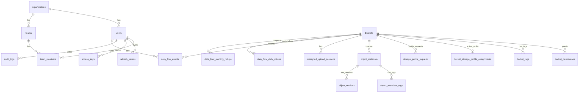

- `V18__object_lifecycle_rules.sql` adds prefix/tag scoped lifecycle rules for trash object and object version retention.
- `V19__object_lifecycle_rule_priority.sql` adds lifecycle rule priority for deterministic conflict handling.
- `V20__object_lifecycle_rule_bucket_scope.sql` adds optional lifecycle rule bucket scope for S3-compatible bucket lifecycle APIs.
- `V25__quota_policies.sql` adds admin-managed quota policy overrides for `USER`, `ORGANIZATION`, and `BUCKET` targets.
- `V26__quota_policy_history.sql` adds quota policy create/update/delete history for admin audit review.
- `V27__quota_policy_history_reason.sql` adds optional quota policy change reason text.
- `V28__object_share_links.sql` adds temporary object share link metadata with hashed tokens, status, expiry, and revoke tracking.
- `V29__object_share_link_usage_limits.sql` adds `max_downloads`, `download_count`, and `last_accessed_at` for share link usage limits and operations review.
- `V30__object_share_link_password.sql` adds optional `password_hash` storage for password-protected share links.
- `V31__object_share_link_ip_allowlist.sql` adds optional `allowed_ip_cidrs` storage for IP-restricted share links.
- `V32__object_share_policy.sql` adds global object share policy storage for password/IP requirements plus expiry/download caps.
- `V33__storage_expansion_requests.sql` adds MinIO pool expansion request plans plus applied evidence.
- `V40__storage_profile_requests.sql` adds bucket Storage Profile assignments plus request/approval/apply history.
- `V41__data_flow_events.sql` adds persisted admin data-flow monitoring events.
# OSMU Database Design

이 문서는 MariaDB 기준 OSMU 메타데이터 DB 설계를 정의한다.

## 1. DB 역할

MariaDB는 실제 파일 데이터를 저장하지 않는다.

저장 대상:

- 사용자
- 조직
- 버킷 메타데이터
- 권한
- Access Key 메타데이터
- 쿼터
- 감사 로그
- 시스템 설정

실제 파일 데이터는 MinIO에 저장한다.

## 2. 공통 규칙

- PK는 `BIGINT AUTO_INCREMENT`를 기본으로 한다.
- 시간 컬럼은 `DATETIME(6)`을 사용한다.
- 기본 시간대는 애플리케이션에서 Asia/Seoul 또는 UTC 중 하나로 통일한다.
- 상태값은 `VARCHAR(32)`로 저장하고 애플리케이션 enum으로 관리한다.
- Secret, Password, Token 원문 저장 금지.
- 감사 로그는 append-only로 다룬다.

## 3. 테이블 목록

| 테이블 | 목적 |
| --- | --- |
| `organizations` | 조직/부서/프로젝트 |
| `users` | 사용자 |
| `teams` | 조직 안의 팀/부서 권한 그룹 |
| `team_members` | 팀별 사용자 멤버십 |
| `refresh_tokens` | refresh token hash와 폐기 상태 |
| `buckets` | 버킷 메타데이터 |
| `bucket_tags` | S3 bucket tagging metadata |
| `bucket_permissions` | 버킷 권한 |
| `access_keys` | S3 접근 키 메타데이터 |
| `quota_policies` | 쿼터 정책 |
| `storage_expansion_requests` | MinIO pool 증설 요청/계획/적용 증거 |
| `storage_expansion_executions` | MinIO pool 증설 dry-run/GitOps/Helm/Kubernetes 실행 이력 |
| `bucket_storage_profile_assignments` | 버킷별 활성 Storage Profile 할당 |
| `storage_profile_requests` | 버킷 Storage Profile 요청/승인/적용 이력 |
| `quota_policy_history` | 쿼터 정책 변경 이력 |
| `object_metadata` | 오브젝트 목록/검색/tag index |
| `object_metadata_tags` | tag exact filter용 inverted index |
| `presigned_upload_sessions` | presigned upload 완료 확정 세션 |
| `audit_logs` | 감사 로그 |
| `data_flow_events` | object upload/download/list/delete/cancel/failure data-flow monitoring event |
| `system_settings` | 시스템 설정 |

## 4. organizations

```sql
CREATE TABLE organizations (
  id BIGINT AUTO_INCREMENT PRIMARY KEY,
  name VARCHAR(100) NOT NULL,
  description VARCHAR(500) NULL,
  default_quota_bytes BIGINT NULL,
  status VARCHAR(32) NOT NULL DEFAULT 'ACTIVE',
  created_at DATETIME(6) NOT NULL,
  updated_at DATETIME(6) NOT NULL,
  UNIQUE KEY uk_organizations_name (name)
);
```

## 5. users

```sql
CREATE TABLE users (
  id BIGINT AUTO_INCREMENT PRIMARY KEY,
  organization_id BIGINT NULL,
  login_id VARCHAR(100) NOT NULL,
  email VARCHAR(255) NOT NULL,
  name VARCHAR(100) NOT NULL,
  password_hash VARCHAR(255) NOT NULL,
  role VARCHAR(32) NOT NULL,
  status VARCHAR(32) NOT NULL DEFAULT 'ACTIVE',
  last_login_at DATETIME(6) NULL,
  created_at DATETIME(6) NOT NULL,
  updated_at DATETIME(6) NOT NULL,
  UNIQUE KEY uk_users_login_id (login_id),
  UNIQUE KEY uk_users_email (email),
  KEY idx_users_organization_id (organization_id),
  CONSTRAINT fk_users_organization
    FOREIGN KEY (organization_id) REFERENCES organizations(id)
);
```

역할:

- `ADMIN`
- `ORG_ADMIN`
- `USER`

상태:

- `ACTIVE`
- `INACTIVE`
- `LOCKED`

현재 구현 메모:

- `V4__organizations.sql`에서 `organizations` table과 `users.organization_id`를 추가한다.
- in-memory repository도 동일하게 `organizationId`를 사용자 profile에 포함한다.
- 현재 FK는 문서 목표이며 MVP migration은 기존 데이터 호환을 우선해 nullable column과 index부터 제공한다.

## 5.1 teams / team_members

```sql
CREATE TABLE teams (
  id BIGINT NOT NULL PRIMARY KEY,
  organization_id BIGINT NOT NULL,
  name VARCHAR(100) NOT NULL,
  description VARCHAR(500) NULL,
  created_at DATETIME(6) NOT NULL,
  updated_at DATETIME(6) NOT NULL,
  UNIQUE KEY uk_teams_org_name (organization_id, name),
  KEY idx_teams_organization (organization_id)
);

CREATE TABLE team_members (
  team_id BIGINT NOT NULL,
  user_id BIGINT NOT NULL,
  created_at DATETIME(6) NOT NULL,
  PRIMARY KEY (team_id, user_id),
  KEY idx_team_members_user (user_id)
);
```

현재 구현:

- Flyway `V47__teams.sql`에서 `teams`, `team_members`를 생성한다.
- `teams.organization_id`는 조직 범위를 나타낸다. `ORG_ADMIN`은 자기 조직 팀만 조회/생성/수정/삭제할 수 있다.
- `team_members.user_id`는 같은 조직 사용자만 허용한다.
- `bucket_permissions.subject_type = TEAM`이면 `subject_id`는 `teams.id`를 의미한다.
- 팀 멤버 변경이나 팀 삭제로 권한이 사라진 사용자의 활성 Access Key는 현재 bucket scope 기준으로 재동기화한다.

## 6. refresh_tokens

```sql
CREATE TABLE refresh_tokens (
  id BIGINT AUTO_INCREMENT PRIMARY KEY,
  user_id BIGINT NOT NULL,
  token_hash VARCHAR(128) NOT NULL,
  status VARCHAR(32) NOT NULL DEFAULT 'ACTIVE',
  expires_at DATETIME(6) NOT NULL,
  created_at DATETIME(6) NOT NULL,
  revoked_at DATETIME(6) NULL,
  UNIQUE KEY uk_refresh_tokens_hash (token_hash),
  KEY idx_refresh_tokens_user_id (user_id),
  KEY idx_refresh_tokens_status (status),
  KEY idx_refresh_tokens_expires_at (expires_at),
  CONSTRAINT fk_refresh_tokens_user
    FOREIGN KEY (user_id) REFERENCES users(id)
);
```

정책:

- refresh token 원문 저장 금지.
- SHA-256 hash만 저장.
- refresh 성공 시 기존 token은 폐기하고 새 token을 발급한다.
- logout 시 전달된 refresh token을 폐기한다.

## 7. buckets

```sql
CREATE TABLE buckets (
  id BIGINT AUTO_INCREMENT PRIMARY KEY,
  name VARCHAR(63) NOT NULL,
  owner_type VARCHAR(32) NOT NULL,
  owner_id BIGINT NOT NULL,
  quota_bytes BIGINT NULL,
  used_bytes BIGINT NOT NULL DEFAULT 0,
  status VARCHAR(32) NOT NULL DEFAULT 'ACTIVE',
  created_by BIGINT NOT NULL,
  created_at DATETIME(6) NOT NULL,
  updated_at DATETIME(6) NOT NULL,
  UNIQUE KEY uk_buckets_name (name),
  KEY idx_buckets_owner (owner_type, owner_id),
  KEY idx_buckets_created_by (created_by)
);
```

정책:

- 버킷 이름은 S3 호환 규칙을 따른다.
- 기본 상태는 private이다.
- MVP에서는 전체 시스템에서 버킷 이름 유니크.

## 7.1 bucket_tags

```sql
CREATE TABLE bucket_tags (
  bucket_name VARCHAR(63) NOT NULL,
  tag_key VARCHAR(128) NOT NULL,
  tag_value VARCHAR(256) NOT NULL,
  PRIMARY KEY (bucket_name, tag_key),
  KEY idx_bucket_tags_key_value (tag_key, tag_value),
  CONSTRAINT fk_bucket_tags_bucket
    FOREIGN KEY (bucket_name) REFERENCES buckets(name)
    ON DELETE CASCADE
);
```

정책:

- S3 bucket tagging XML의 `Tagging/TagSet/Tag/Key/Value`를 저장한다.
- bucket별 최대 50개 tag를 허용한다.
- bucket 삭제 시 tag도 함께 삭제한다.
- `owner_type = USER`이면 `owner_id`는 users.id를 의미한다.
- `owner_type = ORG`이면 `owner_id`는 organizations.id를 의미한다.
- 현재 구현은 단일 `owner_type/owner_id` 모델로 user bucket과 organization bucket을 구분한다.

## 8. bucket_permissions

```sql
CREATE TABLE bucket_permissions (
  id BIGINT AUTO_INCREMENT PRIMARY KEY,
  bucket_id BIGINT NOT NULL,
  subject_type VARCHAR(32) NOT NULL,
  subject_id BIGINT NOT NULL,
  permission VARCHAR(32) NOT NULL,
  created_at DATETIME(6) NOT NULL,
  updated_at DATETIME(6) NOT NULL,
  UNIQUE KEY uk_bucket_permission (bucket_id, subject_type, subject_id, permission),
  KEY idx_bucket_permissions_subject (subject_type, subject_id),
  CONSTRAINT fk_bucket_permissions_bucket
    FOREIGN KEY (bucket_id) REFERENCES buckets(id)
);
```

`subject_type`:

- `USER`
- `ORGANIZATION`
- `TEAM`

`permission`:

- `READ`
- `WRITE`
- `DELETE`
- `ADMIN`

현재 구현:

- Flyway `V5__bucket_permissions.sql`에서 생성한다.
- Backend는 `BucketPermissionRepository`로 in-memory/MariaDB 양쪽 구현을 제공한다.
- object API는 `READ`, `WRITE`, `DELETE`를 action별로 검사한다.

## 9. access_keys

```sql
CREATE TABLE access_keys (
  id BIGINT AUTO_INCREMENT PRIMARY KEY,
  owner_id BIGINT NOT NULL,
  name VARCHAR(100) NOT NULL,
  access_key VARCHAR(128) NOT NULL,
  secret_key_hash VARCHAR(128) NOT NULL,
  secret_key_ciphertext TEXT NULL,
  previous_secret_key_hash VARCHAR(128) NULL,
  previous_secret_key_ciphertext TEXT NULL,
  previous_secret_key_expires_at DATETIME(6) NULL,
  allowed_buckets TEXT NOT NULL,
  permissions TEXT NOT NULL,
  bucket_scopes TEXT NULL,
  status VARCHAR(32) NOT NULL DEFAULT 'ACTIVE',
  expires_at DATETIME(6) NULL,
  last_used_at DATETIME(6) NULL,
  usage_count BIGINT NOT NULL DEFAULT 0,
  created_at DATETIME(6) NOT NULL,
  UNIQUE KEY uk_access_keys_access_key (access_key),
  KEY idx_access_keys_owner_id (owner_id),
  KEY idx_access_keys_status (status),
  KEY idx_access_keys_last_used_at (last_used_at),
  KEY idx_access_keys_usage_count (usage_count)
);
```

정책:

- Secret Key 원문 저장 금지.
- Secret Key는 생성 시 1회만 반환.
- `allowed_buckets`와 `permissions`는 JSON 배열 문자열로 저장한다.
- `bucket_scopes`는 bucket별 permission JSON 배열 문자열로 저장한다.
- 현재 구현 권한 값은 `READ`, `WRITE`, `DELETE`다.
- 비활성화 시 S3 접근도 막아야 함.
- `last_used_at`은 S3 호환 API에서 Access Key 인증이 성공할 때 갱신한다.
- `usage_count`는 S3 호환 API에서 Access Key 인증이 성공할 때마다 1 증가한다.
- Access Key secret rotation 시 `secret_key_hash`, `secret_key_ciphertext`를 새 secret 기준으로 갱신하며 bucket scope와 `access_key` 값은 유지한다.
- rotation grace period 동안 `previous_secret_key_hash`, `previous_secret_key_ciphertext`, `previous_secret_key_expires_at`으로 이전 secret 인증과 SigV4 검증을 임시 허용한다.

- Access key `permissions` supports `READ`, `WRITE`, `DELETE`, and `ADMIN`.
- `ADMIN` access key scope is used for bucket lifecycle alias management.
- `secret_key_ciphertext` stores encrypted signing material for AWS SigV4 verification. Existing keys with null ciphertext still support `X-OSMU-Secret-Key` auth but cannot use SigV4 until re-created.

## 10. quota_policies

```sql
CREATE TABLE quota_policies (
  id BIGINT AUTO_INCREMENT PRIMARY KEY,
  target_type VARCHAR(32) NOT NULL,
  target_id BIGINT NOT NULL,
  quota_bytes BIGINT NOT NULL,
  created_at DATETIME(6) NOT NULL,
  updated_at DATETIME(6) NOT NULL,
  UNIQUE KEY uk_quota_target (target_type, target_id)
);
```

`target_type`:

- `USER`
- `ORGANIZATION`
- `BUCKET`

## 11. quota_policy_history

```sql
CREATE TABLE quota_policy_history (
  id BIGINT AUTO_INCREMENT PRIMARY KEY,
  target_type VARCHAR(32) NOT NULL,
  target_id BIGINT NOT NULL,
  action VARCHAR(32) NOT NULL,
  previous_quota_bytes BIGINT NULL,
  new_quota_bytes BIGINT NULL,
  actor_id VARCHAR(128) NOT NULL,
  reason VARCHAR(512) NULL,
  created_at DATETIME(6) NOT NULL,
  KEY idx_quota_policy_history_target (target_type, target_id, id),
  KEY idx_quota_policy_history_created_at (created_at)
);
```

정책:

- `action`은 `CREATE`, `UPDATE`, `DELETE`를 사용한다.
- quota policy 변경 audit review에서 이전 quota와 신규 quota를 빠르게 확인한다.
- `reason`은 admin이 입력한 변경 사유이며 선택값이다.
- 감사 로그와 함께 actor 추적 근거로 사용한다.

## 11.1. storage_expansion_requests

MinIO server pool 증설 요청, 계획값, 승인/적용 상태, 적용 증거를 저장한다.

```sql
CREATE TABLE storage_expansion_requests (
  id BIGINT NOT NULL PRIMARY KEY,
  requested_capacity_bytes BIGINT NOT NULL,
  server_count INT NOT NULL,
  volumes_per_server INT NOT NULL,
  volume_size_bytes BIGINT NOT NULL,
  estimated_raw_capacity_bytes BIGINT NOT NULL,
  estimated_usable_capacity_bytes BIGINT NOT NULL,
  status VARCHAR(32) NOT NULL,
  reason VARCHAR(512) NULL,
  created_by VARCHAR(128) NOT NULL,
  applied_by VARCHAR(128) NULL,
  applied_at TIMESTAMP NULL,
  applied_evidence VARCHAR(512) NULL,
  created_at TIMESTAMP NOT NULL,
  updated_at TIMESTAMP NOT NULL,
  KEY idx_storage_expansion_status (status, id),
  KEY idx_storage_expansion_summary (status, requested_capacity_bytes, estimated_usable_capacity_bytes, id)
);
```

정책:

- `status`는 `PLANNED`, `APPROVED`, `REJECTED`, `APPLIED`를 사용한다.
- `APPLIED`는 `APPROVED` 상태에서만 가능하다.
- `APPLIED` 상태는 `applied_evidence`를 필수로 기록한다.
- `applied_evidence`에는 GitOps PR URL, Helm 명령, Kubernetes apply 로그, 운영 티켓 ID 등을 저장한다.
- dashboard summary는 request status/count/capacity aggregate query와 `id DESC LIMIT 1` latest query를 사용해 전체 request row를 application memory로 가져오지 않는다.

## 12. storage_expansion_executions

- Server dry-run runner stores `exit_code` and `timed_out` with command output. Disabled runner `SKIPPED` records use `exit_code = NULL`, `timed_out = false`.

Storage Expansion dry-run, GitOps PR, Helm diff, kubectl diff, apply, rollback 실행 이력을 저장한다.

```sql
CREATE TABLE storage_expansion_executions (
  id BIGINT NOT NULL PRIMARY KEY,
  request_id BIGINT NOT NULL,
  execution_type VARCHAR(32) NOT NULL,
  result VARCHAR(32) NOT NULL,
  command_text VARCHAR(1024) NULL,
  output_text MEDIUMTEXT NULL,
  external_url VARCHAR(1024) NULL,
  artifact_sha256 VARCHAR(128) NULL,
  exit_code INT NULL,
  timed_out BOOLEAN NOT NULL DEFAULT FALSE,
  notes VARCHAR(1024) NULL,
  created_by VARCHAR(128) NOT NULL,
  created_at TIMESTAMP NOT NULL,
  KEY idx_storage_expansion_execution_request (request_id, id),
  KEY idx_storage_expansion_execution_type (execution_type, result),
  KEY idx_storage_expansion_execution_result (result, id),
  KEY idx_storage_expansion_execution_timeout (timed_out, id)
);
```

정책:

- `execution_type`은 `DRY_RUN`, `GITOPS_PR`, `HELM_DIFF`, `KUBECTL_DIFF`, `APPLY`, `ROLLBACK`을 사용한다.
- `result`는 `SUCCESS`, `FAILED`, `SKIPPED`를 사용한다.
- `request_id`는 기존 `storage_expansion_requests.id`를 가리키며, MVP repository는 request 존재 여부를 service layer에서 검증한다.
- `external_url`에는 GitOps PR, CI pipeline, 운영 티켓, runbook URL을 저장한다.
- `artifact_sha256`은 manifest/ZIP bundle 검증 기준으로 사용한다.
- dashboard summary는 request aggregate와 execution의 `result`, `timed_out`, `id DESC LIMIT` 기반 aggregate/recent query를 사용하므로 request/execution 전체 row를 application memory로 가져오지 않는다.

## 12.1. bucket_storage_profile_assignments / storage_profile_requests

Bucket-level Storage Profile assignment and request history are stored separately.

```sql
CREATE TABLE bucket_storage_profile_assignments (
  bucket_name VARCHAR(63) NOT NULL PRIMARY KEY,
  profile_code VARCHAR(32) NOT NULL,
  applied_by VARCHAR(128) NOT NULL,
  applied_at TIMESTAMP NOT NULL,
  updated_at TIMESTAMP NOT NULL
);

CREATE TABLE storage_profile_requests (
  id BIGINT NOT NULL PRIMARY KEY,
  bucket_name VARCHAR(63) NOT NULL,
  current_profile_code VARCHAR(32) NOT NULL,
  requested_profile_code VARCHAR(32) NOT NULL,
  status VARCHAR(32) NOT NULL,
  reason VARCHAR(512) NULL,
  requested_by VARCHAR(128) NOT NULL,
  approved_by VARCHAR(128) NULL,
  approved_at TIMESTAMP NULL,
  applied_by VARCHAR(128) NULL,
  applied_at TIMESTAMP NULL,
  admin_note VARCHAR(512) NULL,
  created_at TIMESTAMP NOT NULL,
  updated_at TIMESTAMP NOT NULL,
  KEY idx_storage_profile_requests_bucket (bucket_name, id),
  KEY idx_storage_profile_requests_status (status, id)
);
```

Policy:

- `profile_code` and `requested_profile_code` use `PERFORMANCE`, `STANDARD`, or `DURABLE`.
- `status` uses `PENDING`, `APPROVED`, `REJECTED`, or `APPLIED`.
- If a bucket has no assignment row, backend returns default `STANDARD`.
- Bucket deletion removes the active assignment. Request history can remain as audit history.
- The MVP stores the control-plane profile only. Live object movement between MinIO pools is a later runner/migration step.

## 13. backup_restore_drill_evidence

백업/복구 드릴 evidence 상세 이력을 저장한다. Audit log는 이벤트 추적용으로 유지하고, 이 테이블은 RPO/RTO, row/object count, manifest checksum, evidence URI, gap history를 운영 조회와 대시보드 readiness 판단에 사용한다.

```sql
CREATE TABLE backup_restore_drill_evidence (
  audit_log_id BIGINT NOT NULL PRIMARY KEY,
  environment VARCHAR(160) NOT NULL,
  operator_name VARCHAR(160) NOT NULL,
  result VARCHAR(32) NOT NULL,
  started_at TIMESTAMP NULL,
  completed_at TIMESTAMP NULL,
  backup_timestamp TIMESTAMP NULL,
  restore_duration_minutes BIGINT NOT NULL,
  observed_rpo_hours BIGINT NOT NULL,
  rpo_target_met BOOLEAN NOT NULL,
  rto_target_met BOOLEAN NOT NULL,
  metadata_row_count BIGINT NOT NULL,
  object_count BIGINT NOT NULL,
  object_bytes BIGINT NOT NULL,
  backup_manifest_sha256 VARCHAR(64) NULL,
  evidence_uri VARCHAR(255) NULL,
  gaps_text MEDIUMTEXT NULL,
  status_impact VARCHAR(64) NOT NULL,
  recorded_at TIMESTAMP NOT NULL,
  KEY idx_backup_restore_drill_result_recorded (result, recorded_at, audit_log_id),
  KEY idx_backup_restore_drill_recorded (recorded_at, audit_log_id)
);
```

정책:

- `audit_log_id`는 같은 restore drill evidence에 대해 기록된 `BACKUP_RESTORE_DRILL_EVIDENCE` audit log id를 사용한다.
- `result`는 `SUCCESS`, `FAILED`, `PARTIAL`을 사용한다.
- secret 원문은 저장하지 않는다. `evidence_uri`는 보호된 artifact 위치나 운영 티켓을 가리킨다.
- dashboard backup readiness는 최신 `SUCCESS` row를 우선 사용하고, 성공 row가 없으면 최신 row를 참고해 pending 상태와 gaps를 보여준다.

## 14. object_metadata

Object list/search/tag filter의 metadata index다. 실제 binary는 MinIO에 있고, Backend upload/tag/presigned complete/sync 경로가 이 table을 갱신한다.

```sql
CREATE TABLE object_metadata (
  bucket_name VARCHAR(63) NOT NULL,
  object_key_hash CHAR(64) NOT NULL,
  object_key VARCHAR(1024) NOT NULL,
  size_bytes BIGINT NOT NULL,
  content_type VARCHAR(255) NOT NULL,
  last_modified_at DATETIME(6) NOT NULL,
  tags TEXT NOT NULL,
  deleted_at DATETIME(6) NULL,
  etag VARCHAR(128) NOT NULL DEFAULT '',
  checksums TEXT NOT NULL,
  user_metadata TEXT NOT NULL,
  updated_at DATETIME(6) NOT NULL,
  PRIMARY KEY (bucket_name, object_key_hash),
  KEY idx_object_metadata_bucket_key (bucket_name, object_key(255)),
  KEY idx_object_metadata_deleted_at (bucket_name, deleted_at),
  KEY idx_object_metadata_bucket_updated (bucket_name, updated_at)
);
```

정책:

- `object_key_hash`는 긴 S3 object key를 안정적으로 식별하기 위한 SHA-256 hash다.
- `tags`는 JSON object 문자열이다.
- `etag`는 S3 호환 응답을 위한 object ETag 문자열이다.
- `checksums`는 검증된 S3 checksum response header map을 JSON object 문자열로 저장한다.
- `deleted_at`이 있으면 soft-deleted object이며 active list/download/presigned download에서 숨긴다.
- `user_metadata` stores S3 `x-amz-meta-*` response header map as a JSON object string.
- Temporary object share links are stored in `object_share_links`; only `token_hash`, optional `password_hash`, and optional `allowed_ip_cidrs` are persisted, while raw token is returned once on create. Usage policy fields include `max_downloads`, `download_count`, and `last_accessed_at`. Global admin share policy is stored in `object_share_policy`.
- retention purge scheduler는 `deleted_at <= now - osmu.object.retention.days`인 object를 purge 후보로 조회한다.
- Backend upload/delete/tag update/presigned complete는 index를 즉시 갱신한다.
- Backend를 거치지 않은 S3 직접 변경은 `POST /api/buckets/{bucketName}/sync`로 storage 실제 상태를 읽어 index를 재생성한다.
- active/trash object list의 `prefix`, `search`, `tag`, `cursor`, `limit` 조건은 MariaDB SQL에 pushdown한다. Recursive list/search/filter page는 `ORDER BY object_key LIMIT limit+1`로 nextCursor를 판정해 대량 metadata 후보를 JVM으로 모두 읽지 않는다. `LIKE` pattern은 사용자 입력의 `%`, `_`, `!`를 literal로 escape한다.
- tag exact filter는 `object_metadata_tags` inverted index로 후보를 줄인다.

## 11.0 object_retention_policy

```sql
CREATE TABLE object_retention_policy (
  id TINYINT NOT NULL PRIMARY KEY,
  enabled BOOLEAN NOT NULL,
  retention_days INT NOT NULL,
  batch_size INT NOT NULL,
  version_retention_days INT NOT NULL,
  version_batch_size INT NOT NULL,
  updated_at DATETIME(6) NOT NULL,
  CONSTRAINT chk_object_retention_policy_singleton CHECK (id = 1),
  CONSTRAINT chk_object_retention_policy_days CHECK (retention_days >= 1),
  CONSTRAINT chk_object_retention_policy_batch CHECK (batch_size >= 1),
  CONSTRAINT chk_object_retention_policy_version_days CHECK (version_retention_days >= 1),
  CONSTRAINT chk_object_retention_policy_version_batch CHECK (version_batch_size >= 1)
);
```

정책:

- singleton row `id = 1`만 사용한다.
- `enabled=false`이면 scheduler/manual purge 모두 object purge를 수행하지 않는다.
- `retention_days`는 deleted object cutoff 계산에 사용한다.
- `batch_size`는 1회 purge 후보 조회 limit이다.
- `version_retention_days`는 object version snapshot purge cutoff 계산에 사용한다.
- `version_batch_size`는 1회 object version purge 후보 조회 limit이다.
- `osmu.metadata.mode=mariadb`에서 운영 중 변경한 lifecycle policy를 영속화한다.

## 11.0A object_lifecycle_rules

```sql
CREATE TABLE object_lifecycle_rules (
  rule_id VARCHAR(36) NOT NULL PRIMARY KEY,
  name VARCHAR(128) NOT NULL,
  enabled BOOLEAN NOT NULL,
  priority INT NOT NULL DEFAULT 100,
  bucket_name VARCHAR(63) NOT NULL DEFAULT '',
  target_type VARCHAR(32) NOT NULL,
  prefix VARCHAR(1024) NOT NULL,
  tags JSON NOT NULL,
  retention_days INT NOT NULL,
  batch_size INT NOT NULL,
  created_at DATETIME(6) NOT NULL,
  updated_at DATETIME(6) NOT NULL,
  KEY idx_object_lifecycle_rules_priority (priority, created_at, rule_id),
  KEY idx_object_lifecycle_rules_bucket_target (bucket_name, enabled, target_type, priority),
  KEY idx_object_lifecycle_rules_target (target_type, enabled),
  CONSTRAINT chk_object_lifecycle_rules_retention_days CHECK (retention_days >= 1),
  CONSTRAINT chk_object_lifecycle_rules_batch_size CHECK (batch_size >= 1)
);
```

Policy:

- `target_type` is `TRASH_OBJECT` or `OBJECT_VERSION`.
- `priority` controls deterministic rule order; lower number runs first. API validates 1..10000.
- `bucket_name` is optional scope. Empty string means global rule; non-empty value scopes purge/dry-run to one bucket.
- `prefix` uses starts-with matching against `object_key`; empty string matches all keys.
- `tags` stores exact-match filters; all tags must match the object/version tags.
- `retention_days` and `batch_size` override global retention for matched candidates.

## 11.1 object_metadata_tags

```sql
CREATE TABLE object_metadata_tags (
  bucket_name VARCHAR(63) NOT NULL,
  object_key_hash CHAR(64) NOT NULL,
  tag_key VARCHAR(255) NOT NULL,
  tag_value VARCHAR(256) NOT NULL,
  PRIMARY KEY (bucket_name, object_key_hash, tag_key),
  KEY idx_object_metadata_tags_lookup (bucket_name, tag_key, tag_value, object_key_hash),
  KEY idx_object_metadata_tags_object (bucket_name, object_key_hash)
);
```

정책:

- object tag가 저장/수정/삭제될 때 같은 transaction에서 갱신한다.
- bucket sync 시 기존 tag index를 제거하고 storage actual tags 기준으로 재생성한다.
- tag filter는 `bucket_name + tag_key + tag_value` index를 우선 사용한다.
- Backend validation은 tag key 128자 이하, tag value 256자 이하 정책을 적용해 DB column 길이 오류를 API validation 오류로 선차단한다.

## 11.2 object_versions

```sql
CREATE TABLE object_versions (
  bucket_name VARCHAR(63) NOT NULL,
  object_key_hash CHAR(64) NOT NULL,
  object_key VARCHAR(1024) NOT NULL,
  version_id VARCHAR(64) NOT NULL,
  storage_key VARCHAR(1200) NOT NULL,
  size_bytes BIGINT NOT NULL,
  content_type VARCHAR(255) NOT NULL,
  object_last_modified_at DATETIME(6) NOT NULL,
  created_at DATETIME(6) NOT NULL,
  tags TEXT NOT NULL,
  user_metadata TEXT NOT NULL,
  PRIMARY KEY (bucket_name, object_key_hash, version_id),
  KEY idx_object_versions_object (bucket_name, object_key_hash, created_at)
);
```

정책:

- 기존 active object가 REST upload overwrite 또는 version restore 전에 snapshot될 때 metadata를 저장한다.
- binary는 같은 bucket의 hidden storage key `.osmu/versions/{objectKeyHash}/{versionId}`에 저장한다.
- 일반 object list metadata에는 version storage key를 넣지 않는다.
- bucket usage/quota는 version storage bytes와 object count를 포함한다.
- purge/retention purge는 active object와 해당 object version을 함께 삭제한다.
- version retention purge는 active object와 별개로 오래된 version snapshot만 삭제할 수 있다.

## 12. presigned_upload_sessions

```sql
CREATE TABLE presigned_upload_sessions (
  upload_id VARCHAR(64) PRIMARY KEY,
  user_id BIGINT NOT NULL,
  bucket_name VARCHAR(63) NOT NULL,
  object_key VARCHAR(1024) NOT NULL,
  tags TEXT NULL,
  upload_mode VARCHAR(32) NOT NULL DEFAULT 'PRESIGNED_PUT',
  storage_upload_id TEXT NULL,
  expected_size_bytes BIGINT NOT NULL DEFAULT 0,
  part_size_bytes BIGINT NOT NULL DEFAULT 0,
  part_count INT NOT NULL DEFAULT 0,
  status VARCHAR(32) NOT NULL,
  previous_size_bytes BIGINT NOT NULL,
  previous_exists BOOLEAN NOT NULL,
  expires_at DATETIME(6) NOT NULL,
  created_at DATETIME(6) NOT NULL,
  completed_at DATETIME(6) NULL,
  KEY idx_presigned_upload_sessions_user_id (user_id),
  KEY idx_presigned_upload_sessions_status (status),
  KEY idx_presigned_upload_sessions_expires_at (expires_at)
);
```

정책:

- `upload_mode = MULTIPART`이고 `status = ACTIVE`이며 `expires_at`이 지난 session은 cleanup scheduler 대상이다.
- multipart upload refresh는 `part_size_bytes`, `part_count`, `storage_upload_id`를 사용해 기존 session의 part URL을 재발급한다.
- cleanup 성공 시 MinIO multipart upload를 abort하고 `status = EXPIRED`, `completed_at = cleanup time`으로 갱신한다.
- abort 실패 시 `ACTIVE` 상태를 유지해 다음 cleanup 주기에서 재시도한다.
- cleanup 성공/실패는 `audit_logs.event_type = OBJECT_MULTIPART_UPLOAD_CLEANUP`으로 기록한다.

## 13. audit_logs

```sql
CREATE TABLE audit_logs (
  id BIGINT AUTO_INCREMENT PRIMARY KEY,
  event_type VARCHAR(80) NOT NULL,
  actor_id VARCHAR(120) NOT NULL,
  target_type VARCHAR(80) NOT NULL,
  target_id VARCHAR(255) NOT NULL,
  result VARCHAR(32) NOT NULL,
  message VARCHAR(500) NOT NULL,
  ip_address VARCHAR(80) NULL,
  user_agent VARCHAR(500) NULL,
  request_id VARCHAR(120) NULL,
  created_at DATETIME(6) NOT NULL,
  KEY idx_audit_logs_event_type (event_type),
  KEY idx_audit_logs_actor_id (actor_id),
  KEY idx_audit_logs_request_id (request_id),
  KEY idx_audit_logs_target_type (target_type),
  KEY idx_audit_logs_target_id (target_id),
  KEY idx_audit_logs_result (result),
  KEY idx_audit_logs_created_at (created_at)
);
```

## 13.1. data_flow_events

Object data-flow monitoring events are stored here in MariaDB mode. The admin monitoring API aggregates this table by period, bucket, actor, source, operation, and status. `GET /api/admin/monitoring/data-flow/daily-rollup` also aggregates this table by `DATE(created_at)`, bucket, source, and operation for long-term analytics and chargeback planning. `POST /api/admin/monitoring/data-flow/daily-rollup/materialize` stores aggregate rows in `data_flow_daily_rollups` as a bridge toward partitioned or time-series analytics, and the materialized read/export endpoints use that aggregate table instead of re-scanning event detail. The table intentionally stores object keys as `TEXT` for long S3 keys, but does not index `object_key` in the MVP. `DataFlowEventRetentionJob` periodically deletes rows older than the configured retention window in bounded batches.

```sql
CREATE TABLE data_flow_events (
  id BIGINT NOT NULL PRIMARY KEY,
  event_type VARCHAR(32) NOT NULL,
  operation VARCHAR(64) NOT NULL,
  direction VARCHAR(32) NOT NULL,
  bucket_name VARCHAR(255) NOT NULL,
  object_key TEXT NULL,
  actor_id VARCHAR(255) NULL,
  status VARCHAR(32) NOT NULL,
  size_bytes BIGINT NOT NULL DEFAULT 0,
  message VARCHAR(512) NULL,
  source VARCHAR(64) NOT NULL,
  created_at TIMESTAMP NOT NULL,
  KEY idx_data_flow_events_created_at (created_at, id),
  KEY idx_data_flow_events_bucket (bucket_name, created_at),
  KEY idx_data_flow_events_actor (actor_id, created_at),
  KEY idx_data_flow_events_source (source, created_at),
  KEY idx_data_flow_events_operation (operation, created_at),
  KEY idx_data_flow_events_status (status, created_at)
);
```

## 13.2. data_flow_daily_rollups

Materialized UTC-day data-flow rollup rows are stored here in MariaDB mode. The table keeps aggregate counts and bytes only; it does not store object keys, raw event messages, credentials, or provider responses. `actor_id` and `status` are materialized filter dimensions; empty values represent an unscoped refresh so scoped refreshes do not overwrite global aggregate rows. `DataFlowDailyRollupRetentionJob` deletes rows with `rollup_day` older than the configured daily-rollup retention window in bounded batches.

```sql
CREATE TABLE data_flow_daily_rollups (
  rollup_day DATE NOT NULL,
  bucket_name VARCHAR(255) NOT NULL,
  actor_id VARCHAR(255) NOT NULL DEFAULT '',
  source VARCHAR(64) NOT NULL,
  operation VARCHAR(64) NOT NULL,
  status VARCHAR(32) NOT NULL DEFAULT '',
  success_count BIGINT NOT NULL DEFAULT 0,
  failure_count BIGINT NOT NULL DEFAULT 0,
  cancel_count BIGINT NOT NULL DEFAULT 0,
  total_count BIGINT NOT NULL DEFAULT 0,
  uploaded_bytes BIGINT NOT NULL DEFAULT 0,
  downloaded_bytes BIGINT NOT NULL DEFAULT 0,
  copied_bytes BIGINT NOT NULL DEFAULT 0,
  total_bytes BIGINT NOT NULL DEFAULT 0,
  refreshed_at TIMESTAMP NOT NULL,
  PRIMARY KEY (rollup_day, bucket_name, actor_id, source, operation, status),
  KEY idx_data_flow_daily_rollups_bucket (bucket_name, rollup_day),
  KEY idx_data_flow_daily_rollups_actor (actor_id, rollup_day),
  KEY idx_data_flow_daily_rollups_operation (operation, rollup_day),
  KEY idx_data_flow_daily_rollups_status (status, rollup_day),
  KEY idx_data_flow_daily_rollups_refreshed_at (refreshed_at)
);
```

## 13.3. data_flow_monthly_rollups

Stored UTC-month data-flow aggregate rows are compacted from `data_flow_daily_rollups`. This table is the first dedicated long-window analytics store before table partitioning or an external time-series repository is introduced. It keeps aggregate counts and bytes only; it does not store object keys, raw event messages, credentials, provider responses, or AWS billing parity fields. `actor_id` and `status` remain materialized filter dimensions so scoped monthly refreshes do not overwrite unscoped monthly aggregate rows. `DataFlowMonthlyRollupRetentionJob` deletes rows older than the configured monthly rollup retention window in bounded batches.

```sql
CREATE TABLE data_flow_monthly_rollups (
  rollup_month DATE NOT NULL,
  bucket_name VARCHAR(255) NOT NULL,
  actor_id VARCHAR(255) NOT NULL DEFAULT '',
  source VARCHAR(64) NOT NULL,
  operation VARCHAR(64) NOT NULL,
  status VARCHAR(32) NOT NULL DEFAULT '',
  success_count BIGINT NOT NULL DEFAULT 0,
  failure_count BIGINT NOT NULL DEFAULT 0,
  cancel_count BIGINT NOT NULL DEFAULT 0,
  total_count BIGINT NOT NULL DEFAULT 0,
  uploaded_bytes BIGINT NOT NULL DEFAULT 0,
  downloaded_bytes BIGINT NOT NULL DEFAULT 0,
  copied_bytes BIGINT NOT NULL DEFAULT 0,
  total_bytes BIGINT NOT NULL DEFAULT 0,
  refreshed_at TIMESTAMP NOT NULL,
  PRIMARY KEY (rollup_month, bucket_name, actor_id, source, operation, status),
  KEY idx_data_flow_monthly_rollups_bucket (bucket_name, rollup_month),
  KEY idx_data_flow_monthly_rollups_actor (actor_id, rollup_month),
  KEY idx_data_flow_monthly_rollups_operation (operation, rollup_month),
  KEY idx_data_flow_monthly_rollups_status (status, rollup_month),
  KEY idx_data_flow_monthly_rollups_refreshed_at (refreshed_at)
);
```

## 14. system_settings

```sql
CREATE TABLE system_settings (
  id BIGINT AUTO_INCREMENT PRIMARY KEY,
  setting_key VARCHAR(100) NOT NULL,
  setting_value TEXT NULL,
  description VARCHAR(500) NULL,
  created_at DATETIME(6) NOT NULL,
  updated_at DATETIME(6) NOT NULL,
  UNIQUE KEY uk_system_settings_key (setting_key)
);
```

## 15. MVP ERD



## 16. 마이그레이션 원칙

- Flyway 또는 Liquibase 중 하나를 사용한다.
- 마이그레이션 파일은 수정하지 않는다.
- 변경은 새 마이그레이션으로 추가한다.
- 현재 MVP는 `osmu-backend/src/main/resources/db/migration` 아래 `V1__init_metadata_schema.sql`부터 `V58__data_flow_monthly_rollups.sql`까지의 Flyway migration을 제공한다.
- `V52__billing_pricing_policy_proposals.sql`은 ADMIN-only 내부 chargeback 가격 정책 제안/승인 기록을 저장한다. `PENDING_APPROVAL` 제안은 활성 정책을 바꾸지 않고, 승인 시 `APPROVED_APPLIED`로 전환되어 내부 계산 정책에만 적용된다. `V55__billing_pricing_policy_price_list_approval.sql`은 `approved_price_list`, commercial approval reference/note/actor/effective timestamps를 추가해 내부 승인 이후 `PRICE_LIST_APPROVED` 가격표 승인 참조를 기록한다.
- `V53__chargeback_final_invoices.sql`은 승인된 chargeback invoice draft에서 생성한 final invoice와 `FINALIZED` -> `PAYMENT_REQUESTED` -> `PAID` payment 상태, 수동 payment reference를 저장한다. 외부 payment provider secret이나 provider response 원문은 저장하지 않는다.
- `V54__chargeback_payment_provider_handoffs.sql`은 `PAYMENT_REQUESTED` final invoice를 payment provider handoff adapter에 넘기기 전 검토할 handoff outbox를 저장한다. `PENDING_PAYMENT_PROVIDER_ADAPTER`, adapter retry/block/success 상태, attempt count, next attempt time, sanitized last error, payload JSON을 저장하며, configured webhook handoff send/retry worker가 사용해도 secret 값, webhook URL, provider 응답 원문은 저장하지 않는다. Notification delivery outbox도 기존 `V50__chargeback_notification_deliveries.sql`의 status/attempt/next-at/last-error 컬럼으로 같은 adapter result retry state를 기록한다.
- `V56__data_flow_daily_rollups.sql`은 장기 analytics/time-series 전환 전 단계로 daily rollup aggregate 저장소를 추가한다.
- `V57__data_flow_daily_rollup_dimensions.sql`은 materialized rollup primary key에 actor/status filter dimension을 추가해 scoped refresh와 unscoped refresh를 분리한다.
- `V58__data_flow_monthly_rollups.sql`은 daily rollup에서 compact한 UTC-month aggregate 저장소를 추가해 장기 조회가 전용 aggregate table을 사용할 수 있게 한다.
- repository의 `CREATE TABLE IF NOT EXISTS`는 local fallback이다.

## 16.1 Index Coverage Gate

- `scripts/verify-metadata-index-coverage.ps1`는 migration SQL을 정적으로 읽어 high-volume metadata query path의 leading-column index coverage를 검증한다.
- 현재 gate는 object list/tag/version/trash scan, audit request/result lookup, data-flow event/day/month aggregate windows, storage expansion summary/timeout, chargeback notification/payment retry worker index를 검사한다.
- 이 gate는 migration-backed index가 존재하는지 확인하는 정적 검증이다. 실제 MariaDB `EXPLAIN`, cardinality, slow query log 검토는 target-scale 데이터가 준비된 뒤 별도 evidence로 남긴다.

## 16.2 Migration Rollback Plan

- `scripts/write-migration-rollback-plan.ps1`는 현재 Flyway migration 목록, 최신 migration, risk flag, preflight, backup, forward migration, post-migration smoke, restore rollback, compensating forward migration 단계를 `.osmu-run/latest-migration-rollback-plan.*`로 작성한다.
- `scripts/verify-migration-rollback-plan.ps1`는 rollback plan format, required stages, backup-artifact requirement, forward-only Flyway scope policy, no-secret reference policy를 검증하며 `verify-local.ps1`에 포함된다.
- 이 전략은 Flyway undo migration을 도입하지 않는다. live migration 전에는 backup artifact reference가 필요하고, migration 후 새 write를 받은 상태에서는 backup restore로 live data를 덮지 않고 data-preserving compensating migration을 추가한다.

## 16.3 MariaDB Query Plan Evidence

- `scripts/write-mariadb-query-plan-evidence.ps1`는 high-volume metadata query path의 `EXPLAIN FORMAT=JSON` evidence를 작성한다. 대상은 object prefix list, object search/cursor page, tag exact lookup, trash/version scan, audit request/result lookup, data-flow event/day/month windows, storage expansion summary/timeout, chargeback notification/payment retry worker다.
- `scripts/verify-mariadb-query-plan-evidence.ps1`는 plan-only output, expected-index fixture pass, wrong-index fixture failure를 self-test한다. `verify-local.ps1`는 이 verifier를 실행해 evidence contract가 깨지지 않는지 확인한다.
- plan-only output은 live 성능 증거가 아니다. target-scale MariaDB readiness는 `-Execute` 또는 operator-collected explain files가 모든 expected index를 보여주고, slow-query log 검토가 각 query budget을 만족할 때 확보된다.

- `scripts/write-data-flow-storage-plan.ps1`는 MariaDB partition 또는 dual-write 후보에서 이 evidence writer가 만든 `osmu.mariadb-query-plan-evidence.v1` JSON summary를 `-QueryPlanEvidenceJsonPath`로 받아 storage transition gate에 연결한다. Storage plan에는 result/count/failed check metadata만 저장하고 raw SQL, raw EXPLAIN JSON, DB password는 저장하지 않는다.

## 16.4 Object List Query Pushdown Gate

- `scripts/verify-object-list-query-pushdown.ps1`는 `MariaDbObjectMetadataRepository`의 active/trash object list SQL이 escaped `LOWER(m.object_key) LIKE ?`, `m.object_key > ?`, `ORDER BY m.object_key LIMIT ?`, `object_metadata_tags` lookup path를 유지하는지 정적으로 검증한다.
- 이 gate는 실제 row cardinality 성능 증거가 아니라 코드 회귀 방지다. target-scale 성능 판단은 `write-mariadb-query-plan-evidence.ps1 -Execute` 또는 operator-collected EXPLAIN과 slow-query log로 확인한다.

## 17. 구현 순서

1. `organizations`
2. `users`
3. `teams`
4. `team_members`
5. `refresh_tokens`
6. `buckets`
7. `bucket_tags`
8. `bucket_permissions`
9. `access_keys`
10. `audit_logs`
11. `quota_policies`
12. `quota_policy_history`
13. `object_metadata`
14. `object_versions`
15. `presigned_upload_sessions`
16. `object_share_links`
17. `system_settings`
18. `object_lifecycle_rules`
19. `bucket_storage_profile_assignments`
20. `storage_profile_requests`
21. `data_flow_events`
22. `data_flow_daily_rollups`
23. `data_flow_monthly_rollups`

## Object Lifecycle Migrations

- object lifecycle 추가 migration: `V14__object_metadata_deleted_at.sql`, `V15__object_retention_policy.sql`, `V16__object_versions.sql`, `V17__object_version_retention_policy.sql`.

