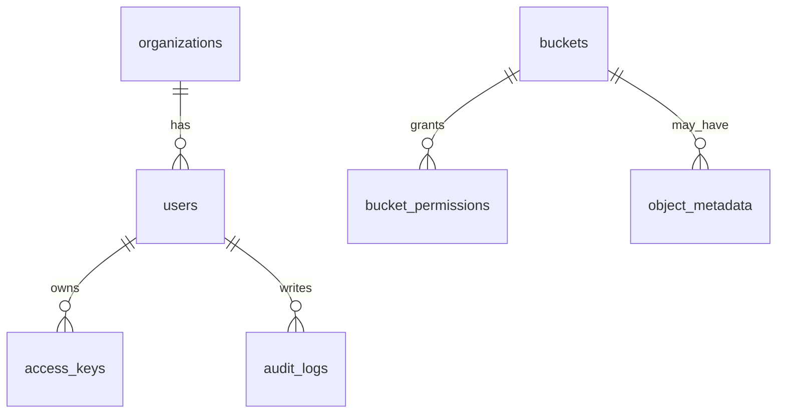

# OSMU Database Design

이 문서는 MariaDB 기준 OSMU 메타데이터 DB 설계를 정의한다.

## 1. DB 역할

MariaDB는 실제 파일 데이터를 저장하지 않는다.

저장 대상:

- 사용자
- 조직
- 버킷 메타데이터
- 권한
- Access Key 메타데이터
- 쿼터
- 감사 로그
- 시스템 설정

실제 파일 데이터는 MinIO에 저장한다.

## 2. 공통 규칙

- PK는 `BIGINT AUTO_INCREMENT`를 기본으로 한다.
- 시간 컬럼은 `DATETIME(6)`을 사용한다.
- 기본 시간대는 애플리케이션에서 Asia/Seoul 또는 UTC 중 하나로 통일한다.
- 상태값은 `VARCHAR(32)`로 저장하고 애플리케이션 enum으로 관리한다.
- Secret, Password, Token 원문 저장 금지.
- 감사 로그는 append-only로 다룬다.

## 3. 테이블 목록

| 테이블 | 목적 |
| --- | --- |
| `organizations` | 조직/부서/프로젝트 |
| `users` | 사용자 |
| `buckets` | 버킷 메타데이터 |
| `bucket_permissions` | 버킷 권한 |
| `access_keys` | S3 접근 키 메타데이터 |
| `quota_policies` | 쿼터 정책 |
| `object_metadata` | 선택적 오브젝트 메타데이터 |
| `audit_logs` | 감사 로그 |
| `system_settings` | 시스템 설정 |

## 4. organizations

```sql
CREATE TABLE organizations (
  id BIGINT AUTO_INCREMENT PRIMARY KEY,
  name VARCHAR(100) NOT NULL,
  description VARCHAR(500) NULL,
  default_quota_bytes BIGINT NULL,
  status VARCHAR(32) NOT NULL DEFAULT 'ACTIVE',
  created_at DATETIME(6) NOT NULL,
  updated_at DATETIME(6) NOT NULL,
  UNIQUE KEY uk_organizations_name (name)
);
```

## 5. users

```sql
CREATE TABLE users (
  id BIGINT AUTO_INCREMENT PRIMARY KEY,
  organization_id BIGINT NULL,
  login_id VARCHAR(100) NOT NULL,
  email VARCHAR(255) NOT NULL,
  name VARCHAR(100) NOT NULL,
  password_hash VARCHAR(255) NOT NULL,
  role VARCHAR(32) NOT NULL,
  status VARCHAR(32) NOT NULL DEFAULT 'ACTIVE',
  last_login_at DATETIME(6) NULL,
  created_at DATETIME(6) NOT NULL,
  updated_at DATETIME(6) NOT NULL,
  UNIQUE KEY uk_users_login_id (login_id),
  UNIQUE KEY uk_users_email (email),
  KEY idx_users_organization_id (organization_id),
  CONSTRAINT fk_users_organization
    FOREIGN KEY (organization_id) REFERENCES organizations(id)
);
```

역할:

- `ADMIN`
- `ORG_ADMIN`
- `USER`

상태:

- `ACTIVE`
- `INACTIVE`
- `LOCKED`

## 6. buckets

```sql
CREATE TABLE buckets (
  id BIGINT AUTO_INCREMENT PRIMARY KEY,
  name VARCHAR(63) NOT NULL,
  owner_type VARCHAR(32) NOT NULL,
  owner_id BIGINT NOT NULL,
  quota_bytes BIGINT NULL,
  used_bytes BIGINT NOT NULL DEFAULT 0,
  status VARCHAR(32) NOT NULL DEFAULT 'ACTIVE',
  created_by BIGINT NOT NULL,
  created_at DATETIME(6) NOT NULL,
  updated_at DATETIME(6) NOT NULL,
  UNIQUE KEY uk_buckets_name (name),
  KEY idx_buckets_owner (owner_type, owner_id),
  KEY idx_buckets_created_by (created_by)
);
```

정책:

- 버킷 이름은 S3 호환 규칙을 따른다.
- 기본 상태는 private이다.
- MVP에서는 전체 시스템에서 버킷 이름 유니크.

## 7. bucket_permissions

```sql
CREATE TABLE bucket_permissions (
  id BIGINT AUTO_INCREMENT PRIMARY KEY,
  bucket_id BIGINT NOT NULL,
  subject_type VARCHAR(32) NOT NULL,
  subject_id BIGINT NOT NULL,
  permission VARCHAR(32) NOT NULL,
  created_at DATETIME(6) NOT NULL,
  updated_at DATETIME(6) NOT NULL,
  UNIQUE KEY uk_bucket_permission (bucket_id, subject_type, subject_id, permission),
  KEY idx_bucket_permissions_subject (subject_type, subject_id),
  CONSTRAINT fk_bucket_permissions_bucket
    FOREIGN KEY (bucket_id) REFERENCES buckets(id)
);
```

`subject_type`:

- `USER`
- `ORGANIZATION`

`permission`:

- `READ`
- `WRITE`
- `DELETE`
- `ADMIN`

## 8. access_keys

```sql
CREATE TABLE access_keys (
  id BIGINT AUTO_INCREMENT PRIMARY KEY,
  user_id BIGINT NOT NULL,
  name VARCHAR(100) NOT NULL,
  access_key VARCHAR(128) NOT NULL,
  secret_key_hash VARCHAR(255) NOT NULL,
  status VARCHAR(32) NOT NULL DEFAULT 'ACTIVE',
  expires_at DATETIME(6) NULL,
  last_used_at DATETIME(6) NULL,
  created_at DATETIME(6) NOT NULL,
  updated_at DATETIME(6) NOT NULL,
  UNIQUE KEY uk_access_keys_access_key (access_key),
  KEY idx_access_keys_user_id (user_id),
  CONSTRAINT fk_access_keys_user
    FOREIGN KEY (user_id) REFERENCES users(id)
);
```

정책:

- Secret Key 원문 저장 금지.
- Secret Key는 생성 시 1회만 반환.
- 비활성화 시 S3 접근도 막아야 함.

## 9. quota_policies

```sql
CREATE TABLE quota_policies (
  id BIGINT AUTO_INCREMENT PRIMARY KEY,
  target_type VARCHAR(32) NOT NULL,
  target_id BIGINT NOT NULL,
  quota_bytes BIGINT NOT NULL,
  created_at DATETIME(6) NOT NULL,
  updated_at DATETIME(6) NOT NULL,
  UNIQUE KEY uk_quota_target (target_type, target_id)
);
```

`target_type`:

- `USER`
- `ORGANIZATION`
- `BUCKET`

## 10. object_metadata

MVP에서는 생략 가능하다. MinIO list 결과만으로 시작할 수 있다.

필요 시 사용:

```sql
CREATE TABLE object_metadata (
  id BIGINT AUTO_INCREMENT PRIMARY KEY,
  bucket_id BIGINT NOT NULL,
  object_key VARCHAR(1024) NOT NULL,
  size_bytes BIGINT NOT NULL,
  content_type VARCHAR(255) NULL,
  etag VARCHAR(255) NULL,
  created_by BIGINT NULL,
  created_at DATETIME(6) NOT NULL,
  updated_at DATETIME(6) NOT NULL,
  UNIQUE KEY uk_object_metadata_key (bucket_id, object_key),
  KEY idx_object_metadata_bucket_prefix (bucket_id, object_key(255)),
  CONSTRAINT fk_object_metadata_bucket
    FOREIGN KEY (bucket_id) REFERENCES buckets(id)
);
```

## 11. audit_logs

```sql
CREATE TABLE audit_logs (
  id BIGINT AUTO_INCREMENT PRIMARY KEY,
  event_type VARCHAR(64) NOT NULL,
  actor_id BIGINT NULL,
  actor_role VARCHAR(32) NULL,
  target_type VARCHAR(64) NULL,
  target_id VARCHAR(255) NULL,
  result VARCHAR(32) NOT NULL,
  ip_address VARCHAR(64) NULL,
  user_agent VARCHAR(500) NULL,
  message VARCHAR(1000) NULL,
  created_at DATETIME(6) NOT NULL,
  KEY idx_audit_logs_event_type (event_type),
  KEY idx_audit_logs_actor_id (actor_id),
  KEY idx_audit_logs_created_at (created_at)
);
```

## 12. system_settings

```sql
CREATE TABLE system_settings (
  id BIGINT AUTO_INCREMENT PRIMARY KEY,
  setting_key VARCHAR(100) NOT NULL,
  setting_value TEXT NULL,
  description VARCHAR(500) NULL,
  created_at DATETIME(6) NOT NULL,
  updated_at DATETIME(6) NOT NULL,
  UNIQUE KEY uk_system_settings_key (setting_key)
);
```

## 13. MVP ERD



## 14. 마이그레이션 원칙

- Flyway 또는 Liquibase 중 하나를 사용한다.
- 마이그레이션 파일은 수정하지 않는다.
- 변경은 새 마이그레이션으로 추가한다.
- 초기 MVP는 Flyway 추천.

## 15. 구현 순서

1. `organizations`
2. `users`
3. `buckets`
4. `bucket_permissions`
5. `access_keys`
6. `audit_logs`
7. `quota_policies`
8. `object_metadata`
9. `system_settings`

