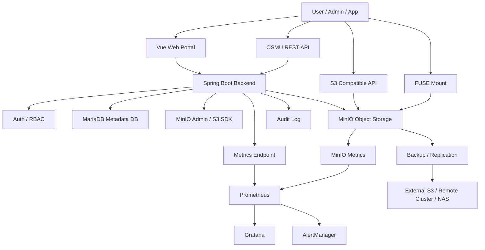

# OSMU System Architecture

이 문서는 OSMU의 전체 시스템 구조를 정의한다.

## 1. 아키텍처 목표

- 기업 내부에 설치 가능한 S3 호환 프라이빗 오브젝트 스토리지 플랫폼을 만든다.
- 실제 파일 데이터는 MinIO에 저장한다.
- 사용자, 조직, 버킷, 권한, 쿼터, 감사 로그는 MariaDB에 저장한다.
- 사용자는 Web Portal, REST API, S3 API, FUSE Mount로 접근할 수 있다.
- MVP는 Docker Compose로 시작하고, 최종 운영은 Kubernetes + Helm을 목표로 한다.

## 2. 전체 구조

## 3. 계층 정의

### 3.1 Data Plane

실제 파일 업로드, 다운로드, 삭제가 수행되는 경로다.

구성:

- MinIO
- S3 API
- FUSE Mount
- Object upload/download

원칙:

- 대용량 파일은 Backend 메모리에 통째로 올리지 않는다.
- 가능하면 streaming 또는 presigned URL을 사용한다.
- 파일 바이너리는 MariaDB에 저장하지 않는다.

### 3.2 Control Plane

OSMU 제품성이 들어가는 관리 계층이다.

구성:

- 사용자 관리
- 조직 관리
- 버킷 관리
- 권한 관리
- Access Key 관리
- 쿼터 관리
- 감사 로그
- 사용량 조회
- 백업 설정

### 3.3 Operation Plane

운영과 장애 대응을 위한 계층이다.

구성:

- 로그
- 메트릭
- 알림
- 백업/복구
- 배포 자동화
- 상태 점검

## 4. MVP 아키텍처

MVP에서는 다음만 먼저 구현한다.

- Vue Web Portal
- Spring Boot Backend
- MariaDB
- MinIO
- Docker Compose
- Health API
- Bucket API
- Object API
- 기본 감사 로그

MVP 제외:

- Kubernetes 운영 자동화
- 멀티 클러스터 복제
- SSO/LDAP
- 고급 과금
- CDN
- 완전한 백업 자동화

## 5. 최종 아키텍처

최종 제품은 다음을 목표로 한다.

- Kubernetes + Helm 배포
- MinIO Operator 연동
- Prometheus/Grafana/AlertManager 연동
- 외부 S3 호환 저장소 백업
- 원격 클러스터 복제
- SSO/LDAP 연동
- 고급 권한 정책
- 설치 마법사
- 라이선스 관리

## 6. 주요 설계 원칙

- MinIO는 Storage Engine이다.
- OSMU Backend는 Control Plane이다.
- MariaDB는 Metadata DB다.
- Web Portal은 관리 도구다.
- S3 API는 MinIO에 위임한다.
- REST API는 OSMU Backend가 제공한다.
- 보안 기본값은 private이다.
- 모든 관리 행위는 감사 로그 대상이다.

