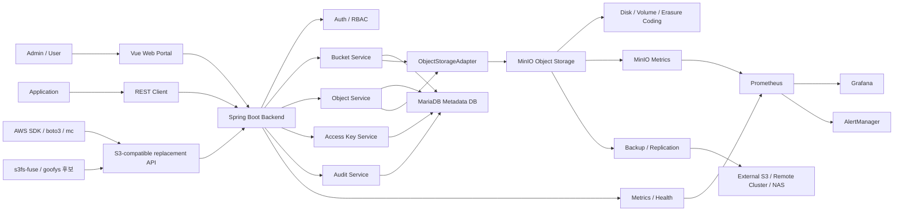
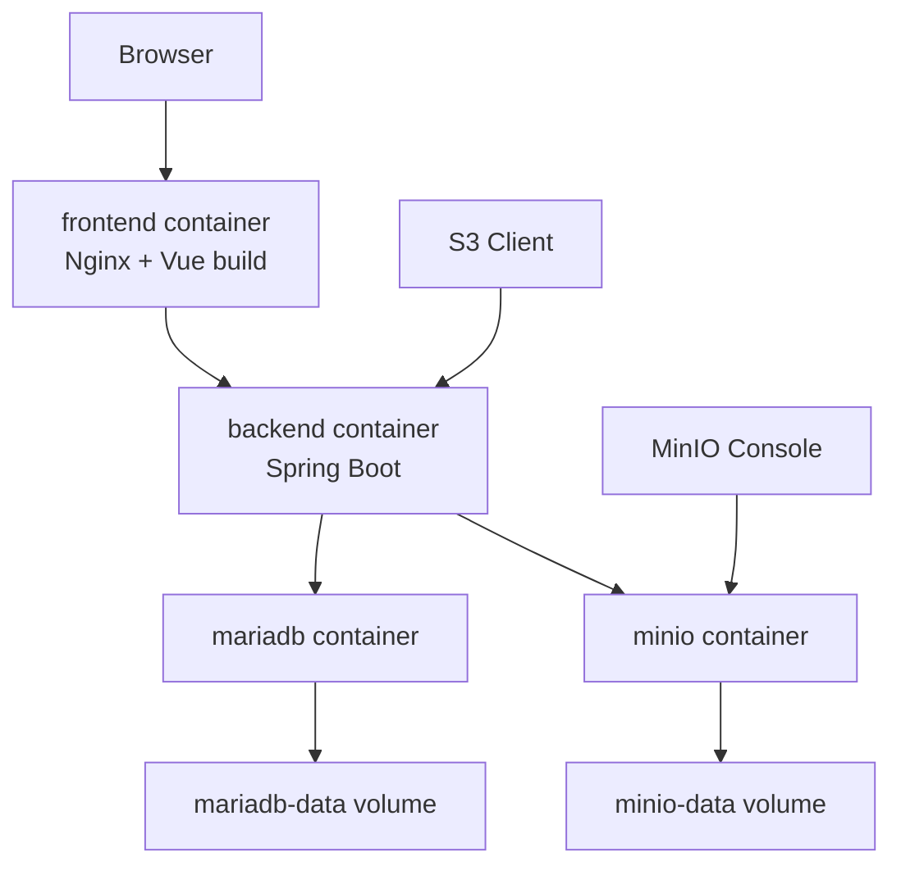
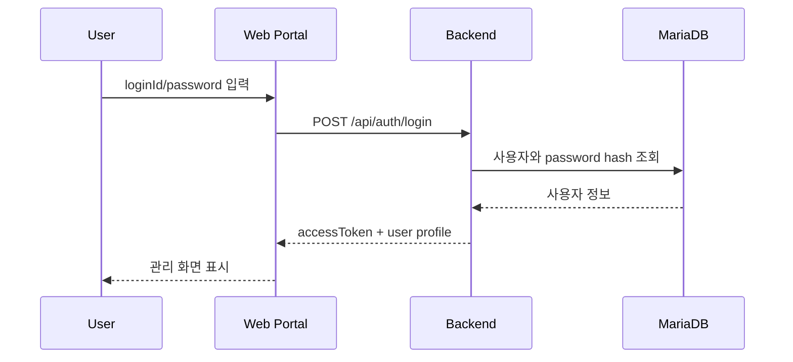
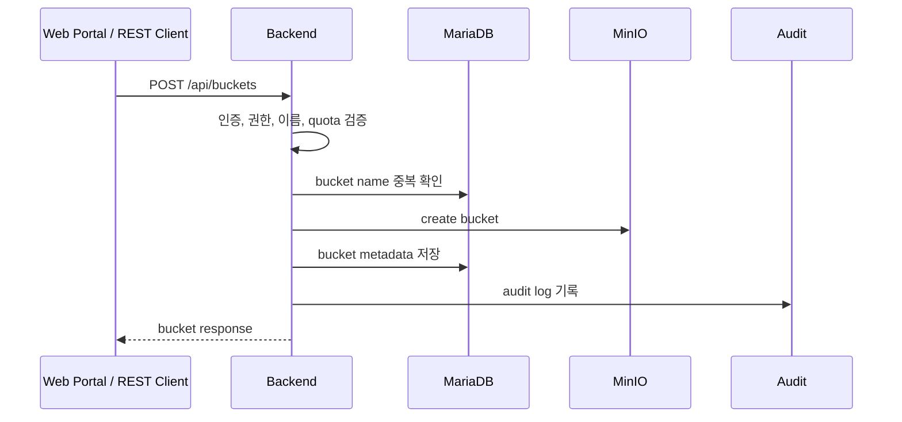
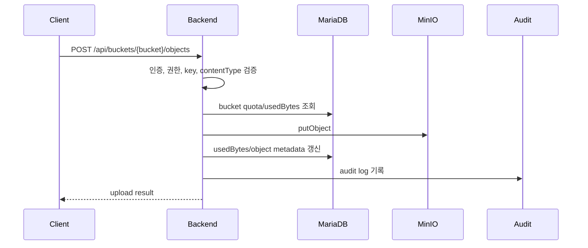
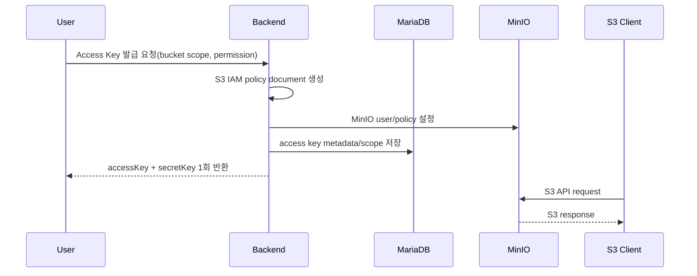

## Object Lifecycle Rule Flow

`AdminController` manages lifecycle rules. `BucketLifecycleController` exposes S3-compatible bucket lifecycle XML endpoints. `ObjectLifecycleRuleRepository` stores rule metadata ordered by priority, created time, and rule id. Retention jobs first apply global retention policy, then apply enabled rules by target type. Candidate lookup filters by optional bucket scope, object key prefix, and exact tag pairs before purge.

Dry-run uses the same candidate lookup path with a read-only preview limit and does not call storage delete, metadata delete, bucket usage update, or purge audit.

Conflict report compares enabled rules with overlapping bucket scope and the same target type. Empty `bucketName` is global and overlaps any bucket; different non-empty buckets do not overlap. Prefixes overlap when one starts with the other, and tags overlap when shared keys have equal values. This gives operators an early warning before broad rules consume candidates intended for narrower rules.

S3 Lifecycle XML import/export is an interoperability layer. It maps S3 `Expiration/Days` to OSMU `TRASH_OBJECT` retention rules and `NoncurrentVersionExpiration/NoncurrentDays` to `OBJECT_VERSION` retention rules. The exporter emits each rule in `ID`, `Filter`, `Status`, action order for AWS example-friendly XML. The importer validates the lifecycle root, S3 rule count and ID length limits, requires each `Rule/Status` to be `Enabled` or `Disabled`, accepts only the OSMU-supported filter predicates (`Prefix`, `Tag`, `And`), enforces OSMU tag key/value restrictions, and requires exactly one supported target action per imported rule. Bucket lifecycle endpoints support both JSON wrapper and raw XML request/response, and they sync the supported subset to the object storage adapter before metadata replacement. In MinIO mode, enabled noncurrent-version rules enable bucket versioning before lifecycle apply. `/api/s3/{bucketName}?lifecycle` provides a path-style S3 lifecycle alias over the same service while still using OSMU REST authentication. OSMU-only `priority`, `batchSize`, and `bucketName` are assigned on import rather than encoded in XML.
# OSMU System Architecture

이 문서는 OSMU의 시스템 아키텍처를 정의한다.

목표는 단순 파일 업로드 웹앱이 아니라, 여러 기업 환경에 설치 가능한 B2B 프라이빗 오브젝트 스토리지 플랫폼을 만드는 것이다.

## 1. 아키텍처 결론

OSMU는 직접 스토리지 엔진을 처음부터 구현하지 않는다. 제품의 핵심 가치는 MinIO 같은 검증된 S3 호환 스토리지 엔진 위에 관리, 권한, 운영, 포털, 설치 자동화를 얹는 것이다.

핵심 분리:

- Web Portal: 사용자와 관리자가 쓰는 관리 UI
- Backend: 제품의 Control Plane
- MariaDB: 제품 Metadata Plane
- MinIO: 실제 Object Data Plane
- Docker Compose: 로컬과 데모 실행 기준
- Kubernetes + Helm: 운영 배포 목표

## 2. 설계 목표

- 주요 S3 클라이언트가 대체 사용할 수 있는 S3-compatible API를 지원한다.
- REST API로 제품 관리 기능을 제공한다.
- 영상, 이미지, 문서, 백업, AI 데이터 등 확장자 제한 없이 저장한다.
- 실제 파일 데이터는 MinIO에 저장한다.
- 사용자, 조직, 버킷, 권한, 쿼터, 키, 감사 로그는 MariaDB에 저장한다.
- Web Portal, REST API, S3 API, FUSE Mount 접근 방식을 모두 고려한다.
- MVP는 Docker Compose로 실행한다.
- 최종 운영은 Kubernetes + Helm으로 확장한다.

## 3. 전체 논리 구조



## 4. MVP 런타임 구조

현재 MVP는 로컬 실행과 데모가 가능한 구조를 먼저 목표로 한다.



구성 파일:

- `infra/local/docker-compose.yml`
- `infra/local/.env.example`
- `osmu-backend/Dockerfile`
- `osmu-frontend/Dockerfile`
- `osmu-frontend/nginx.conf`
- `osmu-backend/src/main/resources/application-local.yaml`

## 5. Plane 분리

### 5.1 Data Plane

실제 파일 업로드, 다운로드, 목록 조회, 삭제가 일어나는 계층이다.

담당:

- MinIO
- S3 API
- FUSE Mount 후보
- Object binary
- Erasure Coding
- 복제와 백업

원칙:

- 파일 바이너리는 MariaDB에 저장하지 않는다.
- 대용량 파일은 Backend 메모리에 통째로 올리지 않는다.
- MVP 이후 presigned URL과 multipart upload를 우선 도입한다.
- S3 data plane은 MinIO를 우선 활용하고, Backend는 OSMU 권한/메타데이터와 연결되는 대체용 S3-compatible alias를 제공한다.

### 5.2 Control Plane

제품성이 들어가는 관리 계층이다.

담당:

- 로그인과 API 인증
- 사용자와 조직 관리
- 버킷 생성, 조회, 삭제
- 권한 정책
- Access Key 발급과 폐기
- 쿼터와 사용량 관리
- 감사 로그
- 백업 정책 설정
- 운영 상태 API

원칙:

- Backend는 Control Plane이다.
- Controller는 HTTP 계약만 담당한다.
- Service는 정책과 비즈니스 로직을 담당한다.
- Repository는 MariaDB 접근을 담당한다.
- StorageAdapter는 MinIO 접근을 담당한다.

### 5.3 Metadata Plane

제품의 관리 데이터를 저장하는 계층이다.

담당:

- 사용자
- 조직
- 버킷 메타데이터
- 권한
- Access Key 메타데이터
- Object metadata index
- 쿼터
- presigned upload session
- 감사 로그
- 시스템 설정

원칙:

- MariaDB가 source of truth다.
- Secret Key, password, token 원문은 저장하지 않는다.
- 감사 로그는 append-only로 다룬다.
- Object binary는 MinIO가 source of truth이고, 목록/search/tag 조회용 metadata index는 MariaDB가 담당한다.

### 5.4 Operation Plane

운영과 장애 대응 계층이다.

담당:

- Health check
- 로그
- 메트릭
- 알림
- 백업과 복구
- 설치와 업그레이드

목표:

- Docker Compose로 로컬과 데모를 표준화한다.
- Kubernetes에서는 Helm Chart로 설치를 단순화한다.
- Prometheus, Grafana, AlertManager 연동을 준비한다.

## 6. Backend 내부 구조

현재 구현과 목표 구조를 함께 둔다.

```text
com.example.osmu
├── common
│   ├── api
│   └── error
├── config
├── auth
├── user
├── bucket
│   └── repository
├── object
├── storage
│   ├── memory
│   └── minio
├── accesskey
│   └── repository
├── audit
│   └── repository
├── admin
└── system
```

주요 경계:

- `BucketService`는 버킷 정책과 사용량 갱신을 담당한다.
- `BucketRepository`는 버킷 메타데이터 저장소 경계다.
- `InMemoryBucketRepository`는 개발용 기본 구현이다.
- `MariaDbBucketRepository`는 MariaDB 전환용 구현이다.
- `ObjectService`는 오브젝트 작업 정책과 쿼터 검사를 담당한다.
- `ObjectStorageAdapter`는 스토리지 엔진 경계다.
- `InMemoryObjectStorageAdapter`는 개발용 기본 구현이다.
- `MinioObjectStorageAdapter`는 MinIO 전환용 구현이다.
- `JwtTokenService`는 HMAC SHA-256 서명 JWT 발급과 검증을 담당한다.
- `JwtAuthInterceptor`는 Health/Login/Refresh 외 `/api/**` 요청의 Bearer access token을 검증한다.
- `JwtAuthInterceptor`는 `/api/admin/**` 요청에 `ADMIN` role을 요구한다.
- `RefreshTokenRepository`는 refresh token hash 저장과 폐기 상태를 담당한다.
- `AccessKeyRepository`는 access key metadata와 secret hash 저장소 경계다.
- `PasswordService`는 PBKDF2-SHA256 hash 생성과 검증을 담당한다.
- `UserRepository`는 사용자 조회 저장소 경계다.
- `InMemoryUserRepository`는 개발용 bootstrap admin을 제공한다.
- `MariaDbUserRepository`는 MariaDB `users` table과 bootstrap admin seed를 담당한다.

## 7. 저장소 모드

MVP 개발 속도를 위해 저장소 구현은 모드로 분리한다.

### 7.1 Object storage mode

```text
OSMU_STORAGE_MODE=in-memory
OSMU_STORAGE_MODE=minio
```

- `in-memory`: 테스트와 빠른 개발용
- `minio`: 로컬 통합 실행과 실제 데모용

### 7.2 Metadata mode

```text
OSMU_METADATA_MODE=in-memory
OSMU_METADATA_MODE=mariadb
```

- `in-memory`: 테스트와 빠른 개발용
- `mariadb`: 로컬 통합 실행과 실제 데모용

## 8. 핵심 요청 흐름

### 8.1 로그인



현재 MVP는 bootstrap admin 계정을 사용자 저장소에 만들고, PBKDF2-SHA256 password hash를 검증한 뒤 HMAC SHA-256 서명 JWT access token과 refresh token을 발급한다.

### 8.2 버킷 생성



보상 전략:

- MinIO 생성 성공 후 DB 저장 실패 시 MinIO bucket 삭제를 시도한다.
- DB 저장 성공 후 audit 실패는 핵심 작업 성공으로 보고 로그 에러만 남긴다.

### 8.3 파일 업로드



현재 구현은 Backend multipart request를 받아 storage adapter로 전달한다. 운영 목표는 다음 순서다.

1. Backend가 권한과 quota를 확인한다.
2. Backend가 presigned URL 또는 multipart upload session을 발급한다.
3. Client가 MinIO로 직접 업로드한다.
4. Backend가 완료 callback 또는 complete API로 metadata를 확정한다.

현재 MVP는 `osmu.storage.mode=minio`에서 presigned PUT/GET URL과 multipart upload create/refresh/parts/complete/abort API를 제공한다. `in-memory` storage mode에서는 명확히 `STORAGE_ERROR`를 반환한다. presigned upload와 multipart upload는 session을 저장하고, refresh API는 저장된 part plan으로 기존 upload id의 part URL을 재발급한다. parts API는 MinIO `listParts`로 이미 업로드된 part ETag를 복구한다. 완료 후 complete API로 quota/object metadata를 확정한다. Presigned upload는 `.osmu/uploads/` staging key를 사용해 active object를 직접 덮어쓰기 전에 complete 단계에서 version snapshot을 만들 수 있게 한다. Multipart overwrite도 complete 직전에 기존 active object를 `.osmu/versions/`로 snapshot한다. Browser multipart upload는 MinIO CORS `ExposeHeaders`에 `ETag`가 필요하다. 만료된 ACTIVE multipart session은 `MultipartUploadCleanupJob`이 주기적으로 MinIO abort를 수행하고 `EXPIRED`로 전환하며, cleanup 결과는 감사 로그와 actuator metric으로 노출한다.
임시 object share link는 REST download 위에 있는 sharing control plane이다. Admin global share policy는 password/IP allowlist 요구 여부와 expiry/download 상한을 정한다. 발급 API는 `READ` 권한과 storage 존재를 확인한 뒤 policy를 적용하고, 원 token은 한 번만 반환하고 SHA-256 token hash, 선택 password hash, 선택 IP/CIDR allowlist, 만료, 상태, note, max download policy를 metadata에 저장한다. public download API는 Bearer token 없이 active/non-expired/non-limit-reached token, 필요한 share password, 허용된 client IP만 허용하고, 성공 시 `downloadCount`와 `lastAccessedAt`을 갱신한 뒤 storage stream을 그대로 전달한다. admin analytics API는 raw token/public URL 없이 bucket/status filter 기반 status/protection/download/recent link 집계를 보여준다. cleanup API는 bucket manage 권한으로 만료된 active link를 `EXPIRED`로 정리한다. scheduler도 같은 만료 정리를 전역 실행하고 Prometheus metric과 audit evidence를 남긴다.

파일 삭제는 soft delete가 기본이다. `DELETE /objects/{key}`는 `object_metadata.deleted_at`을 기록해 active 목록/다운로드에서 숨기고, `restore`는 다시 active로 돌리며, `purge`는 MinIO object와 metadata를 영구 삭제하고 quota/objectCount를 감소시킨다.
`ObjectRetentionPurgeJob`은 retention 기간이 지난 trash object를 자동 purge해 장기 보관 비용을 줄인다.

### 8.4 파일 다운로드

현재 MVP:

- Client가 Backend REST API 호출
- Backend가 `ObjectStorageAdapter.openObject`로 storage stream을 연다
- Controller가 `StreamingResponseBody`로 storage stream을 client response에 복사한다
- MinIO mode의 REST download main path는 전체 파일을 JVM byte array로 적재하지 않는다
- stream open 성공 후 `OBJECT_DOWNLOAD` 감사 로그를 기록한다

목표:

- 작은 파일은 Backend streaming 허용
- 큰 파일은 presigned URL 우선
- 다운로드 이벤트는 감사 로그에 기록

### 8.5 S3 직접 접근



정책:

- Secret Key는 생성 시 1회만 노출한다.
- Backend는 Access Key와 권한 정책을 관리한다.
- Access Key는 `allowedBuckets`와 `READ`, `WRITE`, `DELETE` permission을 metadata에 가진다.
- `S3AccessPolicyGenerator`는 access key scope를 S3 IAM 호환 policy document로 변환한다.
- `S3AccessPolicyProvisioner`는 MinIO user/policy 실제 적용 경계다.
- 기본값은 `noop`이며, 로컬 Docker Compose는 `OSMU_ACCESS_KEY_PROVISIONING_MODE=minio`로 MinIO provisioner를 사용한다.
- 현재 MinIO provisioner는 backend container 안의 `mc` CLI로 `policy create`, `user add`, `policy attach`, `user rm`, `policy rm`을 실행한다.
- Access Key metadata는 provision 성공 후 저장하며, metadata 저장 실패 시 provisioned user/policy를 보상 삭제한다.
- Access Key 비활성화와 scope 재동기화 실패 복구는 metadata를 먼저 `INACTIVE`로 닫아 OSMU 인증을 차단하고, 이후 MinIO user/policy cleanup을 시도한다.
- S3 직접 업로드/삭제는 Backend upload API를 거치지 않으므로 bucket usage/object metadata index가 일시적으로 stale할 수 있다.
- `POST /api/buckets/{bucketName}/sync`는 storage object list를 기준으로 usedBytes/objectCount와 object metadata index를 재생성한다.
- Object metadata detail API는 index와 storage actual metadata를 비교해 `SYNCED`, `STALE`, `MISSING_IN_STORAGE` 상태를 반환한다.
- Backend direct upload는 request stream을 storage adapter로 전달하며 MinIO mode에서 파일 전체를 JVM heap에 적재하지 않는다.
- S3 API 트래픽은 MinIO가 처리한다.

## 9. 데이터 소유권

| 데이터 | Source of Truth | 비고 |
| --- | --- | --- |
| Object binary | MinIO | 실제 파일 |
| Object size/contentType/lastModified/tags index | MariaDB | 목록/search/tag filter 기준, sync로 재생성 |
| Object tag inverted index | MariaDB | `tag=key=value` exact filter 최적화 |
| Object size/contentType/lastModified/tags actual | MinIO | binary와 실제 object metadata |
| Bucket metadata | MariaDB | 이름, 소유자, quota, usedBytes |
| User/Organization | MariaDB | 인증과 권한 기준 |
| Access Key metadata | MariaDB | Secret 원문 저장 금지, bucket scope/permission 포함 |
| Access policy | MariaDB + MinIO | 제품 정책과 MinIO 정책 동기화 필요 |
| Audit log | MariaDB | append-only |
| System config | MariaDB | 운영 설정 |

## 10. 보안 구조

MVP 현재:

- `Authorization: Bearer <jwt-access-token>`
- Health, login, refresh만 public
- 나머지 `/api/**`는 HMAC SHA-256 JWT 검증 필요
- `/api/admin/**`는 기본 `ADMIN` role 필요. 일부 user/organization API는 `ORG_ADMIN`에게 자기 조직 scope로 허용
- 로그인은 사용자 저장소 조회와 PBKDF2-SHA256 password hash 검증 사용
- refresh token은 hash 저장, refresh rotation, logout revoke 적용
- bucket/object/access key는 owner id와 bucket permission 기준 접근 제어 적용
- bucket permission은 `USER` 또는 `ORGANIZATION` subject에 `READ`, `WRITE`, `DELETE`, `ADMIN`을 부여한다.

목표:

- Spring Security 기반 인증 체계
- refresh token 저장과 폐기
- Role 기반 권한
- 조직/사용자 단위 버킷 권한
- Secret Key 1회 노출
- TLS 적용
- 기본 private bucket
- 감사 로그 필수

## 11. 확장성과 고가용성

Backend:

- stateless로 설계한다.
- 여러 replica로 수평 확장 가능하게 한다.
- session은 JWT 또는 외부 저장소를 사용한다.

MariaDB:

- MVP는 단일 DB로 시작한다.
- 운영은 managed DB, replication, backup을 고려한다.

MinIO:

- 단일 컨테이너에서 시작한다.
- 운영은 distributed MinIO와 Erasure Coding을 사용한다.
- RAID 레벨을 직접 구현하지 않고, 설치 구성과 내구성 정책으로 표현한다.

Frontend:

- 정적 빌드 산출물을 Nginx 또는 CDN/Ingress 뒤에 둔다.

## 12. 배포 단계

### 12.1 Local Dev

- Docker Compose
- MariaDB
- MinIO
- Backend
- Frontend
- 필요 시 `in-memory` mode 사용

### 12.2 Demo Server

- Docker Compose
- 실제 `mariadb` mode
- 실제 `minio` mode
- 단일 서버 PoC
- 샘플 계정과 샘플 버킷 제공

### 12.3 Production

- Kubernetes
- Helm Chart
- MinIO Operator 또는 distributed MinIO
- Backend Deployment
- Frontend Deployment
- Ingress + TLS
- Prometheus/Grafana/AlertManager
- DB backup
- Object backup/replication

## 13. 현재 구현 상태

구현됨:

- Vue Web Portal 1차
- Spring Boot REST API 1차
- 공통 API 응답과 에러 응답
- Health API
- Bucket API
- Object API
- Access Key API
- Admin usage/status/audit API
- HMAC SHA-256 JWT 발급/검증
- PBKDF2-SHA256 password hash 검증
- in-memory/MariaDB user repository
- `/api/admin/**` ADMIN role guard
- bucket/object owner guard
- access key owner guard
- audit log actor/request metadata capture
- in-memory/MariaDB audit log repository
- in-memory/MariaDB refresh token repository
- in-memory/MariaDB access key repository
- in-memory/MariaDB organization repository
- Access Key bucket별 scope/permission metadata와 `bucket_scopes` migration
- Bucket permission revoke 후 active Access Key scope/policy 재동기화
- Admin organization create/list API
- User organizationId metadata
- Bucket usage sync API
- USER/ORG bucket owner metadata
- ORG_ADMIN organization bucket creation
- same-organization bucket access guard
- bucket permission metadata와 object action별 `READ`/`WRITE`/`DELETE` guard
- organization usage aggregation API
- organization quota enforcement for object upload
- ORG_ADMIN scoped admin users/organizations API
- S3 access policy document generator
- S3 access policy provisioner interface와 no-op/MinIO mc 구현
- Flyway V1-V11 metadata schema migration
- `BucketRepository` 경계
- `ObjectMetadataRepository` 경계
- `ObjectStorageAdapter` 경계
- in-memory storage/repository
- MariaDB bucket repository
- MinIO object storage adapter
- MinIO presigned upload/download URL API
- presigned upload complete API
- object metadata index 기반 list/search/tag filter
- object tag inverted index
- Docker Compose local stack
- Backend/Frontend Dockerfile
- local verification script

검증 제약:

- Docker daemon 미실행으로 실제 `docker compose up -d --build` 검증 불가

## 14. 다음 아키텍처 결정

우선 결정할 것:

1. 인증 프레임워크: 현재 interceptor 유지 또는 Spring Security 전환
2. DB: 순수 JDBC 유지 여부 또는 JPA/Flyway 전환
3. Object metadata: tag/metadata inverted index와 대량 pagination 최적화
4. 업로드: Backend streaming 유지 또는 presigned URL 우선 전환
5. Access Key: native MinIO Admin API 또는 worker 기반 provisioning으로 교체
6. 권한: bucket permission UI/정책 고도화와 MinIO policy 재동기화
7. 운영: Docker Compose demo 기준 완료 후 Kubernetes/Helm 초안 진행

## 15. 다음 구현 순서

추천 순서:

1. 로컬 의존성 설치와 빌드 검증
2. Docker Compose 전체 실행 검증
3. MariaDB bucket repository 실제 연결 검증
4. MinIO object adapter 실제 연결 검증
5. 조직/공유 권한 DB 스키마와 migration 추가
7. Access Key를 MinIO policy와 연결
8. presigned URL 업로드/다운로드 추가
9. Prometheus/Grafana 초안 추가
10. Kubernetes/Helm 배포 초안 작성

## 16. 설계 원칙

- MinIO는 Storage Engine이다.
- OSMU Backend는 Control Plane이다.
- MariaDB는 Metadata DB다.
- Web Portal은 관리 도구다.
- S3 API는 MinIO에 위임한다.
- REST API는 OSMU Backend가 제공한다.
- 보안 기본값은 private이다.
- 모든 관리 행위는 감사 로그 대상이다.
- 대용량 파일은 Backend 병목을 피한다.
- MVP는 작게 만들고, 운영 기능은 단계적으로 확장한다.
